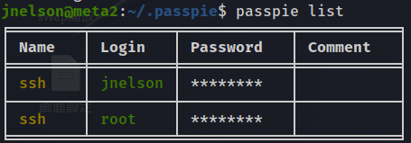

Passpie は、パスワードを安全に管理および保存するためのコマンド ライン パスワード マネージャーです。AES256 暗号化を使用して、パスワード、シークレット、およびその他の機密情報を暗号化されたファイルに保存できます。Passpie はパスワード生成もサポートしており、異なる秘密を含む複数のファイルを保存できます。このツールは、端末から直接パスワードとシークレットを追加、編集、削除、および取得できるシンプルで使いやすいインターフェイスを提供します。Passpie を使用すると、パスワードが安全に暗号化されて 1 つのファイルに保存されるため、パスワードを忘れたり盗まれたりする心配はありません。   
パッピーの使い方
Passpie を使用するには、システムに Python がインストールされている必要があります。Python を入手したら、次のコマンドを使用して Passpie をインストールできます。

pip install passpie   
Passpie をインストールすると、次の基本的なコマンドを使用してパスワードを管理できます。

1.新しいパスワード データベースを初期化します。
passpie init   

2.新しいパスワードを追加します。
passpie add [username] [password] [url] [notes]   

3.保存されているすべてのパスワードを一覧表示します。
passpie list    

4.パスワードを取得します。
passpie get [username]    

5.パスワードを編集します。
passpie edit [username] [password] [url] [notes]     
6.パスワードを削除します。
passpie delete [username]    

Passpie は、パスワードの生成、パスワードのローテーション、検索とフィルタリング、パスワード データベースのバックアップと復元など、その他の高度な機能もサポートしています。これらの機能の詳細については、パスピーのドキュメント ( https://passpie.readthedocs.io/en/latest/ ) を参照してください。

