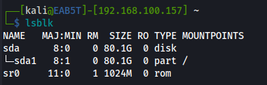

「lsblk」（list block devices）は、現在利用できるブロックデバイスを一覧表示するコマンドです 。  
　各ブロックデバイスをツリー状に表示するので、パーティションの状態を視覚的に把握でき、ストレージの構成やデバイス番号を確認したいときに役立ちます。   
 [option](https://atmarkit.itmedia.co.jp/ait/articles/1802/02/news021.html)   
 
 