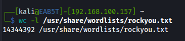

-c, --bytes            バイト数を表示する  
-m, --chars            文字数を表示する  
-l, --lines            改行の数を表示する  
      --files0-from=F    入力として NULL 文字で区切られたファイル F を使用する。F が - の場合は名前を標準入力から読み込む  
-L, --max-line-length  最も長い行の長さを表示する   
-w, --words            単語数を表示する  
