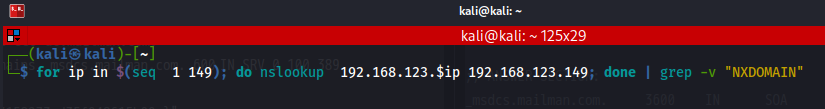
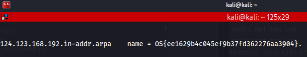

1. nmapでポート53 でリッスンしている IP を確認   
2. 'host listen_IP listen_IP'（2回入力する必要がある）でドメイン名取得
3. host -t text domain_name listen_IP コマンド実施

```
┌──(kali㉿kali)-[~]
└─$ host 192.168.123.149 192.168.123.149   
Using domain server:
Name: 192.168.123.149
Address: 192.168.123.149#53
Aliases: 

149.123.168.192.in-addr.arpa domain name pointer dc.MAILMAN.com.
                                                                                                                                                 
┌──(kali㉿kali)-[~]
└─$ host -t txt dc.MAILMAN.com. 192.168.123.149
Using domain server:
Name: 192.168.123.149
Address: 192.168.123.149#53
Aliases: 

dc.MAILMAN.com descriptive text "OS{f2b9a6bb6b37c5dd67e53cc033cdff64}"
```
## サブドメイン列挙
```
┌──(kali㉿kali)-[~]
└─$ dig axfr mailman.com @192.168.123.149

; <<>> DiG 9.18.7-1-Debian <<>> axfr mailman.com @192.168.123.149
;; global options: +cmd
mailman.com.		3600	IN	SOA	dc.mailman.com. hostmaster.mailman.com. 158 900 600 86400 3600
mailman.com.		3600	IN	NS	dc.mailman.com.
_msdcs.mailman.com.	3600	IN	NS	dc.mailman.com.
_gc._tcp.Default-First-Site-Name._sites.mailman.com. 600 IN SRV	0 100 3268 dc.mailman.com.
_kerberos._tcp.Default-First-Site-Name._sites.mailman.com. 600 IN SRV 0 100 88 dc.mailman.com.
_kerberos._tcp.Default-First-Site-Name._sites.mailman.com. 600 IN SRV 0 100 88 winserv19-temp.mailman.com.
_ldap._tcp.Default-First-Site-Name._sites.mailman.com. 600 IN SRV 0 100 389 dc.mailman.com.
_ldap._tcp.Default-First-Site-Name._sites.mailman.com. 600 IN SRV 0 100 389 winserv19-temp.mailman.com.
_gc._tcp.mailman.com.	600	IN	SRV	0 100 3268 dc.mailman.com.
_gc._tcp.mailman.com.	600	IN	SRV	0 100 3268 winserv19-temp.mailman.com.
_kerberos._tcp.mailman.com. 600	IN	SRV	0 100 88 dc.mailman.com.
_kpasswd._tcp.mailman.com. 600	IN	SRV	0 100 464 dc.mailman.com.
_kpasswd._tcp.mailman.com. 600	IN	SRV	0 100 464 winserv19-temp.mailman.com.
_ldap._tcp.mailman.com.	600	IN	SRV	0 100 389 dc.mailman.com.
_kerberos._udp.mailman.com. 600	IN	SRV	0 100 88 dc.mailman.com.
_kerberos._udp.mailman.com. 600	IN	SRV	0 100 88 winserv19-temp.mailman.com.
_kpasswd._udp.mailman.com. 600	IN	SRV	0 100 464 dc.mailman.com.
_kpasswd._udp.mailman.com. 600	IN	SRV	0 100 464 winserv19-temp.mailman.com.
dc.mailman.com.		3600	IN	A	192.168.123.149
dc.mailman.com.		3600	IN	TXT	"OS{1221212}"
DomainDnsZones.mailman.com. 600	IN	A	192.168.50.149
DomainDnsZones.mailman.com. 600	IN	A	192.168.120.149
_ldap._tcp.Default-First-Site-Name._sites.DomainDnsZones.mailman.com. 600 IN SRV 0 100 389 dc.mailman.com.
_ldap._tcp.DomainDnsZones.mailman.com. 600 IN SRV 0 100 389 dc.mailman.com.
_ldap._tcp.DomainDnsZones.mailman.com. 600 IN SRV 0 100 389 winserv19-temp.mailman.com.
ForestDnsZones.mailman.com. 600	IN	A	192.168.50.149
ForestDnsZones.mailman.com. 600	IN	A	192.168.120.149
_ldap._tcp.Default-First-Site-Name._sites.ForestDnsZones.mailman.com. 600 IN SRV 0 100 389 dc.mailman.com.
_ldap._tcp.ForestDnsZones.mailman.com. 600 IN SRV 0 100 389 dc.mailman.com.
mailman.com.		3600	IN	SOA	dc.mailman.com. hostmaster.mailman.com. 158 900 600 86400 3600
;; Query time: 251 msec
;; SERVER: 192.168.123.149#53(192.168.123.149) (TCP)
;; WHEN: Tue Nov 29 09:50:34 JST 2022
;; XFR size: 30 records (messages 1, bytes 1454)
```
### ゾーン転送
```
──(kali㉿kali)-[~]
└─$ host -t axfr _msdcs.mailman.com 192.168.123.149
Trying "_msdcs.mailman.com"
Using domain server:
Name: 192.168.123.149
Address: 192.168.123.149#53
Aliases: 

;; ->>HEADER<<- opcode: QUERY, status: NOERROR, id: 25119
;; flags: qr ra; QUERY: 1, ANSWER: 13, AUTHORITY: 0, ADDITIONAL: 0

;; QUESTION SECTION:
;_msdcs.mailman.com.		IN	AXFR

;; ANSWER SECTION:
_msdcs.mailman.com.	3600	IN	SOA	dc.mailman.com. hostmaster.mailman.com. 47 900 600 86400 3600
_msdcs.mailman.com.	3600	IN	NS	dc.mailman.com.
608b67a2-2eca-4397-bfb4-0697e7f987fe._msdcs.mailman.com. 600 IN	CNAME dc.mailman.com.
_kerberos._tcp.Default-First-Site-Name._sites.dc._msdcs.mailman.com. 600 IN SRV	0 100 88 dc.mailman.com.
_ldap._tcp.Default-First-Site-Name._sites.dc._msdcs.mailman.com. 600 IN	SRV 0 100 389 dc.mailman.com.
_kerberos._tcp.dc._msdcs.mailman.com. 600 IN SRV 0 100 88 dc.mailman.com.
_ldap._tcp.dc._msdcs.mailman.com. 600 IN SRV	0 100 389 dc.mailman.com.
_ldap._tcp.be24abe3-dc4e-4070-a0ce-21a930a25f6e.domains._msdcs.mailman.com. 600	IN SRV 0 100 389 dc.mailman.com.
gc._msdcs.mailman.com.	3600	IN	TXT	"OS{e769a6972f3158273ed35f048615b00e}"
_ldap._tcp.Default-First-Site-Name._sites.gc._msdcs.mailman.com. 600 IN	SRV 0 100 3268 dc.mailman.com.
_ldap._tcp.gc._msdcs.mailman.com. 600 IN SRV	0 100 3268 dc.mailman.com.
_ldap._tcp.pdc._msdcs.mailman.com. 600 IN SRV	0 100 389 dc.mailman.com.
_msdcs.mailman.com.	3600	IN	SOA	dc.mailman.com. hostmaster.mailman.com. 47 900 600 86400 3600

Received 853 bytes from 192.168.123.149#53 in 251 ms
```
### 利用可能なIP範囲192.168.x.0/24を総当り検索



grepの「-v」は除くを意味する




