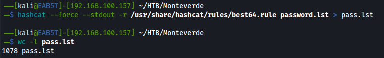

# cewl
Webサイトからカスタムワードリストを作成   
```
cewl www.megacorpone.com -m 6 -w megacorp-cewl.txt
```
> `www.megacorpone.com`：対象のサイト   
> `-m` ： 最低文字数(-m 6 最低6文字)
# John the Ripper (JTR)
## カスタム ルール   (発見したパスワードに規則性がある場合に活用できる)
元の辞書にカスタム変更を加えて、既存の辞書からカスタム単語リストを作成   
各単語の先頭に特殊文字 (例: !@#$*&) を追加し、末尾に 0 ～ 9 の数字を追加   
```
#フォーマット
[symbols]word[0-9]
```   
john.conf の最後にルールを追加
```
user@machine$ sudo vi /etc/john/john.conf 
[List.Rules:THM-Password-Attacks] 
Az"[0-9]" ^[!@#$]
```

> `[List.Rules:THM-Password-Attacks]` ：ルール名 THM-Password-Attacks を指定します。  
> `Az`：-pで元の単語リスト/辞書の中から1つの単語を表します。   
>`"[0-9]"` ：単語の末尾に1桁の数字（0から9まで）を付加します。2桁の場合は、"[0-9][0-9]"と追加します。     
>`^[!@#$]`  ：各単語の先頭に特殊文字を追加します。^は行頭・語頭を意味する。注意：^を$に変更すると、
>                     特殊文字が行／単語の末尾に追加されます。   

単語リスト(今回は”password”のみ)を作成し単語リストを拡張する
```
#単語リスト作成
user@machine$ echo "password" > /tmp/single.lst
```
Johnコマンドに--rulesオプションで作成したルールの名前を入れる。また、結果をターミナルに表示する必要がある場合は--stdoutを使用する。リダイレクトで新しいファイルに書き出す。
```
user@machine$ john --wordlist=/tmp/single.lst --rules=THM-Password-Attacks --stdout > ex_single.lst
Using default input encoding: UTF-8 
!password0 
@password0 
#password0 
$password0
```
# hashcatによるパスワードリスト作成
