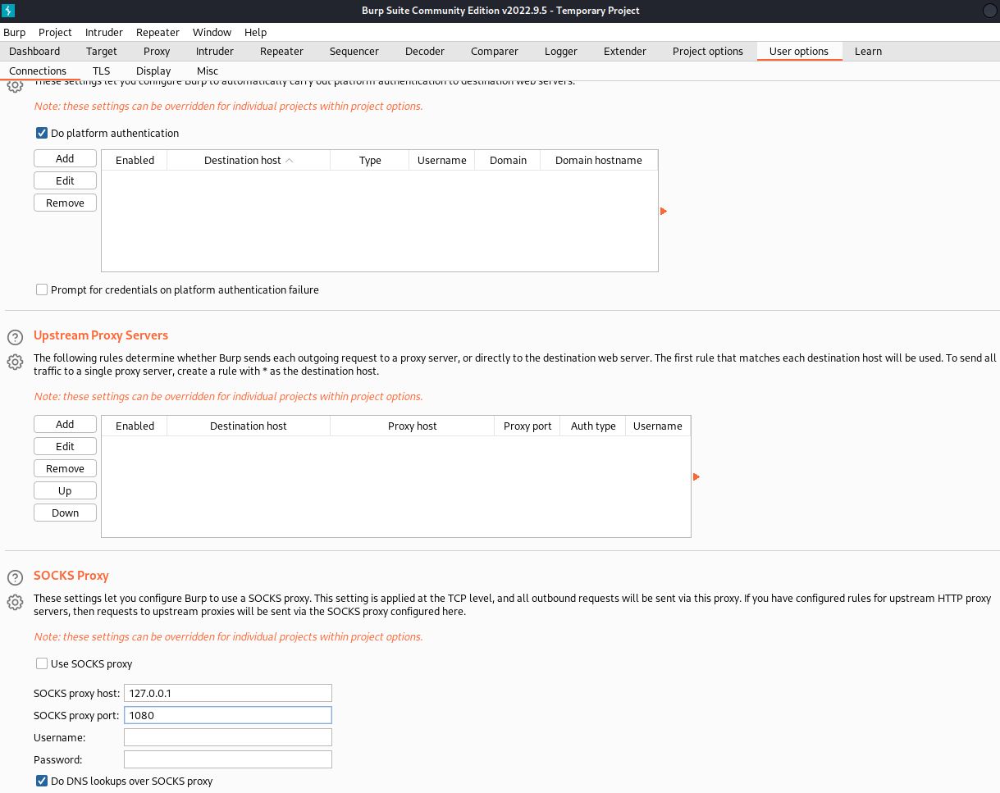

# ポートスキャン

## nmap

#### 初回のポートスキャン

```
nmap -Pn -n -vvv -sV -T4 -oA nmap/intial [IP]
```

#### 開いているポートに対して詳細なスキャン

```
nmap -Pn -sC -sV -T4 -p 80 -oA nmap/base_script [IP]
```

#### nmapによる脆弱性調査

```
nmap -Pn -n -vvv -T4 --script=vuln -oA nmap/vuln [IP]
```

### 正常系の確認

- netcatを用いた確認

```
$nc -nv[IP][PORT]
```

- http/httpsの場合はブラウザで接続する
- ftpではftpコマンドで接続する

```
$ftp [IP]
```

### Port 80,443(HTTP,HTTPS)

```
nikto -h <URL>
```

```
gobuster dir -u <URL> -w /usr/share/wordlists/dirb/wordlists/common.txt -t 10
/etc/proxychains4.confに「socks5 127.0.0.1 1080」を追記しておく
HTTP_PROXY="socks5:/127.0.0.1:1080/" gobuster dir -u <URL> -w /usr/share/dirb/wordlists/common.txt -t 10
ポート指定は「:」
```

#### feroxbuster(web ディレクトリ調査)

```
feroxbuster --url <URL> --depth 2 --wordlist <wordlist>
```

### cewl(web ページからワードリストの作成ができる)

```
cewl <URL>
```

-----

# ポートフォワーディング

- sshuttle -vvr sean@10.11.1.251 10.1.1.0/24
- ssh sean@10.11.1.251 -D 1080

**<span style="color: red;">ネットワーク越しのnmapで検索結果が信用できないときは踏み台端末でnmapを実施</span>**

```
proxychains sudo env "PATH=$PATH" autorecon [IP]
```

### ネットワーク越しのnmap
```
proxychains nmap -p- -Pn 10.2.2.23 --open -r -oA nmap/all 
```
- ポート全検索
```
proxychains nmap -p 1-10000 -Pn [IP] --open -r -oA nmap/1-10000
proxychains nmap -p 10001-20000 -Pn [IP] --open -r -oA nmap/10001-20000
proxychains nmap -p 20001-30000 -Pn [IP] --open -r -oA nmap/20001-30000
proxychains nmap -p 30001-40000 -Pn [IP] --open -r -oA nmap/30001-40000
proxychains nmap -p 40001-50000 -Pn [IP] --open -r -oA nmap/40001-50000
proxychains nmap -p 50001-60000 -Pn [IP] --open -r -oA nmap/50001-60000
proxychains nmap -p 60001- -Pn [IP] --open -r -oA nmap/6000-
```
- TOP100
```
proxychains nmap --top-ports=100 -Pn [IP] --open -r -oA nmap/top100
```

ポートフォワーディングを利用したweb



