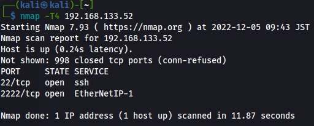
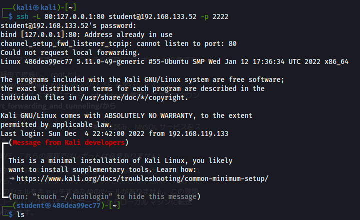
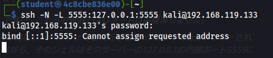
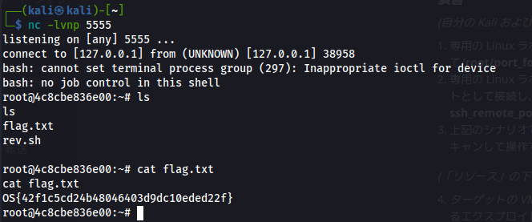
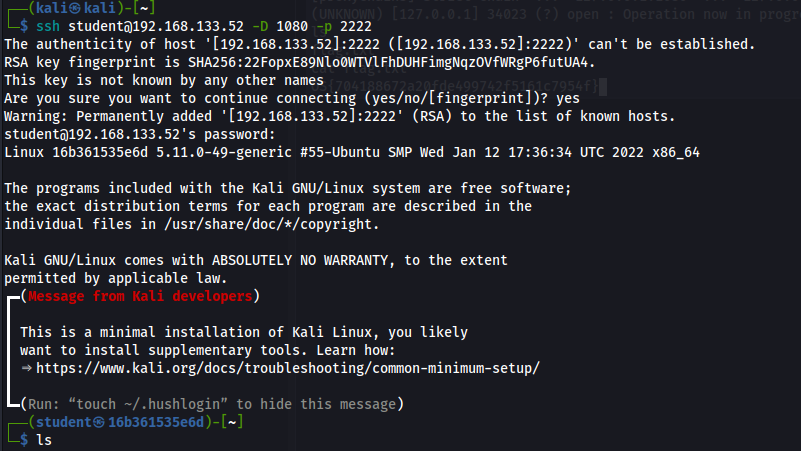
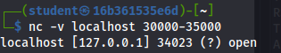
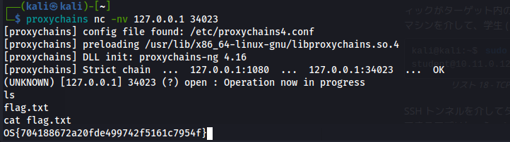

```
ssh [user]@[ip] -D 1080
```

configファイル変更
/etc/proxychains4.confを修正
```
socks5 127.0.0.1 1080
```
使用方法
```
proxychains nmap [option]
```

## 24.5.3 安定したリバーストンネルの構築   
1.　新しいSSH鍵のペアを生成   
2.　kaliのauthorized_keysファイルに追加   
3.　SSHポート転送コマンド発行   
4.　/etc/proxychains4.confを編集   
```
ssh-keygen -t rsa -N '' -f ~/.ssh/key
```
```
ssh -f -N -R 1080 -o "UserKnownHostsFile=/dev/null" -o "StrictHostKeyChecking=no" -I key kali@192.168.119.164
```

## 20.2.2 SSH ローカル ポート フォワーディング   
ターゲット VM #1 には、サーバーのローカル アドレス空間からのみ到達可能な、内部でホストされている Web サイトがあります。このサーバーを参照してフラグを取得します。  
```
[構文]   
ssh -N -L [bind_address:]port:host:hostport [username@address]
```







## 20.2.3. SSH リモート ポート フォワーディング   




受信までに時間がかかった



## 20.2.5. SSH 動的ポート転送





開放ポートを探す   





