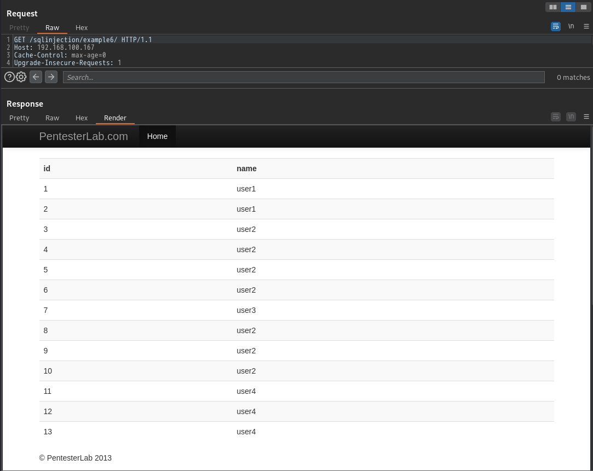

# <span style="color: blue;">Example 1</span>

>\`- -\` を使用したコメントは、\`- -\` の後にスペースが続かない場合、しばしば問題を引き起こす可能性があります。そのため、最後にスペースを追加することをお勧めします。
# <span style="color: blue;">Example 2</span>
この制限を回避するには、上で見たトリックですべての行を取得し、SQL キーワード LIMIT を使ってこの数を制限すればよいのです。   
   
# <span style="color: blue;">Example 3</span>
ここでは、アポストロフィ (') マークがフィルタリングされています。このフィルタリングから逃れるために、逆引きスラッシュ ( \ ) を使用できます。ユーザー名の部分に`\`を書き、パスワードの部分に`\' or 1=1#`を書きます。   

# <span style="color: blue;">Example 4</span>
この例では、開発者がクエリの一部を直接パラメータに指定しています。これは従来のウェブアプリケーションでは本当に稀なことですが、ウェブサービス、特にモバイルアプリケーションでは時々見かけることがあります。WHERE文に直接注入しているので、リクエストを操作して好きなものを取得することができます。  

# <span style="color: blue;">Example 5</span>
これはユニオン ベースの SQL インジェクションの例です。これは、ページが限られた量の結果に基づいて情報を取得していることを意味します。つまり、Web ページはすべてのレコードを取得するクエリを送信していますが、Web ページは表示される結果の量を制限しています。   

# <span style="color: blue;">Example 6</span>
 この例は、例 5 の反復にすぎません。解決するには、2 つのアプローチを使用できます。
- 前と同じようにユニオン選択を使用します (例 5)
- URL からグループを削除します (これによりデータベースがダンプされます)。  
</br>


# <span style="color: blue;">Example 7</span>
この問題を利用するためには、ブラインド SQL インジェクションを使用する必要があります。しかし、エラーメッセージが表示されるので、エラーベースの悪用で情報を取得することができます。

エラーベースの悪用とは、エラーメッセージを利用して情報を収集することです。エラーを起こしやすいステートメントを注入することで、ブラインドSQLインジェクションを使用する代わりに、エラーメッセージから直接情報を取得することができます。


- sqlmapの利用
```
sqlmap -u http://192.168.100.167/sqlinjection/example7/?id=1 -dump-all
```
# <span style="color: blue;">Example 8</span>
これは2次SQLインジェクションで、ページがユーザの入力をフィルタリングしているが、DB上のデータはフィルタリングしていないことを意味します。これを実行するためには、3つのステップを行う必要があります。
- ランダムなユーザーを作成する
- 最初に、クエリ (ペイロード) に挿入するコードを使用してユーザーを作成する必要があります。
- 作成したユーザーを使って、ペイロードを起動させます。
最初に悪用する標準ユーザーを作成します   
   
ID番号をクリック  

  
# <span style="color: blue;">Example 9</span>
これは、mysql-real-escape-stringと呼ばれるフォームフィルタリング処理を使用したページの例です。これは、与えられたフィールドから任意のエスケープ文字を削除し、攻撃者がフォームフィールドとURLにコードを注入することを阻止するPHP関数です。

この関数には、データベースと接続設定が同じ文字セットを使用していない場合、mysqlがエスケープ文字からエスケープを実行してしまうという欠陥があります。

この場合、GBK(中国語簡体字用の文字セット)の文字セットを挿入できる接続であれば、挿入された文字は有効であるため、関数はエスケープせず、データベースはペイロードを受信することになります。   
   
```
呵' or 1=1 #
```
