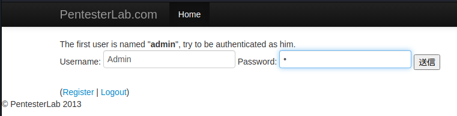

# <span style="color: blue;">Example 1</span>


# <span style="color: blue;">Example 2</span>
この状況では、開発者は文字列比較の脆弱性を時間的に一定にしないようにしています。これは、ウェブページが入力された文字列を、エラーを見つけるまで一文字ずつ分析することを意味します。

もし、ある文字が解析されるのにかかる時間を記録すれば、それが正しいのか間違っているのかがわかります（正しい場合は、エラーを見つける前に次の文字に移るので、エラーを取り出すのにもっと時間がかかります）。  
また、以下の自動化されたPythonスクリプトを使用して、同じ結果を得ることができます。   
 [http-auth-timming.py](https://gist.github.com/mgeeky/57e866604942f1824da310982c46da84)   
 
 # <span style="color: blue;">Example 3</span>
 これは Cookie 操作のエクスプロイトです。ログインすると、サーバーは user1 という名前の Cookie を値 user1 で設定します。
 
 
 Cookie エディターのブラウザー拡張機能を使用して値をuser1からadminに変更し、サイトのホーム ボタンをクリックしてExample3を再選択するだけです。   
 
 
  # <span style="color: blue;">Example 4</span>
  これは Cookie 操作のエクスプロイトですが、ひねりがあり、今回は Cookie の値が暗号化されています   
     
   MD5復号化ソフトウェアを使用して値を見つけ、それを管理者に変更します。   
   ```
   admin:21232f297a57a5a743894a0e4a801fc3
  ```
  
  
  
  # <span style="color: blue;">Example 5</span>
  この例では、文字列比較の方法を変えた場合の結果を示しています。ユーザーを作成するとき、アプリケーションは与えられたユーザー名を既存のユーザーと比較することで、そのユーザーが存在しないことをプログラムでチェックします。ログインするとき、アプリケーションはユーザー名とパスワードが正しいかどうかをチェックし、ユーザー名をセッションに保存します。最後に、アプリケーションにアクセスするたびに、アプリケーションはセッションで提供されたユーザー名に基づいてユーザーの詳細を取得します。

ここでのトリックは、==ユーザーを作成するときの比較はプログラム的に（つまりRubyで）== 行われますが、==ユーザーの詳細を取得するときの比較はデータベース== によって行われるという事実に由来します。デフォルトでは、==MySQL (VARCHAR型) は大文字小文字を区別せずに比較==を行います。"admin" と "Admin" は同じ値です。

この情報を使って、adminとして識別されるユーザーを作成することができるはずです。   
Username：Adminを登録
   
   
AdminでログインしたのにadminでSuccess!!!になる    
    
# <span style="color: blue;">Example 6</span>
以前の問題を解決するために、開発者はユーザーの作成時に大文字と小文字を区別して比較することにしました。このチェックは、MySQL が文字列比較を行う方法に基づいて回避することも可能です。==MySQLは末尾のスペースを無視==します（例：pentesterlabとpentesterlabは等しい）。上記と同じ方法で、adminというユーザーでログインしているふりをすることができるはずです。   
adminの後にスペースを入れて登録

admin＋スペースでログイン


