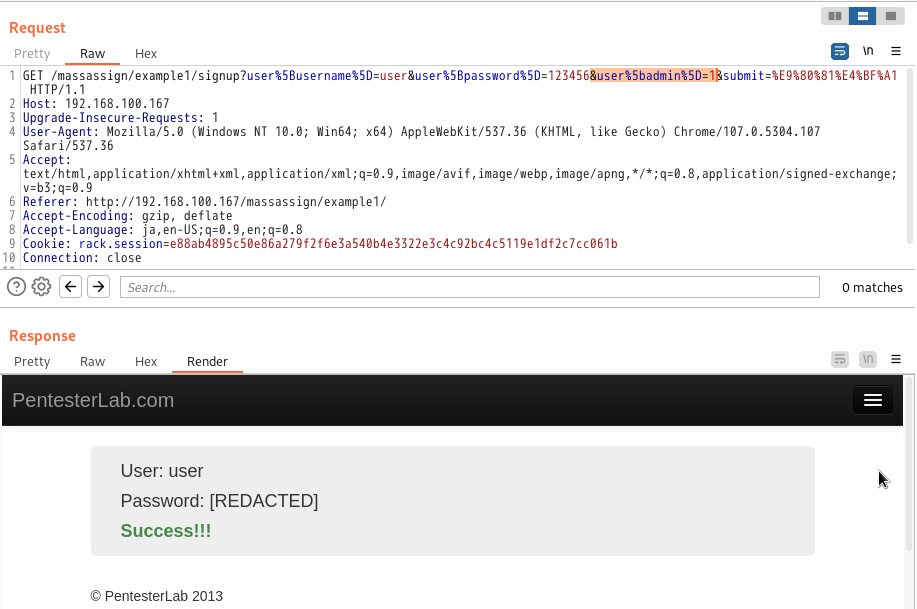
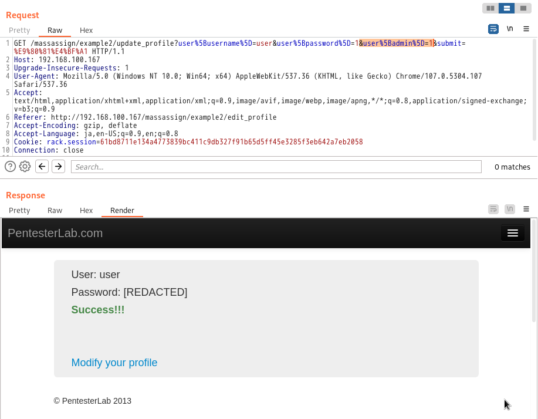
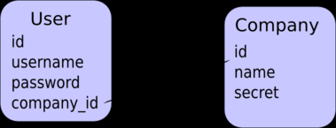
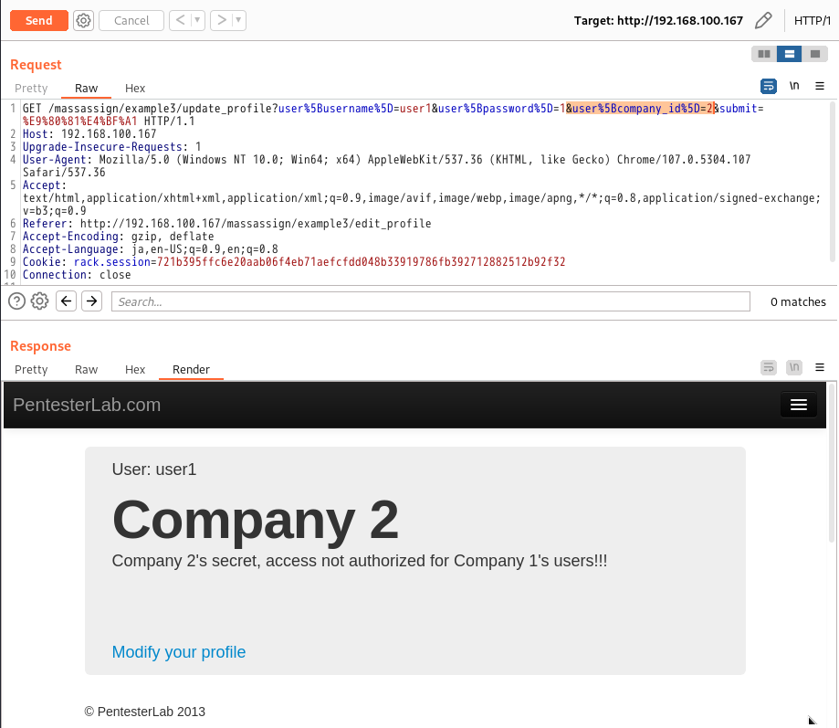

# <span style="color: blue;">Example 1</span>
これは権限昇格の例で、基本的にこの例では標準ユーザーと管理者の2種類のアカウントがあり、管理者として登録するためにBurpsuitで送信されたデータを簡単に操作することが可能です。    
Burpsuitでuser[admin]と値1を追記する   

```
#パラメータ追記
(&user[admin]=1)
&user%5badmin%5D=1
```


# <span style="color: blue;">Example 2</span>
管理者権限を持つユーザを作成する必要
modify your profile(プロフィール変更)リンクをクリックしてから
```
#パラメータ追記
(&user[admin]=1)
&user%5badmin%5D=1
```
を追記する


# <span style="color: blue;">Example 3</span>
ActiveRecord (Ruby-on-Rails で最も一般的なデータマッパー) を使っている場合、Company クラスに複数の User があると、User クラス内の company_id フィールドでリレーションを管理するのが慣例です (プログラムで変更することも可能)。   

   
Rubyでは次のようなコードになっています。
```Ruby
class User < ActiveRecord::Base
  belongs_to :company
end

class Company < ActiveRecord::Base
  has_many :users
end
```
>Ruby-on-Railsは「設定」よりも「慣習」を重視するので、クラス名や属性名を推測するのにとても役立ちます...。

```
#パラメータ追記
&user%5Bcompany_id%5D=2
```
