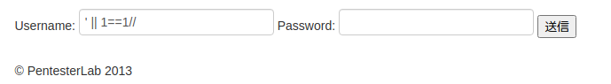

SQLデータベースがほぼ同じ構文をサポートしているのに対して、NoSQLデータベースは異なる構文を持っています。
# Example 1
この例は、有名(悪名高い)な' or 1=1 --の MongoDB バージョンです。前回見た内容を覚えていれば、このログインを迂回するために 2 つのものが必要になることがわかると思います。  
- 常に真の状態であること。
- NoSQL クエリを正しく終了させる方法
まず MongoDB のドキュメントを読むと、SQL の `or 1=1` は`|| 1==1` に変換されることがわかります (= が二重になっていることに注意しましょう)。それからいろいろと調べてみると、NULL BYTE を指定すると MongoDB が残りのクエリを使えなくなることがわかります。コメント `//` や`<!--` を使って、クエリの最後をコメントアウトすることもできます。   
  

# Example 2
この例では、NoSQLデータベースからより多くの情報を取得することを試みます。  
ちょっとした推測（またはアプリケーションに関する以前の知識）を使って、おそらくパスワードフィールドがあることが推測できます。  
その推測を確認するために、いろいろと遊んでみましょう。  
- http://vulnerable/mongodb/example2/?search=admin'%20%26%26%20this.password.match(/.*/)//+%00]  (http://vulnerable/mongodb/example2/?search=admin'%20%26%26%20this.password.match(/.*/)//+%00) にアクセスすると、結果を見ることができます。  
- http://vulnerable/mongodb/example2/?search=admin'%20%26%26%20this.password.match(/zzzz/)//+%00] (http://vulnerable/mongodb/example2/?search=admin'%20%26%26%20this.password.match(/zzzz/)//+%00) にアクセスすると、結果が表示されない。  
- http://vulnerable/mongodb/example2/?search=admin'%20%26%26%20this.passwordzz.match(/.*/)//+%00]  (http://vulnerable/mongodb/example2/?search=admin'%20%26%26%20this.passwordzz.match(/zzzz/)//+%00) にアクセスすると：エラーメッセージ（passwordzzフィールドが存在しないため） が表示されます。  
さて、2つの状態があるので、ブラインドインジェクションを実行する方法があります。   

- 正規表現が何かにマッチしない場合、結果が出ない：falseの状態。
- 正規表現が何かにマッチすると1つの結果が得られる：trueの状態。
この知識を利用して、adminパスワードを推測するエクスプロイトをスクリプト化することができます。まず、マッチングが正しく行われることを確認するため、^と$を使用します。文字列の途中の文字にマッチしないように、^と$を使用します(そうしないと、繰り返しが非常に難しくなります)。

アルゴリズムは以下のようになります。
- test if password match /^a.$/ if it matches test without the wildcard `.`.そして、マッチしない場合は次の文字に移動します。
- test if password match /^b.$/ if it matches test without the wildcard `.`.そして、マッチしない場合は次の文字に移動します。
例えば、パスワードがaabの場合、次のようなテストが行われます。
- /^a.*$/はtrueを返します。
- falseを返す/^a$/。
- /^aa.*$/はtrueを返します。
- falseを返す/^aa$/。
- /^aaa.*$/ はfalseを返します。
- /^aab.*$/ それは真を返します。
- /^aab$/はtrueを返します。パスワードが見つかりました。  
この内容で、ユーザーadminのパスワードを取得することができるはずです。