# Example 1
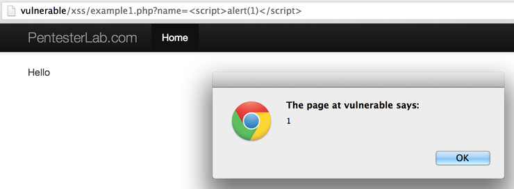
```
<script>alert(1)</script>
```

# Example 2
フィルターをバイパスする最も基本的な方法  
大文字小文字を入れてみる
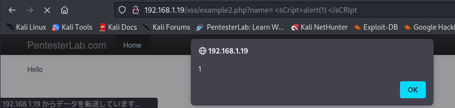
```
 <sCript>  </sCRIpt
 ```
# Example 3
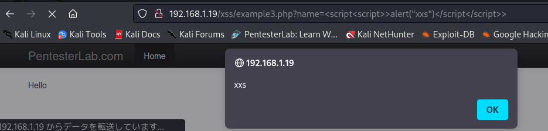
```
<script<script>>alert("xxs")</script</script>>
```
# Example 4
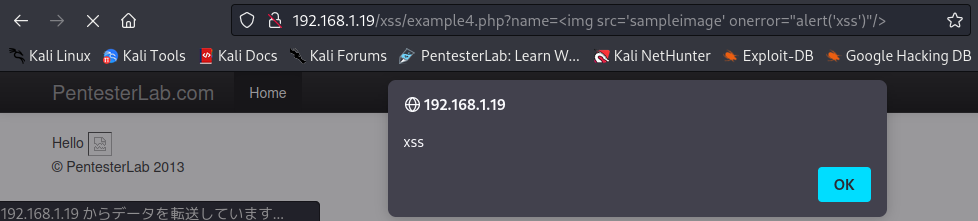
ページが読み込まれると自動的に実行されるため、 onerrorを使用するとさらにうまく機能します。    
# Example 5
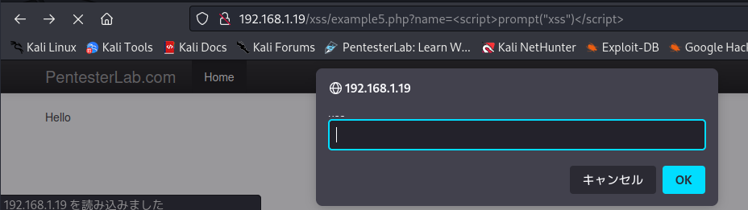
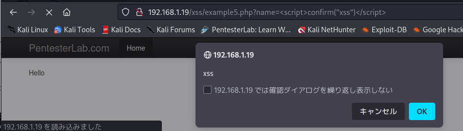
alertという文字にフィルターがかかっていたらJavascriptの関数promptやconfirmを使う

# Example 6
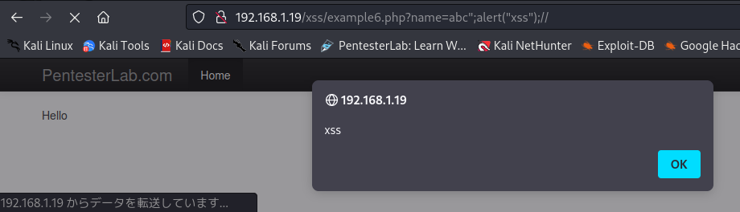
name=フィールドに何か違うものを入力するたびに$aの値は変化する。このスクリプトを操作して、アラート機能を実行させることができる。まず、" "文字を追加して、テキストがこのクォートマークの前にあることを示す。次に、JavaScriptでは行末に必ず使われる「;」を追加する。その後、alert('XSS')を追加する準備ができたが、入力の最後にあるクォータマークが原因でまだ動作しないので、これを//でコメントアウト
```
abc";alert("xss");//
```
# Example 7
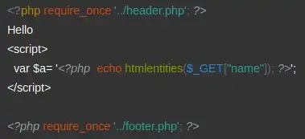   
開発者はユーザー入力を処理するために PHP の関数 "[htmlentities()](https://www.php.net/manual/ja/function.htmlspecialchars.php)" を使用しています。"[htmlentities()](https://www.php.net/manual/ja/function.htmlspecialchars.php)" 関数は特殊文字をエンコードするため、XSS インジェクションを解除することができます。しかし、開発者は関数「[htmlentities()](https://www.php.net/manual/ja/function.htmlspecialchars.php)」に何もフラグを指定しておらず、デフォルトでは「ENT_COMPAT | ENT_HTML401」フラグのみを使用しています。   
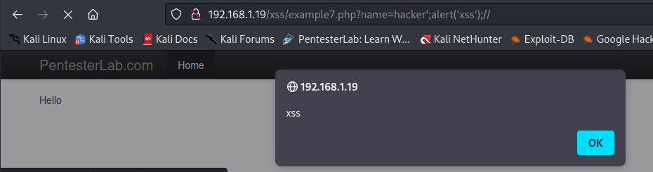  
```
hacker';alert('xss');//
```

# Example 8
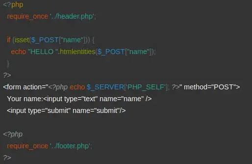  
フォームを構築するために、開発者はユーザから提供されたパスであるPHP_SELFを使用し、それを信頼しています。アプリケーションのパスを操作することで、以下のようなことが可能です。     
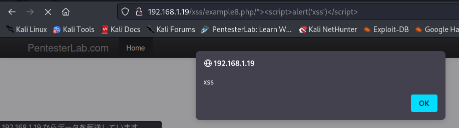  
```
http://192.168.1.18/xss/example8.php/"><script>alert("XSS")</script>
```

# Example 9
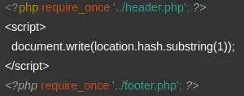   

この例は、DOM ベースの XSS です。このページは、実際には完全に静的なものであっても、脆弱性が存在する可能性があります。

この例では、何が起こっているかを理解するために、ページのコードを読む必要があります。ページがレンダリングされるとき、JavaScript のコードは現在の URL を使って URL のアンカー部分 (#...) を取得し、動的に (クライアントサイドで) ページ内に書き込みます。これを利用して、ペイロードをURLの一部として使用すると、XSS脆弱性を誘発する可能性があります。

IEで実行？