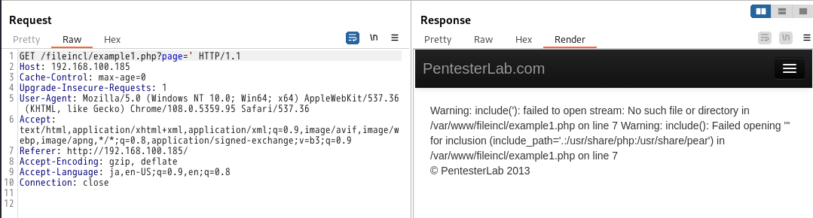
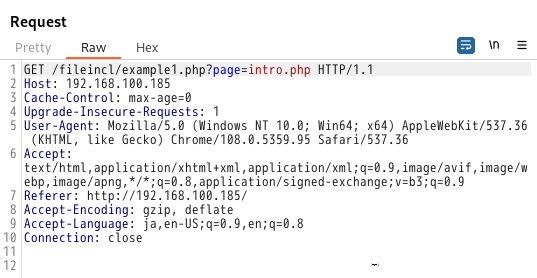
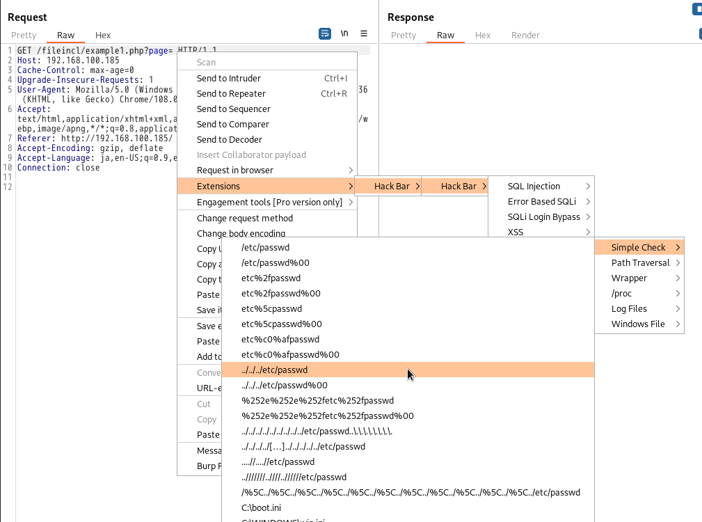
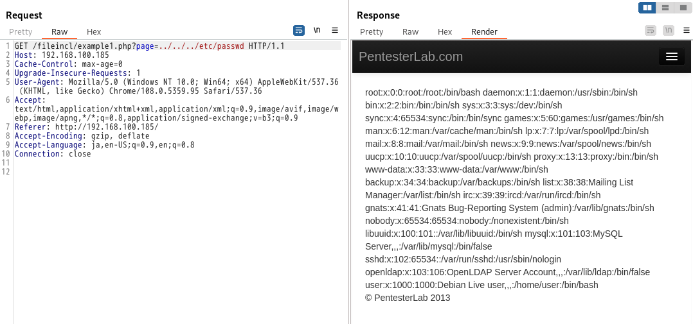
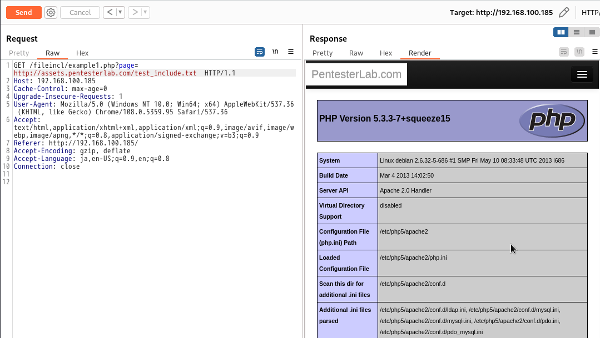
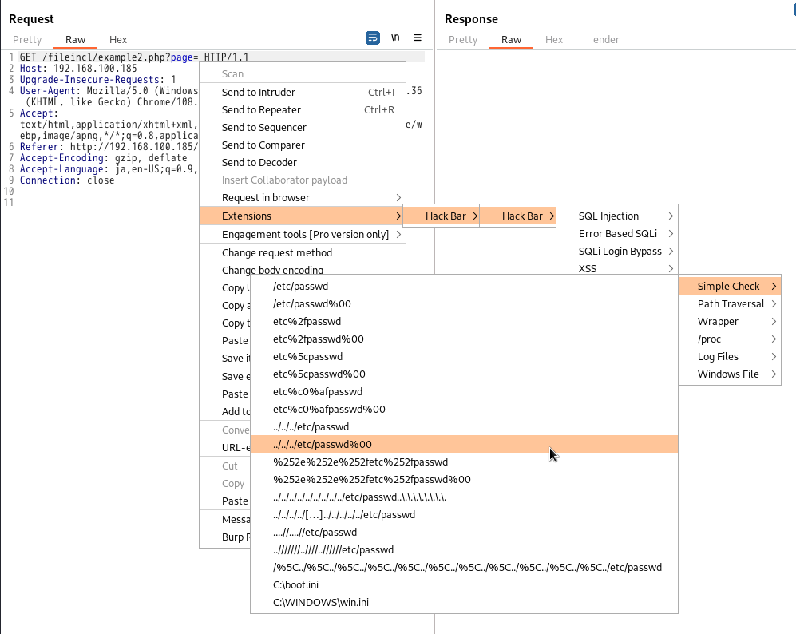
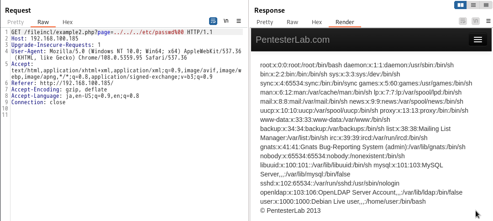
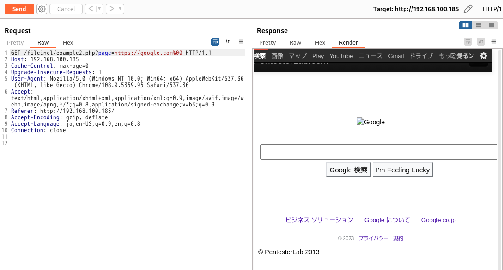

多くのアプリケーションで、開発者はクラスを読み込むためのファイルや、複数のウェブページ間でテンプレートを共有するためのファイルをインクルードする必要があります。   

ファイルインクルード脆弱性は、インクルード関数（require, require_once, include, include_once in PHP など）の呼び出しにおいて、ユーザ制御のパラメータがファイル名の一部として使用される際のフィルタリング不足に起因しています。これらのメソッドの呼び出しに脆弱性がある場合、攻撃者はその関数を操作して自 分のコードを読み込むことができるようになります。また、ファイルインクルード脆弱性は、ディレクトリトラバーサルとして、任意のファイルを読み込むために使用される可能性があります。しかし、任意のコードに PHP の開始タグが含まれている場合、そのファイルは PHP のコードとして解釈されます。   

このインクルード機能により、ローカルリソースやリモートリソース（Webサイトなど）の読み込みが可能になります。脆弱性がある場合、それが原因となります。   

- ローカルファイル インクルード：LFI.ローカルファイルが読み込まれ、解釈される。  
- リモートファイルインクルード：RFI.リモートファイルが読み込まれ、解釈されます。
   
デフォルトでは、PHP は設定オプション allow_url_include によりリモートファイルの読み込みを無効にしています。ISO では、テストできるようにこのオプションを有効にしています。
# Example 1
パラメータに特殊文字（例えば引用符）を挿入するとすぐに、エラーメッセージが表示されるのがわかります。   
エラーメッセージを注意深く読むと、多くの情報を抽出することができます。

- スクリプトのパス：/var/www/fileincl/example1.php。
- 使用された関数: include()。
- includeの呼び出しで使用されている値は、追加やフィルタリングを行わずに ' を注入した値です。  

ディレクトリトラバーサルを検出するために使用される方法を、ファイルのインクルードを検出するために使用することができます。

   
   
   
外部リソースを要求することによって、リモートファイルインクルードをテストすることができます。   
   

# Example 2
ディレクトリトラバーサルと同様の方法で、この例では提供された値に独自のサフィックスを追加します。前と同様に、NULL BYTEを使用してサフィックスを取り除くことができます(LFIについて)。   

   
   

RFI の場合は、URL に応じて &blah= あるいは ?blah= を追加することでサフィックスを取り除くこともできる。