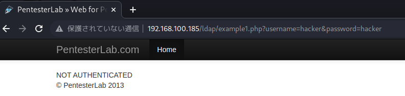
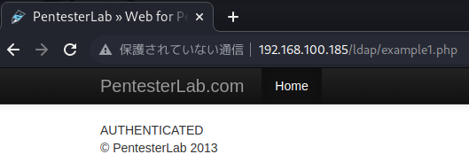
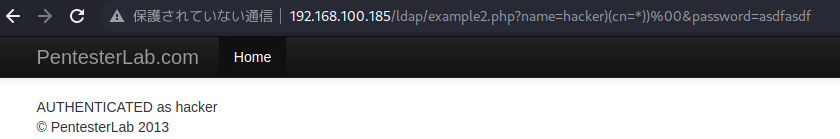

>LDAP インジェクションは、ユーザー入力に基づいて LDAP ステートメントを構築する Web ベースのアプリケーションを悪用するために使用される攻撃です。アプリケーションがユーザー入力を適切にサニタイズできない場合、ローカル プロキシを使用して LDAP ステートメントを変更できます。これにより、許可されていないクエリへのアクセス許可の付与や、LDAP ツリー内のコンテンツの変更など、任意のコマンドが実行される可能性があります。SQL インジェクションで利用できるのと同じ高度なエクスプロイト手法が、LDAP インジェクションにも同様に適用できます。
# <span style="color: blue;">Example 1</span>
この最初の例では、ユーザー名とパスワードを使用して LDAP サーバーに接続します。この例では、認証情報が無効であるため、LDAPサーバーはあなたを認証しません。



しかし、LDAP サーバーの中には NULL バインドを許可しているものもあります。 NULL 値を送信すると、LDAP サーバーは接続をバインドしようとし、 PHP のコードはその認証情報が正しいものであると判断してしまいます。2 つの NULL 値を指定してバインドするには、 このパラメータをクエリから完全に削除する必要があります。username=&password= のようなものを URL に残しておくと、 これらの値は null ではなく空になってしまうのでうまくいきません。  
攻撃者はクエリからすべてのパラメーターを削除することで認証をバイパスできます。
   
><span style="color: Violet;">これは、バックエンドがLDAPベースでない場合でも、今後テストするすべてのログインフォームに対して行うべき重要なチェックです。</span>
# <span style="color: blue;">Example 2</span>
LDAPインジェクションの最も一般的なパターンは、フィルターでインジェクションできるようにすることです。ここでは、LDAPインジェクションを使って、認証チェックを回避する方法を見ていきます。  
まず、LDAPの構文を少し勉強する必要があります。ユーザーを取得する場合、ユーザー名に基づいて、以下のようになります。   
```
(cn=[INPUT])
```
さらに条件を追加したり、ブーリアンロジックを使ったりしたい場合は
- ORを使ったブール値 |：(|(cn=[INPUT1])(cn=[INPUT2])) で、[INPUT1] または [INPUT2] にマッチするレコードを取得することができます。
- ANDを使用したブール値&：(&(cn=[INPUT1])(userPassword=[INPUT2])) で cn が [INPUT1] に、パスワードが [INPUT2] に一致するレコードを取得することができます。   

ご覧のとおり、ブール論理はフィルターの先頭にあります。後で注入する可能性が高いため、(LDAP サーバーによっては) フィルター内にロジックを注入することが常に可能であるとは限りません(cn=[INPUT])  </br></br> 
LDAPでは、あらゆる値にマッチさせるために、ワイルドカードの_を頻繁に使用します。これは、すべての_にマッチさせることも、部分文字列だけにマッチさせることもできます(例えば、admで始まるすべての単語にはadm*を使用します)。   
他のインジェクションと同様、サーバーサイドのコードによって追加されたものを取り除く必要があります。NULL BYTE (%00 としてエンコードされる) を使って、フィルタの最後を取り除くことができます。 </br>  
ここに、ログイン スクリプトがあります。以下を使用すると、それがわかります。
- username=hacker&password=hacker認証されます (これは通常の要求です)。
- username=hack*&password=hacker認証されます (ワイルドカードは同じ値に一致します)。
- username=hacker&password=hac*認証されません (パスワードはおそらくハッシュされている可能性があります)。  

では、LDAP インジェクションを使用して、username パラメータで認証を回避する方法を見てみましょう。以前のテストに基づいて、私たちはフィルターがおそらく次のように見えると推測できます。
```
(&(cn=[INPUT1])(userPassword=HASH[INPUT2]))
```
HASHはソルトをしようしないハッシュ（おそらくMD5かSHA1）です。
>LDAPはいくつかのフォーマットをサポートしています。:`{CLEARTEXT}`, `{MD5}`, `{SMD5}` (salted MD5), `{SHA}`, `{SSHA}` (salted SHA1), `{CRYPT}`パスワードの保存に使用します。

[INPUT2]はハッシュ化されているので、ペイロードを注入するために使用することはできません。   
ここでの目標は[INPUT1]、内部 (ユーザー名パラメーター) に注入することです。以下を注入する必要があります。   
- hacker)を使った現在のフィルタの終了
- 常に真である条件((cn=*) など)
- 有効な構文を維持するための ) で、最初の ) を閉じます
- NULL BYTE (%00) は、フィルタの終端を取り除くためのものです   

これを組み合わせると、どんなパスワードでもハッカーとしてログインできるようになるはずです。次に、ワイルドカードのトリックを使って他のユーザーを見つけることができます。例えば、フィルタの最初の部分にa*を使い、自分が誰としてログインしているのかを確認することができます。
```
http://192.168.100.185/ldap/example2.php?name=hacker)(cn=*))%00&password=asdfasdf
```

   
変数$filterは " (&(cn=hacker)(cn=*))%00)(userPassword=[pass])) " になり、%00は次のすべての文字列を取り除きます。