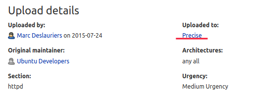
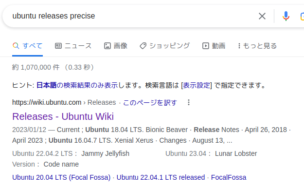
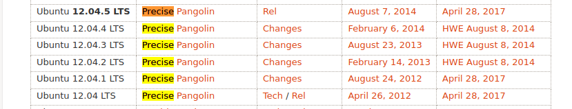

- nmap
	- 22 ssh
	- 80 http　apache/2.2.22(ubuntu)
	- 443 ssh/http
- 「ubuntu 2.2.22 apache」を検索して
   
    
   
   
- かなり古いバージョンなのでnmapで脆弱性を検索してみる
```
nmap --script vuln -oA nmap/vulnscan 10.10.10.79
```
- 同時にgobusterでディレクトリ検索を実施
```
gobuster -u http://10.10.10.79 -w /usr/share/wordlists/dirbuster/directory-list-2.3-medium.txt -o gobuster.log -t 50
```
- nmapの結果から「ssh-hartbleed」と「ssh-poodle」の脆弱性があることがわかる
> Heartbleedは、細工したHeartbeatのリクエストを送信した場合にサーバーのメモリー上にある意図していないデータが返ってしまうバグでした。   
> この脆弱性により、個人データやパスワードなどの重要な情報を盗まれる危険性がありました。
- sslyzeでsslのheartbleedの脆弱性を検査する
```
sslyze　--heartbleed 10.10.10.79
```


> xkcd	世界一で最も人気のあるウェブ漫画の一つ
- 「[xkcd heartbleed](https://xkcd.com/1354/)」を検索
- 「heartbleed.py」をダウンロードする
- heartbleed.pyの＃Payload lengthを編集し実行する
```
python heartbleed.py -n 100 10.10.10.79
```
>おそらく4000バイトを100回出力している
- gobusterの結果から「/dev」にアクセスしてみると「hype_key」「notes.txt」が確認できる
- hype_keyはhexでエンコードされているのでデコードする
- [hex to ascii](https://www.rapidtables.com/convert/number/hex-to-ascii.html)で検索してデコードする
- RSAキーが出てくる
- heartbleed.pyの結果からbase64の文字列を発見。デコードするとパスワードの可能性のある文字列が出てくる
- hype.keyはRSAのpribate keyなので600に変更する
```
chmod 600 hype.key
```
- hype_keyのアンダーバーの前はユーザー名になっていることが多い
- sshで接続すれば初期シェルがとれる
- bashのヒストリーファイルから
```
tmux -S /.devs/dev_sess
```
が確認できる
- /.devs/dev_sessを調べるとグループがhypeになっているのでコマンドを実行すれば権限昇格できる

- Dirty COWでも権限昇格してみる   
[dirty](https://github.com/FireFart/dirtycow/blob/master/dirty.c)で実行できる