#### nmap
```shell
# Nmap 7.93 scan initiated Mon Aug 21 14:59:09 2023 as: nmap -p- -T4 -oA all 10.10.11.219
Nmap scan report for 10.10.11.219
Host is up (0.26s latency).
Not shown: 65533 closed tcp ports (reset)
PORT   STATE SERVICE
22/tcp open  ssh
80/tcp open  http

# Nmap done at Mon Aug 21 15:11:23 2023 -- 1 IP address (1 host up) scanned in 734.63 seconds

```
```shell
# Nmap 7.93 scan initiated Mon Aug 21 15:12:19 2023 as: nmap -T4 -sVC -oA svc 10.10.11.219
Nmap scan report for pilgrimage.htb (10.10.11.219)
Host is up (0.23s latency).
Not shown: 998 closed tcp ports (reset)
PORT   STATE SERVICE VERSION
22/tcp open  ssh     OpenSSH 8.4p1 Debian 5+deb11u1 (protocol 2.0)
| ssh-hostkey: 
|   3072 20be60d295f628c1b7e9e81706f168f3 (RSA)
|   256 0eb6a6a8c99b4173746e70180d5fe0af (ECDSA)
|_  256 d14e293c708669b4d72cc80b486e9804 (ED25519)
80/tcp open  http    nginx 1.18.0
| http-cookie-flags: 
|   /: 
|     PHPSESSID: 
|_      httponly flag not set
|_http-title: Pilgrimage - Shrink Your Images
| http-git: 
|   10.10.11.219:80/.git/
|     Git repository found!
|     Repository description: Unnamed repository; edit this file 'description' to name the...
|_    Last commit message: Pilgrimage image shrinking service initial commit. # Please ...
|_http-server-header: nginx/1.18.0
Service Info: OS: Linux; CPE: cpe:/o:linux:linux_kernel

Service detection performed. Please report any incorrect results at https://nmap.org/submit/ .
# Nmap done at Mon Aug 21 15:12:45 2023 -- 1 IP address (1 host up) scanned in 25.77 seconds

```

```bash
# Nmap 7.93 scan initiated Mon Aug 21 15:12:56 2023 as: nmap --script=vuln -T4 -oA script 10.10.11.219
Pre-scan script results:
| broadcast-avahi-dos: 
|   Discovered hosts:
|     224.0.0.251
|   After NULL UDP avahi packet DoS (CVE-2011-1002).
|_  Hosts are all up (not vulnerable).
Nmap scan report for pilgrimage.htb (10.10.11.219)
Host is up (0.28s latency).
Not shown: 998 closed tcp ports (reset)
PORT   STATE SERVICE
22/tcp open  ssh
80/tcp open  http
| http-csrf: 
| Spidering limited to: maxdepth=3; maxpagecount=20; withinhost=pilgrimage.htb
|   Found the following possible CSRF vulnerabilities: 
|     
|     Path: http://pilgrimage.htb:80/
|     Form id: filename
|     Form action: /
|     
|     Path: http://pilgrimage.htb:80/logout.php
|     Form id: filename
|     Form action: /
|     
|     Path: http://pilgrimage.htb:80/dashboard.php
|     Form id: 
|     Form action: /login.php
|     
|     Path: http://pilgrimage.htb:80/register.php
|     Form id: 
|     Form action: /register.php
|     
|     Path: http://pilgrimage.htb:80/login.php
|     Form id: 
|_    Form action: /login.php
| http-enum: 
|   /login.php: Possible admin folder
|_  /.git/HEAD: Git folder
| http-cookie-flags: 
|   /: 
|     PHPSESSID: 
|_      httponly flag not set
|_http-fileupload-exploiter: ERROR: Script execution failed (use -d to debug)
|_http-dombased-xss: Couldn't find any DOM based XSS.
|_http-stored-xss: Couldn't find any stored XSS vulnerabilities.
| http-git: 
|   10.10.11.219:80/.git/
|     Git repository found!
|     Repository description: Unnamed repository; edit this file 'description' to name the...
|_    Last commit message: Pilgrimage image shrinking service initial commit. # Please ...

# Nmap done at Mon Aug 21 15:24:40 2023 -- 1 IP address (1 host up) scanned in 703.30 seconds

```

/etc/hostsファイルに「pilgrimage.htb」を登録
```
10.10.11.219  pilgrimage.htb
```

webにアクセスをしてみる


nmapの結果から「.git」フォルダがあることが分かる
「[[git-dumper]]」でファイルを取得する

https://github.com/arthaud/git-dumper　からダウンロード
```
pip install -r requirements.txt
```

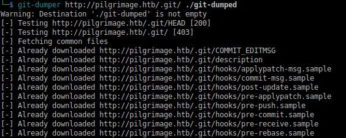
「login.php」からDBがわかる
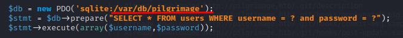
「index.php」で「magick convert」コマンドを使っている
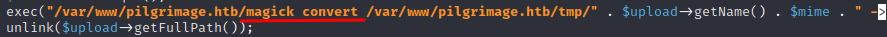

「magick convert」を検索すると[[ImageMagick]]のコマンドらいし

「ImageMagick PoC」で検索すると「CVE-2022-44268」の脆弱性があるらしい

>ImageMagickのローカルファイルインクルージョンの脆弱性は、アップロードされた画像のサイズが変更される時に悪用される可能性がある。悪意のあるPNG画像をアップロードすると、サイズ変更プロセスに、サイズ変更された画像のコンテンツとしてローカルファイルが16進数表現で含まれる。
>（参考）https://www.metabaseq.com/imagemagick-zero-days/

https://github.com/Sybil-Scan/imagemagick-lfi-poc からファイルをダウンロードしてexploit.pngを作成する
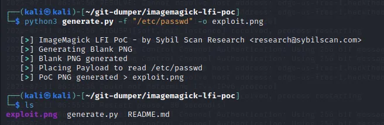
作成された画像をアップロードすると縮小ファイルへのリンクが表示される
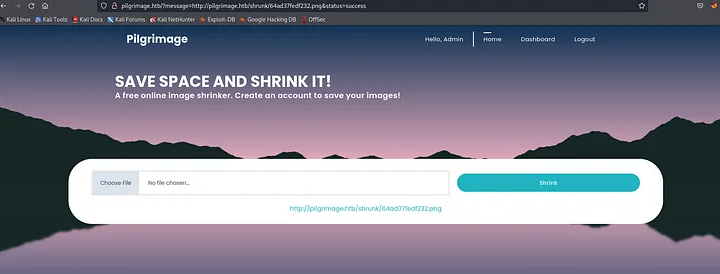

ファイルをダウンロードする
```
wget http://pilgrimage.htb/shrunk/64a42359ca344.png
```
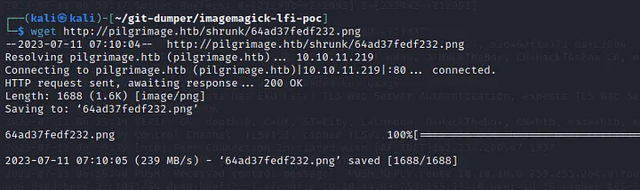

変換されたPNGファイルの内容を読み取る
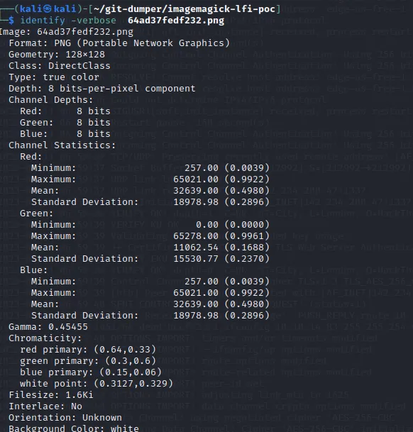
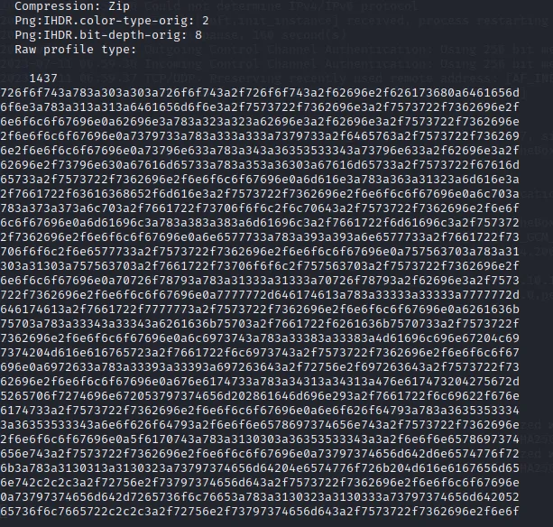

↑のデータ部分をデコードするためにCyberChefを使う
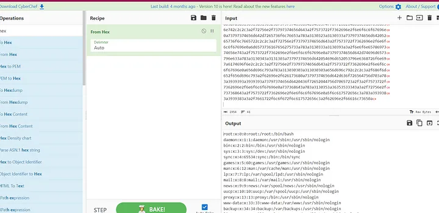
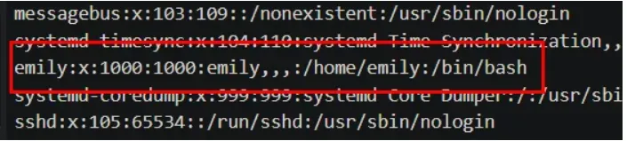

「emily」とゆうユーザーがいることが分かる

同様に先ほど判明したDBのディレクトリからもデータを取得してみる
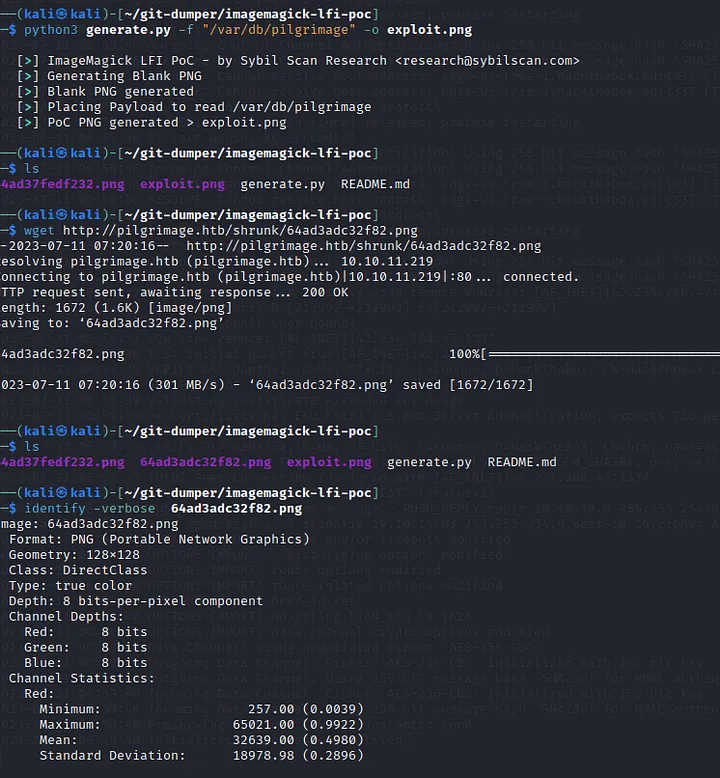

作成されたexploit.pngファイルをアップロードし縮小ファイルをダウンロードする

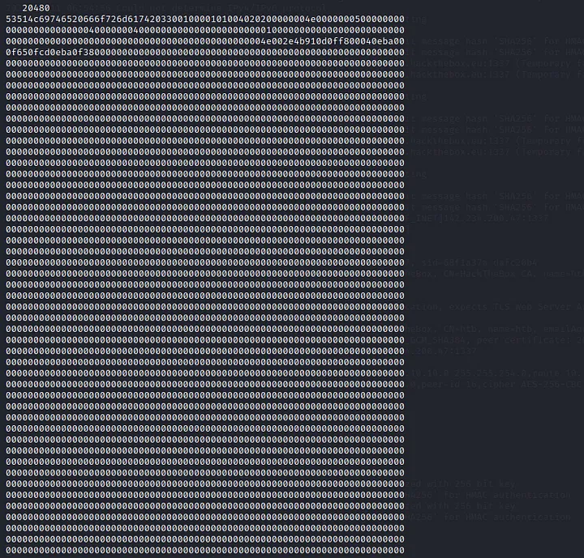

データ部分をCyberChefでデーコードするとユーザー名とパスワードが分かる

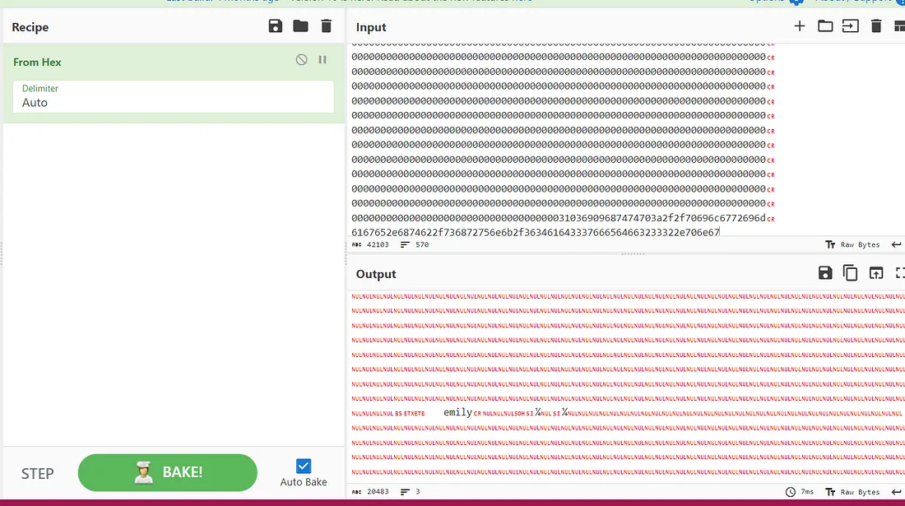
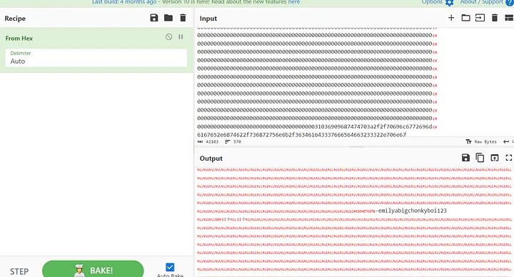

>参考
>このデータベースはsqliteであるのでsqlitebrowserで見ることもできる
>https://sqlitebrowser.org/dl/ からダウンロードして使用できる

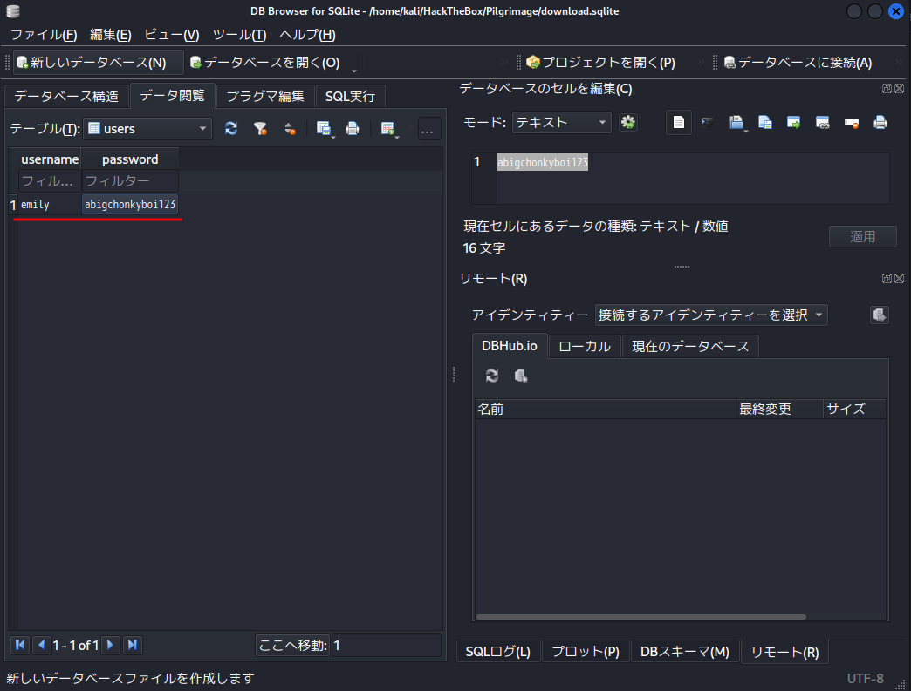

取得できたユーザー名とパスワードでSSH接続する

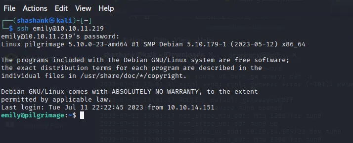

### 特権昇格
実行中のプロセスを確認
```shell
ps -aux
```

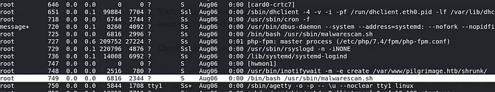

怪しいシェルスクリプトが動いている

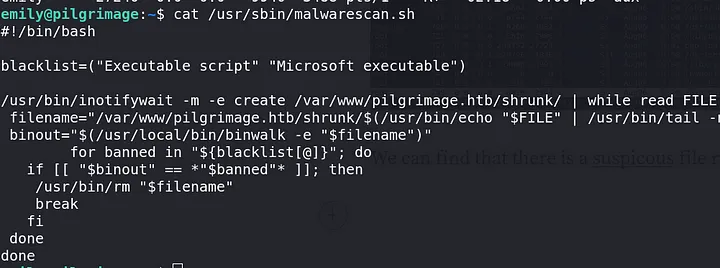

binwalkを使用している事がわかるのでバージョンを確認する
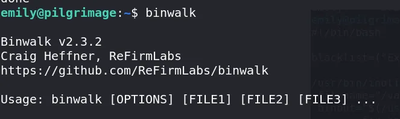

「binwalk 2.3.2 exploit」で検索するとすぐにExploitDBがみつかる
searchsploitでも見つかる

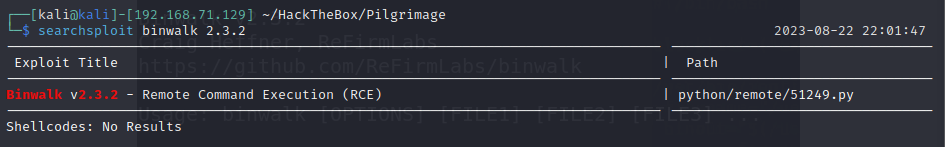
適当な画像を用意してエクスプロイトファイルを作成する
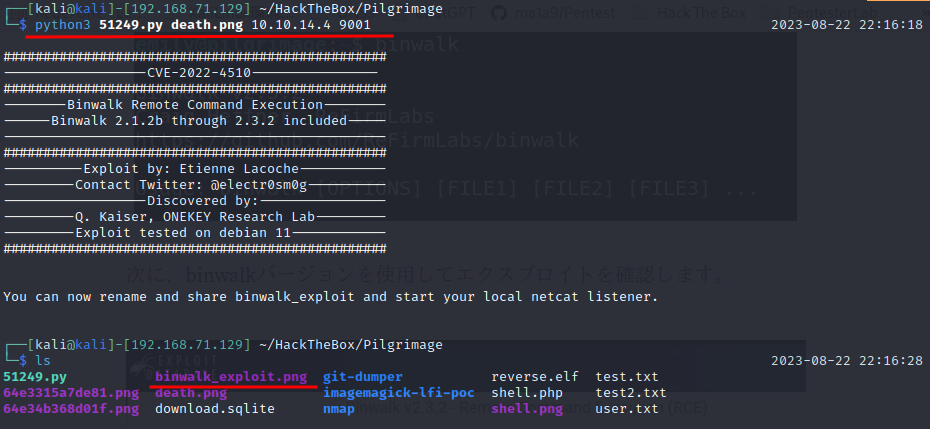
作成されたbinwalk_exploit.pngをローカルシステムにアップロードする
エクスプロイト画像を実行ディレクトリに配置する
```shell
cp binwalk_exploit.png / var / www / pilgrimage.htb / shrunk/
```


リスナーを起動しておくとリバースシェルが帰ってくる

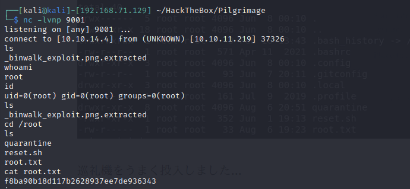
